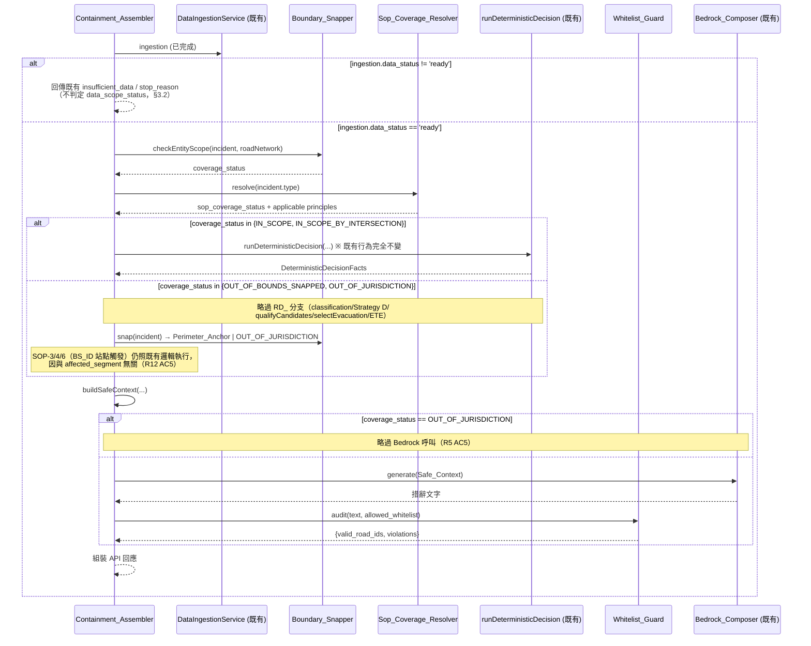

# 技術設計文件 (Technical Design Document)

**Design Status**: `DRAFT_PENDING_REVIEW`
**對應需求**: 同目錄 `requirements.md`（R1–R14）
**Implementation Authorization**: `NOT_AUTHORIZED_PENDING_REVIEW`

## 空間鎖定與邊界接管機制 (Boundary Snapping & Containment Protocol)

> 撰寫語言為繁體中文；型別名稱、欄位名稱、程式識別字保留英文。
> 本文件僅描述「如何設計」，不建立產品程式碼。實作順序見同目錄 `tasks.md`。

---

## 0. 與既有系統的關係（前提聲明）

本功能是既有 `city-response-commander`（見 `.kiro/specs/impl1/design.md`）決策管線的**前置擴充**，不是獨立系統，也不取代任何既有機制：

- 既有 `DataIngestionService`（`packages/domain/src/ingestion/data_ingestion_service.ts`）的 7 源 manifest STOP gate、`insufficient_data` / `stop_reason` 語意**完全不變**。
- 既有 `runDeterministicDecision`（`packages/domain/src/rule_engine/decision_pipeline.ts`）在 `IN_SCOPE` 事件上的行為**完全不變**（見 §3、Requirement 12）。
- 既有 `LLM_PROHIBITED_FIELDS`（`packages/shared-schemas/src/llm_boundary.ts`）機制**沿用並擴充**，不重建（見 §7、Requirement 13）。

本設計新增的模組全部屬於「決定性程式碼」（🟩 det），與既有 Rule Engine 同一信任等級；`Bedrock_Composer` 屬於既有「🟪 Bedrock-LLM」等級，只產出文字。

---

## 1. Executive Summary

當注入事件的地點或類型超出既有官方資料涵蓋範圍時，系統新增一層決定性前置關卡：

1. **Entity_Scope_Check + Boundary_Snapper** — 用路網白名單/路口白名單判定事件地點是否在涵蓋範圍內；若否，吸附到路網拓樸推導出的 `Perimeter_Anchor`（周界管制門）。
2. **Sop_Coverage_Resolver** — 用事件 `type` 查官方 SOP 對照表；查無時掛載 `DEFAULT_UNIVERSAL_SOP`（決定性通用原則，非官方 SOP 條文）。
3. **Whitelist_Guard** — 稽核 `Bedrock_Composer` 輸出中的道路 id，過濾白名單外的內容。
4. **Containment_Assembler** — 組裝以上三者的決定性輸出為 API 回應，並決定是否呼叫既有 `runDeterministicDecision`（見 §3 執行順序）。

核心不變量與既有系統一致：**決定性程式碼擁有一切數值與識別碼真值；Bedrock 只能填寫文字欄位**。新模組不引入任何例外。

---

## 2. Requirements Mapping

| 需求 | 摘要 | 主要元件 | 執行主體 | 主要落點章節 |
| --- | --- | --- | --- | --- |
| R1 | 前置關卡執行順序與職責邊界 | `Containment_Assembler` | 決定性 | §3 |
| R2 | 實體集合涵蓋判定 | `Boundary_Snapper.checkEntityScope` | 決定性 | §4.1 |
| R3 | 座標路徑與 haversine | `Boundary_Snapper.snapByCoordinate` | 決定性 | §4.3 |
| R4 | 周界錨點推導與吸附 | `Boundary_Snapper.deriveAnchors` / `snap` | 決定性 | §4.2 |
| R5 | 吸附距離上限與 `OUT_OF_JURISDICTION` | `Boundary_Snapper` | 決定性 | §4.2, §4.3 |
| R6 | 未知事件類型通用接管 | `Sop_Coverage_Resolver` | 決定性 | §5 |
| R7 | Fact_Gap / Coverage_Gap 並存 | `Containment_Assembler` | 決定性 | §3.2 |
| R8 | Safe_Context 動作空間限制 | `Containment_Assembler.buildSafeContext` | 決定性 | §6 |
| R9 | LLM 輸出白名單稽核 | `Whitelist_Guard` | 決定性 | §4.4, §6 |
| R10 | API 顯式標示欄位 | `Containment_Assembler` | 決定性 | §8 |
| R11 | 設定項目 | `ConfigProvider` | 決定性 | §9 |
| R12 | 與 `runDeterministicDecision` 的執行順序 | `Containment_Assembler` | 決定性 | §3 |
| R13 | `LLM_PROHIBITED_FIELDS` 同步 | `llm_boundary.ts`, `eslint-local-rules.cjs` | 決定性 | §7 |
| R14 | 測試涵蓋 | 全部模組 | 決定性 | §10 |

---

## 3. 執行順序與既有管線的短路規則（Requirement 1、12）

### 3.1 決策序列



### 3.2 為什麼可以安全短路 RD_ 分支

現有 `runDeterministicDecision`（`decision_pipeline.ts:211-282`）在 RD_ 事件上，若 `affected_segment` 不在路網中：

- `classifySegments` 收到 `saturation_score: null`（因 `selectSaturation` 對不存在的 segment 回傳 `null`）；
- `IncidentAnchorResolutionStrategy.resolve`（Strategy D）回傳 `manual_confirmation_required: true`、空的 `unranked_direct_intersections`；
- `qualifyCandidates` 用 `anchorIntersection: null` 呼叫（`decision_pipeline.ts:241-244` 已有「未解析錨點不得當作定位依據」的既有規則）；
- 後續 evacuation/ETE 多半得到空集合或 `null`。

也就是說，**這條分支在 Coverage_Gap 情境下原本就只產出降級後的空值**，新流程略過它不會遺漏任何有意義的既有輸出。反過來說，**絕不能兩者都跑**：若都跑，API 回應中會同時出現 `incident_anchor.manual_confirmation_required = true`（舊）與 `mapped_anchor_node`（新，吸附成功）兩份語意衝突的地點解析結果，稽核者無法判斷以哪個為準。Requirement 12 AC6 因此明定 `coverage_status` 非 `IN_SCOPE*` 時 `incident_anchor` 必須是 `null`。

SOP-3（BL17）、SOP-4（大巨蛋）、SOP-6（多語）三條規則的觸發依據是 `BS_ID` 電信站點，與 `affected_segment`/`affected_road` 無關，因此不受 Coverage_Gap 影響，維持照既有邏輯執行（Requirement 12 AC5）。

### 3.3 Fact_Gap 與 Coverage_Gap 的判定時機

`ingestion.data_status !== 'ready'` 是**唯一**驅動 `data_status: insufficient_data` 的來源（見 Requirement 7 AC8，本 spec 不擴大 Fact_Gap 偵測範圍）。此時 `ingestion.roadNetwork` 為 `undefined`（`data_ingestion_service.ts:53-54` 明確標注「only present when data_status='ready'」），因此 `Boundary_Snapper` **無input可用**，`Containment_Assembler` 必須在呼叫 `Boundary_Snapper` 之前就先檢查這個條件並短路（Requirement 12 AC2）——這與 Requirement 7 AC5「兩者同時發生時同時回報」看似矛盾，實則不然：AC5 描述的是「Fact_Gap 發生在 ingestion 已 ready、但個別事件相關的 Coverage_Gap 判定為 OUT_OF_BOUNDS_SNAPPED」的情境（此時 `data_status` 仍為 `ready`，不會是 `insufficient_data`，因為 Requirement 7 AC8 已排除逐事件 Fact_Gap 升級為頂層狀態）。實務上，在本 spec 範圍內，`data_status: insufficient_data` 與 `data_scope_status: OUT_OF_BOUNDS_SNAPPED` **不會同時出現**；Requirement 7 AC5 保留給未來若有人擴充逐事件 Fact_Gap 偵測時使用，本次實作只需確保兩欄位語意獨立、互不覆蓋即可。

---

## 4. Boundary_Snapper

`packages/domain/src/boundary/boundary_snapper.ts`（新檔案）。純函式模組，只 import `@city-commander/shared-schemas` 與 `packages/config` 的型別（Requirement 1 AC3）。

```ts
export interface EntityScopeResult {
  readonly coverage_status: 'IN_SCOPE' | 'IN_SCOPE_BY_INTERSECTION' | 'OUT_OF_BOUNDS';
  readonly decision_anchor_segment_id: string | null; // Requirement 2 AC1/AC2/AC3
  readonly matched_field: 'affected_segment' | 'affected_road' | 'location_intersection' | null;
  readonly matched_value: string | null;
}

export interface PerimeterAnchor {
  readonly segment_id: string;       // 屬於 Road_Whitelist（Req 4 AC6）
  readonly gateway_intersection: string; // 屬於 Intersection_Whitelist（Req 4 AC7）
  readonly capacity_vph: number;
}

export interface SnapResult {
  readonly coverage_status: 'OUT_OF_BOUNDS_SNAPPED' | 'OUT_OF_JURISDICTION';
  readonly anchor: PerimeterAnchor | null;      // OUT_OF_JURISDICTION 時為 null（Req 4 AC5/AC8）
  readonly distance_meters: number | null;      // 座標路徑未啟用時為 null（Req 3 AC6）
  readonly reason: string;                      // 'no_perimeter_anchor_available' 等
  readonly evidence: readonly string[];         // 吸附證據（Req 2 AC6, R3 AC3/AC4）
}

export interface BoundarySnapperConfig {
  readonly max_snap_distance_meters: number;      // 必填，缺失即錯誤（Req 5 AC1/AC2）
  readonly coordinate_path_enabled: boolean;
  readonly anchor_gazetteer?: ReadonlyMap<string, { lat: number; lon: number }>; // Req 3 AC1
}

export function checkEntityScope(
  incident: Incident,
  roadNetwork: RoadNetworkModel,
): EntityScopeResult;

export function derivePerimeterAnchors(
  roadNetwork: RoadNetworkModel,
): readonly PerimeterAnchor[];

export function snap(
  incident: Incident,
  roadNetwork: RoadNetworkModel,
  config: BoundarySnapperConfig,
): SnapResult;
```

### 4.1 Entity_Scope_Check（Requirement 2）

決定性、無外部相依，只用既有 `RoadNetworkModel`：

1. `incident.affected_segment` 屬於 `Road_Whitelist`（`roadNetwork.getSegment(id) !== undefined`）→ `IN_SCOPE`，錨點 = `affected_segment`。
2. 否則若 `incident.affected_road` 屬於 `Road_Whitelist` → `IN_SCOPE`，錨點 = `affected_road`。
3. 否則掃描全部路段的 `intersections[]`，找出出現在 `incident.location` 文字中的路口名稱（複用 `incident_anchor_resolution_strategy.ts` 裡 `intersectionAppearsInLocation` 的比對邏輯，含路段別名去除 `一二三四五六七八九十]+段$`）；有命中則 `IN_SCOPE_BY_INTERSECTION`，多個命中依 Req 2 AC5（最長字串優先、字典序 tie-break）選出，錨點 = 該路口所屬路段中 `segment_id` 字典序最小者。
4. 都沒有命中 → `OUT_OF_BOUNDS`。

> **注意**：此比對邏輯與既有 `IncidentAnchorResolutionStrategy`（Strategy D）在字串比對演算法上刻意共用同一個 helper（見 §4.5），避免兩套「路口名稱是否出現在 location 文字中」的判斷各自實作、結果不一致。

### 4.2 Perimeter_Anchor 推導與吸附（Requirement 4）

```
derivePerimeterAnchors(roadNetwork):
  for each segment in roadNetwork.getAllSegments():
    for each intersection_name in segment.intersections:
      if intersection_name does NOT match any segment.name in roadNetwork:
        → intersection_name is a Perimeter_Gateway_Intersection
        → emit PerimeterAnchor{ segment_id: segment.segment_id,
                                 gateway_intersection: intersection_name,
                                 capacity_vph: segment.capacity_vph }
```

「不對應任何路段 `name`」即代表這個路口名稱是路網對外的開口（Glossary: `Perimeter_Gateway_Intersection`）。此推導是純拓樸運算，對 15 筆官方路段資料的結果在啟動時計算一次即可快取（無需每次決策重算，因 `RoadNetworkModel` 是不可變的）。

吸附選擇（`snap`）：

- 座標路徑未啟用 或 座標無效／未提供 → 依 Req 4 AC3：選 `capacity_vph` 最高者，同分取 `segment_id` 字典序最小。
- 座標路徑啟用且事件座標有效 → 依 Req 4 AC4：選 haversine 距離最小者，同分取 `segment_id` 字典序最小；若最小距離 > `max_snap_distance_meters` → `OUT_OF_JURISDICTION`（Req 5 AC3）。
- `derivePerimeterAnchors` 回傳空陣列（15 筆資料若全部互相對應、無對外開口）→ `OUT_OF_JURISDICTION`，`reason: 'no_perimeter_anchor_available'`（Req 4 AC5）。

### 4.3 座標路徑（Requirement 3）

```ts
function haversineMeters(a: {lat:number; lon:number}, b: {lat:number; lon:number}): number
```

標準大圓距離公式，回傳整數公尺（Req 3 AC5）。緯度範圍 `[-90,90]`、經度範圍 `[-180,180]` 外視為 `invalid_coordinate`（Req 3 AC4）；`ConfigProvider` 未提供 `anchor_gazetteer` 時記錄 `gazetteer_unavailable`（Req 3 AC3）；兩種情況都退回 Entity_Scope_Check 路徑，`distance_meters` 欄位設為 `null`（Req 3 AC6）。**目前官方資料集（`road_network_geometry.json`、`live_incidents.json`）不含任何座標欄位，座標路徑在本次比賽資料上恆為未啟用狀態**——此路徑僅為未來若 Dashboard 提供地圖點選座標時預留，非本次交付的示範路徑。

### 4.4 Whitelist_Guard

`packages/domain/src/boundary/whitelist_guard.ts`。

```ts
export interface WhitelistPartition {
  readonly allowed: ReadonlySet<string>;
  readonly rejected: ReadonlySet<string>;
}

export function partitionByWhitelist(
  candidateIds: readonly string[],
  whitelist: ReadonlySet<string>,
): WhitelistPartition;　// allowed ∪ rejected == candidateIds, allowed ∩ rejected == ∅（Req 12.5 屬性測試）

export function extractRoadIdLike(text: string): readonly string[];
// 抽取符合 road id 格式（如 RD_TPE_\d{3}）的子字串，供稽核 Bedrock 輸出（Req 9 AC1）
```

### 4.5 與既有 `IncidentAnchorResolutionStrategy` 共用的比對 helper

為避免「路口名稱是否出現在 location 文字」這條邏輯出現兩份實作、行為分岔，將 `incident_anchor_resolution_strategy.ts` 中的 `intersectionAppearsInLocation`（含路段別名正規化）抽出為 `packages/domain/src/road_network/intersection_text_match.ts` 的共用函式，兩處都改為 import 這個共用實作。這是本次重構唯一觸碰既有檔案的必要變更，且是內部行為不變的搬移（純函式抽取），不影響 `incident_anchor_resolution_strategy.ts` 既有輸出。

---

## 5. Sop_Coverage_Resolver（Requirement 6）

`packages/domain/src/boundary/sop_coverage_resolver.ts`。

```ts
export type SopCoverageStatus = 'OFFICIAL_SOP_MATCHED' | 'UNKNOWN_TYPE_UNIVERSAL_SOP';
export type SopAuthority = 'OFFICIAL_SOP' | 'SYSTEM_DEFAULT_PRINCIPLE';

export interface SopCoverageResult {
  readonly sop_coverage_status: SopCoverageStatus;
  readonly sop_authority: SopAuthority;
  readonly matched_article_nos: readonly number[];      // OFFICIAL_SOP_MATCHED 時非空
  readonly universal_principles: readonly UniversalPrinciple[]; // UNKNOWN_TYPE_UNIVERSAL_SOP 時非空
}

export interface UniversalPrinciple {
  readonly principle_id: 'UPSTREAM_REDUCTION' | 'PERIMETER_DISPERSAL' | 'PERIMETER_CONTROL';
  readonly description: string; // 決定性中文文字，非 Bedrock 生成
}

export const DEFAULT_UNIVERSAL_SOP: readonly UniversalPrinciple[] = [
  { principle_id: 'UPSTREAM_REDUCTION', description: '上游減量：於周界錨點上游疏導車流，降低進入未劃設區域之流量' },
  { principle_id: 'PERIMETER_DISPERSAL', description: '周邊擴散：透過 alternatives 分流至周界錨點鄰近之替代路段' },
  { principle_id: 'PERIMETER_CONTROL', description: '周界管制：於周界錨點設立管制點，阻止車流繼續駛向未劃設區域' },
] as const;

export function resolveSopCoverage(
  incidentType: string,
  incidentDescription: string,
  sopArticleTable: SopTypeToArticleTable, // 由 emergency_traffic_sop.txt 條文回溯之對照表
): SopCoverageResult;
```

對照表內容需可回溯到 `emergency_traffic_sop.txt` 的 7 條條文（Req 6 AC1）——沿用既有 `ingestion.sopArticles`（`sop_loader.ts` 已解析的條文 chunk），不重新解析 SOP 文字。`principle_id` 與官方條號欄位（`sop_citations[].article_no`）分屬不同欄位、不得混用（Req 6 AC6）。

---

## 6. Containment_Assembler

`packages/backend/src/decision/containment_assembler.ts`（新檔案，Layer 2，可 import Layer 1 的 `Boundary_Snapper`/`Sop_Coverage_Resolver`/`Whitelist_Guard`/既有 `runDeterministicDecision`）。

```ts
export interface ContainmentResult {
  readonly data_status: IngestionDataStatus;        // 既有欄位，語意不變
  readonly stop_reason: string | null;               // 既有欄位，語意不變
  readonly data_scope_status:
    | 'IN_SCOPE' | 'IN_SCOPE_BY_INTERSECTION'
    | 'OUT_OF_BOUNDS_SNAPPED' | 'OUT_OF_JURISDICTION' | null; // data_status!=ready 時為 null
  readonly mapped_anchor_node: (PerimeterAnchor & { distance_meters: number | null }) | null;
  readonly sop_coverage_status: SopCoverageStatus | null;
  readonly sop_authority: SopAuthority | null;
  readonly facts: DeterministicDecisionFacts | null;  // IN_SCOPE* 時來自既有 runDeterministicDecision
  readonly decision: {
    readonly reroute_roads: readonly string[];
    readonly perimeter_control: { action: string; target_gate: string; reason: string } | null;
    readonly ai_reasoning: string | null;
  };
  readonly whitelist_violations: { readonly road_id: string; readonly occurrences: number }[];
}

export function assembleContainment(input: {
  ingestion: IngestionResult;
  incident: Incident;
  config: PolicyStrategyConfigProvider & BoundarySnapperConfig & { universal_sop_enabled: boolean };
  composer: BedrockComposerClient; // 既有介面
}): Promise<ContainmentResult>;
```

`assembleContainment` 的責任嚴格對應 §3.1 序列圖，不重新實作任何已存在的規則邏輯（Requirement 1 AC1）——它是一個**組裝器**，不是新的 Rule Engine。

### 6.1 Safe_Context 組裝（Requirement 8）

```ts
interface SafeContext {
  readonly allowed_road_whitelist: readonly string[]; // Road_Whitelist 的子集合
  readonly official_sop_text: readonly SopCitation[] | null;
  readonly universal_principles: readonly UniversalPrinciple[] | null;
  readonly scope_disclosure: string | null; // OUT_OF_BOUNDS_SNAPPED 時載明「未落於已劃設範圍、已對齊至 X」
  readonly instruction: string; // 要求 Bedrock 只用白名單內 road id；UNKNOWN_TYPE_UNIVERSAL_SOP 時要求輸出建議、禁止拒答語句（Req 6 AC9）
}
```

`allowed_road_whitelist` 在 `OUT_OF_BOUNDS_SNAPPED` 時 = `{吸附錨點.segment_id} ∪ (roadNetwork.alternativesOf(吸附錨點.segment_id) ∩ Road_Whitelist)`（Req 8 AC2，重用既有 `RoadNetworkModel.alternativesOf` 的單向查詢語意，不改寫成雙向）。

---

## 7. `LLM_PROHIBITED_FIELDS` 整合（Requirement 13）

**設計決定**：新欄位（`data_scope_status`、`mapped_anchor_node`、`decision.reroute_roads`、`decision.perimeter_control`、`sop_coverage_status`、`sop_authority`）**不併入** `DecisionCore`（`packages/shared-schemas/src/decision_core.ts`），因為它們的資料來源（`Containment_Assembler`）與 `DecisionCore` 的資料來源（`runDeterministicDecision` + backend identity fields）是兩條不同管線，`DecisionCore` 的 `core_hash`/`immutable_after_commit` 語意也不適用於 Coverage_Gap 欄位。

因此改採 Requirement 13 AC4 的路徑：新增獨立型別 `ContainmentDisclosure`（`packages/shared-schemas/src/containment_disclosure.ts`），並新增對等的守門常數：

```ts
// packages/shared-schemas/src/containment_disclosure.ts
export const CONTAINMENT_PROHIBITED_KEYS: readonly (keyof ContainmentResult)[] = [
  'data_scope_status',
  'mapped_anchor_node',
  'sop_coverage_status',
  'sop_authority',
  // decision.reroute_roads / decision.perimeter_control 為巢狀欄位，
  // 於 schema_validator.ts 以路徑字串 'decision.reroute_roads' 等額外列出
];
export const CONTAINMENT_PROHIBITED_PATHS: readonly string[] = [
  ...CONTAINMENT_PROHIBITED_KEYS,
  'decision.reroute_roads',
  'decision.perimeter_control',
];
```

`packages/rag/src/schema_validator.ts` 除既有 `LLM_PROHIBITED_FIELDS` 檢查外，新增一段對 `CONTAINMENT_PROHIBITED_PATHS` 的等效檢查（同一驗證函式，兩份常數陣列，理由：`ContainmentResult` 與 `DecisionCore` 是不同型別，`keyof` 無法共用同一個型別參數）。`eslint-local-rules/test/prohibited-fields-sync.test.ts` 擴充一個新的 `describe` block，比對 `CONTAINMENT_PROHIBITED_KEYS` 與 `eslint-local-rules.cjs` 內對應的手動複本（沿用既有 sync 測試的模式，不是新機制）。

---

## 8. API 回應範例（Requirement 10）

以下範例已對齊 §4.2 對官方 15 筆 `road_network_geometry.json` 手算並鎖定為
golden fixture 的實際推導結果（`packages/domain/test/unit/perimeter_anchor_derivation.test.ts`）：
官方資料集上唯一的 Perimeter_Anchor 是 `RD_TPE_009`（基隆路地下道）／
「正氣橋」（此路口名稱只出現在 `RD_TPE_009.intersections`，不對應任何
路段 `name`）。`RD_TPE_009.alternatives` 僅有 `["RD_TPE_003"]`，故 §6.1
的 `allowed_road_whitelist` 在此例為 `{RD_TPE_009, RD_TPE_003}`。

```json
{
  "incident_id": "INC_OUT_OF_BOUNDS_001",
  "data_status": "ready",
  "stop_reason": null,
  "data_scope_status": "OUT_OF_BOUNDS_SNAPPED",
  "mapped_anchor_node": {
    "segment_id": "RD_TPE_009",
    "gateway_intersection": "正氣橋",
    "distance_meters": null
  },
  "sop_coverage_status": "UNKNOWN_TYPE_UNIVERSAL_SOP",
  "sop_authority": "SYSTEM_DEFAULT_PRINCIPLE",
  "incident_anchor": null,
  "decision": {
    "reroute_roads": ["RD_TPE_009", "RD_TPE_003"],
    "perimeter_control": {
      "action": "BLOCK_ENTRY",
      "target_gate": "RD_TPE_009",
      "reason": "事故點位於轄區地圖外圍，於周界節點 RD_TPE_009（正氣橋）設立防衛封鎖線"
    },
    "ai_reasoning": "（Bedrock 生成文字，經 Whitelist_Guard 稽核）"
  },
  "whitelist_violations": []
}
```

---

## 9. Config 新增項目（Requirement 11）

比照 `packages/config/src/config_schema.ts` 既有攤平陣列格式追加（沿用 §23.1 慣例，非新機制）：

| key | type | required | provisionalDefault | 備註 |
| --- | --- | --- | --- | --- |
| `boundary_snapping.max_snap_distance_meters` | number | **false**（TASK-BS-02 修正：`required:true` 會違反既有 `config_schema.test.ts`「所有必填項目都要有 `provisionalDefault`」不變量；`required:false`＋無預設值＋由 `Boundary_Snapper` 自身在使用時顯式檢查缺失並報錯，才是與 `orchestration.state_machine_arn` 完全一致的既有模式） | **無** | Req 5 AC1/AC2 |
| `boundary_snapping.coordinate_path_enabled` | boolean | true | `false` | Req 11 AC2 |
| `boundary_snapping.anchor_gazetteer_source` | string | false（僅 `coordinate_path_enabled=true` 時必填） | 無 | Req 11 AC3 |
| `containment.universal_sop_enabled` | boolean | true | `true` | Req 11 AC4/AC5 |

---

## 10. 測試策略（對映 Requirement 14）

| Property/測試 | 對映需求 | 位置 |
| --- | --- | --- |
| P-B1: 吸附結果 `segment_id` 為 `null` 或屬於 Road_Whitelist | R14.2 | `packages/domain/test/property/p_boundary_snap.test.ts` |
| P-B2: 相同輸入兩次執行結果相同（純函式性） | R14.3 | 同上 |
| P-B3: `OUT_OF_JURISDICTION` 時錨點為 `null` | R14.4 | 同上 |
| P-B4: Whitelist_Guard 分割集合聯集=輸入、交集=空 | R14.5 | `packages/domain/test/unit/whitelist_guard.test.ts` |
| Sop_Coverage_Resolver 對照表全覆蓋 + ≥3 未知 type | R14.6 | `packages/domain/test/unit/sop_coverage_resolver.test.ts` |
| Max_Snap_Distance 邊界（=、<、>門檻） | R14.7 | `packages/domain/test/unit/boundary_snapper_boundary.test.ts` |
| Containment_Assembler 整合：IN_SCOPE / OUT_OF_BOUNDS_SNAPPED / OUT_OF_JURISDICTION / (insufficient_data ∧ OUT_OF_BOUNDS_SNAPPED) | R14.8 | `packages/backend/test/decision/containment_assembler.test.ts` |
| No-regression：`IN_SCOPE` 事件 `decision_pipeline.ts` 輸出前後逐欄位相同 | R14.9 | 同上（golden diff against 既有 ACC_001/EVT_002/EVT_003 fixtures） |
| `prohibited-fields-sync.test.ts` 擴充涵蓋 `CONTAINMENT_PROHIBITED_KEYS` | R14.10 | `eslint-local-rules/test/prohibited-fields-sync.test.ts` |
| Bedrock 輸出嘗試覆寫保留欄位仍以決定性值為準 | R14.11 | `packages/rag/test/schema_validator.test.ts` |

---

## 11. Non-Goals / 明確排除範圍

- 不擴大既有逐事件 Fact_Gap 偵測（見 Requirement 7 AC8、§3.3）。
- 座標路徑（Req 3）在本次官方資料集上不會被觸發，僅實作介面與退化路徑，不建置 `Anchor_Gazetteer` 的實際資料來源。
- 不修改 `emergency_traffic_sop.txt` 或既有官方來源檔案雜湊；`DEFAULT_UNIVERSAL_SOP` 明確標示 `sop_authority: SYSTEM_DEFAULT_PRINCIPLE`，任何時候都不得混充為官方條文。
