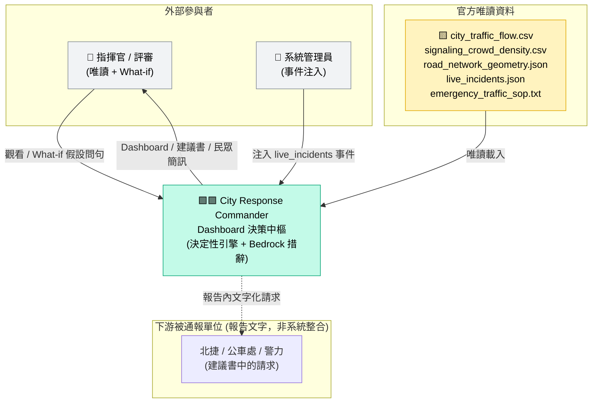
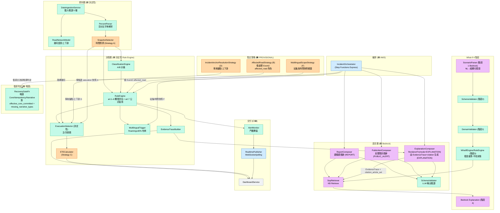
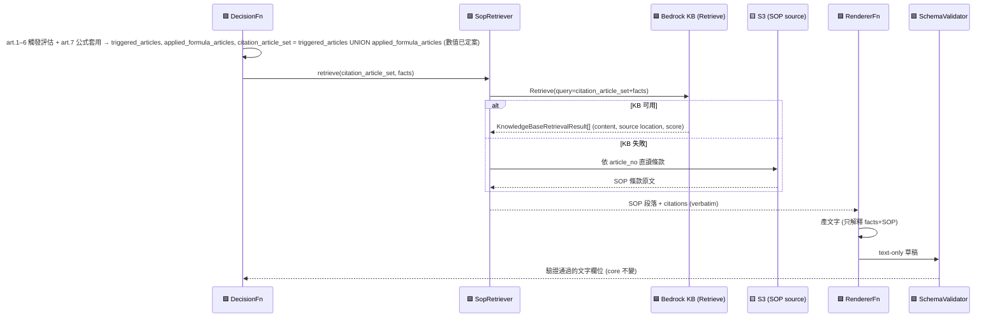
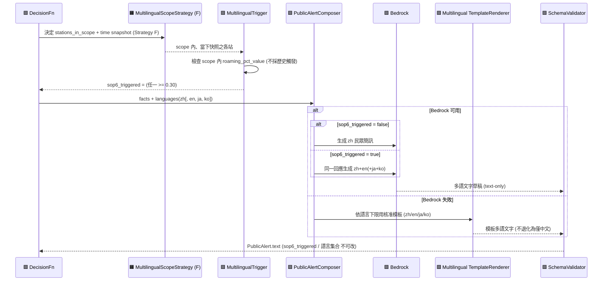
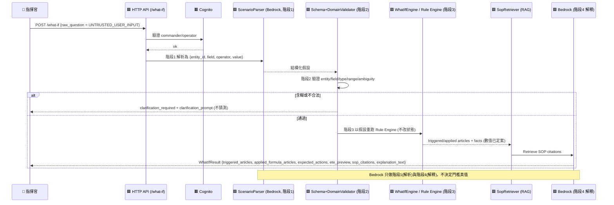
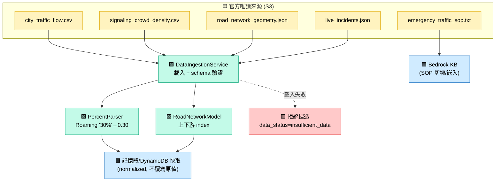
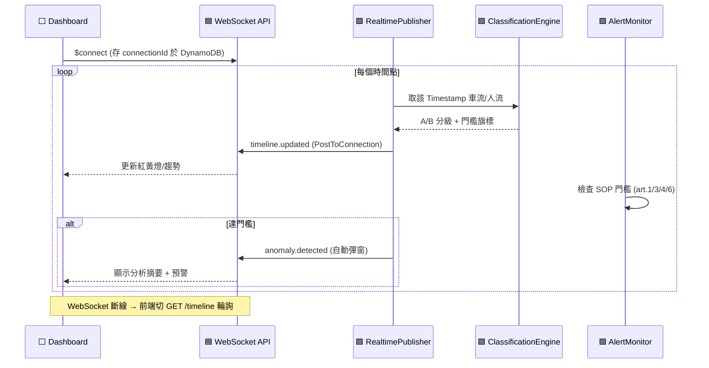
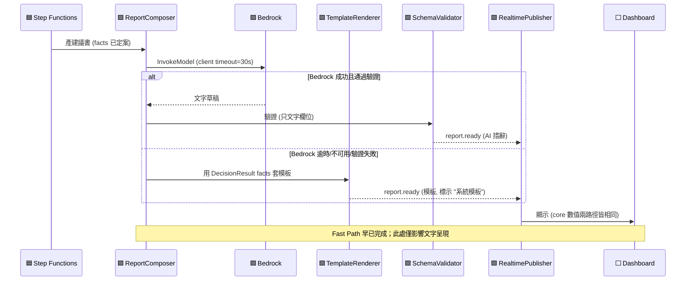
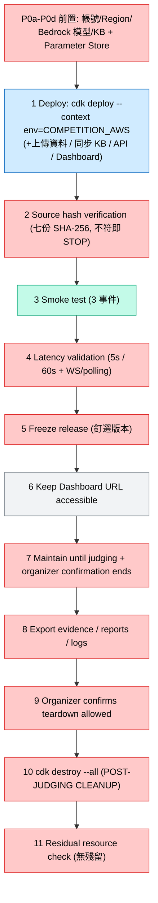

# 技術設計文件 (Technical Design Document)

**Design Status**: `RECOVERED_AND_AMENDED_BY_HG-001_PENDING_READ_ONLY_REVIEW`  
**Amendment**: `HG-001` (2026-07-24)  
**Implementation Authorization**: `NOT_AUTHORIZED_PENDING_READ_ONLY_REVIEW`

## 智慧交通指揮系統 — City Response Commander

> 本文件為 `city-response-commander` 之技術設計，對應同目錄 `requirements.md`。
> 撰寫語言為繁體中文；AWS 服務名稱、API 名稱、欄位名稱與程式識別字保留英文。
> 本文件僅描述「如何設計」，不建立 `tasks.md`、產品程式碼或任何 AWS 資源。

### HG-001 Organizer Guidance Amendment Record

| Field | Value |
|---|---|
| `guidance_id` | `HG-001` |
| `guidance_date` | `2026-07-24` |
| `authority_class` | `ORGANIZER_WRITTEN_GUIDANCE` |
| `implementation_uniqueness` | `NON_UNIQUE` |
| `selected_policy_class` | `ORGANIZER_GUIDED_TEAM_POLICY` |
| `runtime_official_source` | `false` |
| `official_sop_amendment` | `false` |
| `seven_source_manifest_member` | `false` |

HG-001 是主辦方書面實作指引，不是新的 SOP 條文，不是第八個 Runtime 官方來源，也不變更七份官方來源雜湊。團隊採用決定性、可重現、可配置的政策，並於 Dashboard、EvidenceTrace 與報告揭露 event time、cutoff、observation time、staleness、road set、inputs、formula、assumptions 與 `guidance_id`。

**OQ 狀態**：
- OQ-001、OQ-002、OQ-003：`RESOLVED_FOR_IMPLEMENTATION_BY_ORGANIZER_GUIDANCE`
- OQ-005：`PARTIALLY_RESOLVED_BY_ORGANIZER_GUIDANCE`，僅時間維度；station-set 範圍仍 OPEN
- OQ-004、OQ-006..OQ-011：`OPEN / AWAITING_HOST_REPLY`

### 權威順序與正式來源真相 (Authority Order & Formal Source of Truth)

**正式來源真相順序 (Formal Source of Truth)** — 供來源鑑真、版本裁決與雜湊驗證之用：

1. **官方 PDF**（命題文件之官方 PDF 原件；命題解說之正式形式為 DOCX，**非** PDF）
2. **官方 DOCX**（命題解說之官方 DOCX 原件）
3. **`emergency_traffic_sop.txt`**（7 條明文 SOP 規則）
4. **官方 CSV / JSON**（`city_traffic_flow.csv`、`signaling_crowd_density.csv`、`road_network_geometry.json`、`live_incidents.json`）

> **正式官方來源恰為七份**（見 §3.1 與 §10.0 之 `SubmissionProvenanceManifest`）：命題文件 PDF、命題解說 DOCX、`city_traffic_flow.csv`、`signaling_crowd_density.csv`、`road_network_geometry.json`、`emergency_traffic_sop.txt`、`live_incidents.json`。命題解說之官方形式為 **DOCX**（非 PDF）；官方 **PDF** 專指**命題文件**。**不得**將命題解說之任何 PDF 版本列為正式來源。

**鏡像檔案非真相來源 (mirrors are NOT source of truth)**：任何 `.md`（例如 `命題解說 .md`）或 `docx_extracted.txt` 皆屬 `DERIVED_SEARCHABLE_MIRROR`，其性質標記為 `NOT_SOURCE_OF_TRUTH`。這類鏡像僅供人類檢索與閱讀之便，**不得取代亦不得代表**上述任一正式來源檔案；正式判讀一律回到官方 PDF / DOCX / SOP / CSV / JSON 原件，鏡像**不得作為官方 PDF/DOCX 之替身或表述**。

**功能性分工 (functional split，不可混淆)**：
- **SOP（`emergency_traffic_sop.txt`）之條件、AND/OR 邏輯、數值門檻與處置步驟，驅動決策引擎**——decision engine 的一切數值/布林真值以 SOP 為準。
- **官方 PDF / DOCX 定義產品範疇、功能模組與交付要求**（product scope / features / delivery），不用以改寫 SOP 的判定數值。
- **官方 CSV / JSON** 為資料事實（唯讀輸入）。

**衝突裁決**：當設計細節彼此衝突時，先依「功能性分工」判斷應以何來源為準——涉及判定邏輯 / 數值一律以 SOP 為準，涉及產品範疇 / 功能一律以 PDF / DOCX 為準；其餘依「正式來源真相順序」裁決。`requirements.md` 與本設計文件位於全部官方來源之後，**不得凌駕**任何官方檔案。

**雜湊防呆**：系統於部署 / 啟動時對每一正式來源檔案計算 SHA-256 並與 `OfficialSourceManifest`（§10.0）比對；**任一檔案雜湊不符即中止（STOP）決策流程並回報**，絕不在版本未知的情況下靜默使用（見 §10.0、§15、§21）。

### 圖例 (Global Legend)

本文件所有 Mermaid 圖沿用同一套顏色與標記語意：

| 標記 | 語意 | 樣式 (class) |
| --- | --- | --- |
| 🟦 AWS-managed | AWS 代管服務（不含自研邏輯） | `aws` |
| 🟩 deterministic-code | 決定性程式碼（掌管全部數值/布林真值） | `det` |
| 🟪 Bedrock-LLM | Amazon Bedrock 自然語言生成（僅產文字） | `llm` |
| 🟨 official-raw-data | 官方唯讀原始資料 | `data` |
| 🟧 provisional-policy | 暫定團隊政策（可抽換 Strategy） | `prov` |
| ⬜ Dashboard | React/TS 前端儀表板 | `dash` |
| 🟥 observability+security | 可觀測性與安全（Logs/Metrics/Trace/IAM/Auth） | `obs` |

---

## 1. Executive Summary（執行摘要）

`city-response-commander` 是一套 **Dashboard 決策中樞**（非對話機器人），具備「自動感知」與「互動決策」兩種能力。系統沿時間軸自動讀取官方車流與電信信令資料、依 SOP 7 條規則判定事件級別與應變處置，並在突發事件注入後於 **60 秒內** 完成路網重規劃、產出「交控中心建議書」與「多語化民眾簡訊」，同時於儀表板展示可稽核的推理與 SOP 引用。

本設計的核心原則是一條**明確且不可跨越的界線**：

- **決定性程式碼（Deterministic Engine）擁有一切數值與布林真值**：資料解析、百分比解析、時間序列選取、A/B 分級、SOP 觸發（AND/OR）判定、替代路徑候選來源、容量檢查、直接相交檢查、上/下游判定、主/次疏散選擇、Saturation 排序、ETE 公式、多語觸發布林、Evidence Trace、延遲量測。
- **Amazon Bedrock 只擁有自然語言**：以 RAG 為依據的解釋、建議書措辭、民眾警示措辭、zh/en/ja/ko 生成、What-if 的自然語言互動；Bedrock **只能填寫文字欄位**，永不重算 ETE、永不更動 A/B 級別、永不更改主疏散道路、永不虛構道路或 SOP。

系統執行環境為 **AWS-only**，所有生成式 AI 一律經由 **Amazon Bedrock**。設計以三種環境設定檔（LOCAL_MOCK / PERSONAL_AWS_DEV / COMPETITION_AWS）保證可在本機示範、於團隊自有帳號開發、並於主辦 8/1–8/2 競賽帳號快速部署與拆除。HG-001 已將 OQ-001、OQ-002、OQ-003 解決供實作，並部分解決 OQ-005 的時間維度。這些 organizer-guided policies 仍維持可配置，因主辦方未指定唯一演算法。OQ-004、OQ-006..OQ-011 與 OQ-005 的 station-set 維度繼續由 Strategy 介面或 `PARTIALLY_DEFINED` 標記封裝，狀態為 `OPEN / AWAITING_HOST_REPLY`。

延遲採**雙路徑**設計：Fast Path 先以決定性結果輸出初步警示與核心決策（TEAM_TARGET：偵測→初步民眾警示 ≤ 5 秒，非官方硬指標）；Enrichment Path 隨後補上 Bedrock 解釋、多語與完整報告。**Bedrock 失敗不得阻擋 Fast Path。**

### 交付範圍界線

- 本文件為 HG-001 修復與設計同步版本。
- 本修復不建立產品程式碼、不建立或部署 AWS 資源。
- OQ-001、OQ-002、OQ-003 僅依主辦方書面指引解決供實作；OQ-005 僅部分解決；其餘 OQ 保持 OPEN。

---

## 2. Requirements Mapping（需求對應）

下表將 `requirements.md` 之 17 項需求對應到本設計元件、負責的執行主體（決定性 vs Bedrock）、對應之正確性屬性（§22.1 之 P1–P37），以及主要落點章節。**「正確性屬性 (Property)」欄為 R1–R17 對 Property 之權威對映**（取代先前 renumbering 前的舊屬性編號）；欄中出現之每一 Property 皆存在於 §22.1（P1–P37）。

| 需求 | 摘要 | 主要負責元件 | 執行主體 | 正確性屬性 (Property) | 主要落點章節 |
| --- | --- | --- | --- | --- | --- |
| R1 多源數據整合與唯讀存取 | 讀取 5 檔、欄位語意、百分比解析、時間軸讀取、唯讀 | `DataIngestionService`、`SnapshotSelector` | 決定性 | P1, P2, P3, P34 | §6, §8, §9, §10, §22.1 |
| R2 交通擁塞級別判定 (SOP1) | A/B 分級、邊界 0.85/0.95、全 15 路段 | `ClassificationEngine` | 決定性 | P4 | §9, §22.1 |
| R3 城市應變觸發路段 (SOP1) | RD_TPE_001/002 之 B/A 級處置 | `RuleEngine.article1` | 決定性 | P5 | §9, §22.1 |
| R4 動態時序監測儀表板 (模組1) | 即時視覺化、門檻自動彈窗、紅黃燈 | `DashboardService`、`AlertMonitor` | 決定性 + Dashboard | P6, P7 | §16, §8, §22.1 |
| R5 事件注入與 60 秒重規劃 (模組2) | 注入介面、RAG 取 SOP、60 秒重規劃、避開飽和/容量不足 | `IncidentOrchestrator`、`RuleEngine`、`EvacuationSelector`、`RealtimePublisher` | 決定性（+Bedrock 解釋） | P33 + latency/integration tests | §6, §12, §20, §22.1, §22.2 |
| R6 車禍主疏散推理 (SOP2) | 三要件觸發、三項篩選、最低 Saturation、下游次要、CMS 文字 | `RuleEngine.article2`、`EvacuationSelector` | 決定性 | P8–P12, P25, P37 | §9, §22.1 |
| R7 路網幾何語意 | alternatives 單向、空 nearby 正常、上下游排序 | `RoadNetworkModel` | 決定性 | P13–P15 | §9, §10, §22.1 |
| R8 捷運接駁分流 (SOP3) | BL17 Growth>0.30 或 Count>25000、邊界 25000/25001/0.30 | `RuleEngine.article3` | 決定性 | P16 | §9, §22.1 |
| R9 大巨蛋散場 (SOP4) | 歷史峰值≥30000 且當前 Growth≤-0.20 | `RuleEngine.article4` | 決定性 | P17 | §9, §22.1 |
| R10 號誌故障 (SOP5) | type=Power_Failure 或描述含故障、人工指揮建議 | `RuleEngine.article5` | 決定性（+Bedrock 措辭） | P18, P19, P31 | §9, §22.1 |
| R11 數位通報多語觸發 (SOP6) | 任一 Roaming≥30%、同回應多語、時間格式 | `RuleEngine.article6`、`MultilingualTrigger` | 決定性觸發 + Bedrock 生成 | P20, P21, P32, P36 | §9, §14, §22.1 |
| R12 ETE 計算 (SOP7) | 公式、base_clearance、penalty、負值以 0 計 | `ETECalculator` | 決定性 | P22, P23 | §9, §22.1 |
| R13 交控中心建議書 | 事件辨識/分級/路徑/號誌/聯動/ETE、格式不拘 | `ReportComposer` + Bedrock | 決定性資料 + Bedrock 措辭 | P24, P27, P37 | §9, §14, §22.1 |
| R14 多語化民眾簡訊 | 觸發判定、要點、可讀性、格式不拘 | `PublicAlertComposer` + Bedrock | 決定性資料 + Bedrock 措辭 | P20, P21, P25, P29, P36 | §9, §14, §22.1 |
| R15 AI 決策推理與解釋鏈 (模組4) | 展示推理、排除理由、引用 SOP | `EvidenceTrace` + Bedrock | 決定性事實 + Bedrock 解釋 | P26, P27 | §9, §14, §16, §22.1 |
| R16 What-if 顧問 (模組3) | 對話視窗、假設條件即時檢索、引用 SOP | `WhatIfEngine` + Bedrock | 決定性重算 + Bedrock 措辭 | P28, P35 | §9, §12, §14, §22.1 |
| R17 加分項目 (選配) | Dashboard 設計、ja/ko 多語 | `DashboardService`、`MultilingualTrigger` | Dashboard + Bedrock | P29 + UI visual/snapshot tests | §16, §14, §22.1 |

Open Questions 於仍需維持可配置性的範圍內，以 Strategy 介面或 `PARTIALLY_DEFINED` 標記承接（§11）。HG-001 已解決 OQ-001、OQ-002、OQ-003 供實作，並僅部分解決 OQ-005 的時間維度。OQ-004、OQ-006..OQ-011，以及 OQ-005 的 station-set 維度，維持 `OPEN / AWAITING_HOST_REPLY`。權威狀態矩陣見 §29。

### 2.1 Cursor REQ ↔ Kiro R Crosswalk（完整 32 列對映）

**Baseline Provenance（基準來源佐證與雜湊驗證）** — 本 crosswalk 之權威基準來源鑑真資訊：

| 欄位 | 值 |
| --- | --- |
| `baseline_reference_path` | `.kiro/specs/city-response-commander/references/cursor_requirements_baseline.md` |
| `baseline_version` | `2.1 (FINAL BASELINE)` |
| `baseline_status` | `LOCKED_PENDING_HOST_REPLIES` |
| `baseline_size_bytes` | `36179` |
| `baseline_sha256` | `E6BC97168BA683533FB91D76E1B3997DED071D0D265D223EA05D03630F436398` |
| `verification_status` | `VERIFIED_BY_OPERATOR` |

> 上表 `baseline_sha256` 為 64 字元 SHA-256（大寫十六進位），供比對 `references/cursor_requirements_baseline.md` 內容完整性；任一不符即該基準視為未驗證，crosswalk 對映不予採用。

> **基準來源**：外部 Cursor Requirements Baseline `references/cursor_requirements_baseline.md`（Version 2.1 FINAL BASELINE、`LOCKED_PENDING_HOST_REPLIES`、恰 32 條 `REQ-001..032`、無缺號、無重複）。本 crosswalk 將每一條 Cursor REQ 對映至本設計之 Kiro 需求（R1–R17）、設計元件、章節、資料模型、API/事件合約、正確性屬性（P1–P37）、Golden/邊界測試，以及**既有**開放問題（**OQ-001..OQ-011**，沿用 §29 之編號，不另立新號）。
>
> **coverage_status enum（僅此五種）**：`FULLY_COVERED`｜`PARTIALLY_COVERED`｜`NOT_COVERED`｜`DELIVERABLE_ONLY`｜`BONUS_ONLY`。
>
> **判定規則**：僅當該 REQ 有**具體設計落地**（component + section + property/test）時方標 `FULLY_COVERED`；僅因存在對應 Kiro R 編號**不足以**宣稱涵蓋。`mapped_open_questions` 遵循 HG-001 狀態矩陣：OQ-001、OQ-002、OQ-003 已解決供實作；OQ-005 僅部分解決其時間維度；OQ-004 與 OQ-006..OQ-011 維持完全開放。`DELIVERABLE_ONLY`（交付物）與 `BONUS_ONLY`（加分項）皆已有設計落地（§6/§24/§25/§25.1 及 §8/§16/§14.4/§21.3），屬**合法涵蓋**，**不得**報告為核心系統設計缺漏。
>
> **不改動 Cursor 需求原文**：本 crosswalk 僅新增對映，未修改 `references/cursor_requirements_baseline.md` 或 `requirements.md`；亦未重新設計已核定之 AWS 架構。針對原設計未明列落點之交付物（REQ-025 GitHub、REQ-029 影片），僅於 §25.1 新增最小必要之「Deliverables → design landing」對照（不新增任何 AWS 資源）。

| cursor_requirement_id | cursor_requirement_title | cursor_requirement_summary | mapped_kiro_requirement_ids | mapped_design_components | mapped_design_sections | mapped_data_models | mapped_api_or_event_contracts | mapped_test_properties | mapped_golden_or_boundary_tests | mapped_open_questions | coverage_status | gap_resolution |
| --- | --- | --- | --- | --- | --- | --- | --- | --- | --- | --- | --- | --- |
| REQ-001 | Dashboard 即時車流人流視覺化 | 沿時間軸展示車流(CSV)與人流(信令)資料 | R1, R4 | `DashboardService`, `DataIngestionService`, `SnapshotSelector` | §8, §16.1, 圖5 | `RawTrafficRecord`(§10.1), `RawCrowdRecord`(§10.2) | GET /timeline, GET /roads, GET /crowd；`timeline.updated` | P1, P7, P34 | 燈號渲染/時間正規化單元+屬性(§22.2) | OQ-001 | FULLY_COVERED | — |
| REQ-002 | 異常自動彈窗預警 | 達 SOP 門檻自動彈出分析摘要與預警 | R4 | `AlertMonitor` | §16.2, 圖5 | `RuleEvaluation`(§10.7) | `anomaly.detected`（fallback: GET /roads, /crowd 比對門檻） | P6 | 門檻邊界(0.85/25000/30% 等)屬性產生器 | OQ-001, OQ-005 | FULLY_COVERED | — |
| REQ-003 | 事件注入介面 | 管理員將 live_incidents 事件注入系統 | R5 | `InjectFn`/`IdempotencyGateFn`, `IncidentOrchestrator` | §12, §16.3, 圖6, 圖7 | `Incident`(§10.4), `IdempotencyTable`(§10.11e) | POST /incidents/{id}/inject；`incident.injected` | P33 | 冪等重試測試(§22.3) | — | FULLY_COVERED | — |
| REQ-004 | 60 秒內路網重規劃 | 收到事故後 60 秒內完成重規劃並更新畫面 | R5 | `IncidentOrchestrator`, `RuleEngine`, `EvacuationSelector`, `RealtimePublisher` | §20(延遲預算), 圖8 | `LatencyTrace`(§10.16) | `decision.fast_path_ready`, `decision.enriched` | 非 PBT（延遲屬整合/延遲測試，見 §22.1 說明） | Latency 測試層(§22.2)；`EndToEndLatencyMs`≤60s | OQ-001 | FULLY_COVERED | — |
| REQ-005 | 避開已飽和之路段 | 重規劃避開飽和/容量不足並揭露壅塞 | R5, R6 | `EvacuationSelector` | §9.4(art.2), §11.7 | `RouteCandidate`(§10.8) | 經 GET /decisions/{id} 揭露 `saturation_at_snapshot` | P9, P11 | TC-SOP2-001..002(capacity 1000)；ACC_001 Golden | OQ-008 | PARTIALLY_COVERED | 「PDF 避開飽和」與「SOP-2 壅塞主疏散仍維持」之 precedence 為 **OQ-008 `PARTIALLY_DEFINED`（未經主辦確認）**。已於 §11.7 落地暫定調和（避開飽和＝候選偏好/排序階段軟性精神；維持壅塞主疏散＝選定後處置階段硬性規則），並以 P11／§11.7 落實「揭露所選路徑壅塞」。gap：`confirmed precedence` 待主辦回覆 OQ-008；在此之前不宣稱為官方規則、不將 Saturation 變為 art.2 第四道硬篩，暫定揭露已就位。 |
| REQ-006 | What-if 對話式問答 | 對話視窗輸入模擬指令/假設性問題 | R16 | `ScenarioParser`, `WhatIfEngine` | §14.5, 圖10 | `WhatIfRequest`(§10.14), `WhatIfResult`(§10.15) | POST /what-if | P28, P35 | What-if 4 階段測試；含糊即 `clarification_required` | OQ-009 | FULLY_COVERED | — |
| REQ-007 | SOP 邏輯驗證 | 依假設檢索 SOP、回答觸發條款與預期動作 | R16 | `WhatIfEngine`/`RuleEngine`, `SopRetriever` | §14.5, §14.2 | `WhatIfResult`(§10.15) | POST /what-if | P28, P35 | RAG citation 測試(§22.2) | OQ-009 | FULLY_COVERED | — |
| REQ-008 | 判定依據展示 | 展示推理過程、引用資料、排除替代道路理由 | R15 | `EvidenceTraceBuilder`, `DashboardService` | §9, §9.2(界線圖), §16 | `EvidenceTrace`(§10.10) | GET /decisions/{id} | P26, P27 | RAG citation(§22.2)；解釋鏈完整性(P26) | OQ-004, OQ-009 | FULLY_COVERED | — |
| REQ-009 | ETE 公式運算 | 依事故嚴重度即時計算並顯示 ETE | R12 | `ETECalculator` | §9.4(art.7), §11.3, §20 | `ETEResult`(§10.9) | GET /decisions/{id} 之 `ete` | P22, P23 | ACC_001 ETE=78.6(HG-001 SELECTED POLICY) | OQ-001, OQ-003 | FULLY_COVERED | — |
| REQ-010 | 多語化通報觸發 | 任一站漫遊率≥30% 自動產多語告警 | R11 | `MultilingualTrigger`, `MultilingualScopeStrategy`(F) | §14.4, §11.8, 圖11 | `PublicAlert`(§10.13) | `public_alert.ready` | P20, P32 | TC-SOP6-001..002 | OQ-005 | FULLY_COVERED | — |
| REQ-011 | SOP-1 交通擁塞級別判定 | A/B 分級(全 15 路段) + 觸發路段處置 | R2, R3 | `ClassificationEngine`, `RuleEngine.article1` | §9.4(art.1) | `DecisionCore.classifications`/`art1_measures`(§10.11a) | GET /roads | P4, P5, P7 | TC-SAT-001..004 | — | FULLY_COVERED | — |
| REQ-012 | SOP-2 車禍與路障應變觸發條件 | 三要件 AND(status/severity/RD_) 觸發 art.2 | R6 | `RuleEngine.article2` | §9.4(art.2) | `RuleEvaluation`(§10.7) | 內部評估（結果經 GET /decisions/{id}） | P8 | ACC_001 Golden(triggered_articles 含 2) | — | FULLY_COVERED | — |
| REQ-013 | SOP-2 主疏散路徑選擇 | 三項篩選、最低 Saturation 主疏散、下游列次要 | R6 | `EvacuationSelector`, `IncidentAnchorResolutionStrategy`(D) | §9.4, §9.5, §11.5 | `RouteCandidate`(§10.8), `IncidentAnchor`(§10.8a) | GET /decisions/{id} | P9, P10, P30 | ACC_001 Golden(主 RD_TPE_004/次 RD_TPE_005, PROVISIONAL)；TC-SOP2-001..002 | OQ-001, OQ-004, OQ-006, OQ-007, OQ-008 | FULLY_COVERED | — |
| REQ-014 | SOP-2 主疏散壅塞處理 | 壅塞主疏散仍維持 + 長綠燈 + 併行大眾運輸 | R6 | `EvacuationSelector` | §9.4(art.2), §11.7 | `RouteCandidate`(§10.8) | GET /reports/{id} | P11 | ACC_001 Golden；§11.7 壅塞處置 | OQ-008 | FULLY_COVERED | — |
| REQ-015 | SOP-2 CMS 官方文字格式 | 產出固定格式 CMS 文字(封閉/改道/延誤) | R6 | `ReportComposer`, `SchemaValidator` | §10.11b, §14.3, §21.3 | `DecisionCore.cms_core_text`(§10.11a/b) | GET /reports/{id} 之 `cms_section` | P25, P37 | CMS 模板範例(§21.3)；權限分離(P37) | OQ-003 | FULLY_COVERED | — |
| REQ-016 | SOP-3 捷運與接駁分流 | BL17 Growth>0.30 或 Count>25000 觸發+處置 | R8 | `RuleEngine.article3` | §9.4(art.3) | `RuleEvaluation`(§10.7) | GET /crowd | P16 | TC-SOP3-001..004 | OQ-001, OQ-002 | FULLY_COVERED | — |
| REQ-017 | SOP-4 大巨蛋散場啟動 | 歷史峰值≥30000 且 Growth≤-0.20 連動 art.3 | R9 | `RuleEngine.article4` | §9.4(art.4) | `RuleEvaluation`(§10.7) | GET /crowd | P17 | DOME Golden(峰值 40000、growth −0.31, §22.3) | OQ-001 | FULLY_COVERED | — |
| REQ-018 | SOP-5 號誌故障應變 | 人工指揮建議(每路口 2 人)+CMS 加註 | R10 | `RuleEngine.article5`, `AffectedIntersectionScopeStrategy`(E) | §9.4(art.5), §11.6 | `AffectedIntersectionScope`(§10.9a) | GET /reports/{id} | P18, P19, P31 | EVT_003 Golden | OQ-010, OQ-011 | FULLY_COVERED | — |
| REQ-019 | SOP-6 數位通報與多語化 | 任一 Roaming≥30% 同回應多語 + 時間格式 | R11 | `RuleEngine.article6`, `MultilingualTrigger` | §9.4(art.6), §11.8 | `PublicAlert`(§10.13) | `public_alert.ready` | P20, P21, P32 | TC-SOP6-001..002 | OQ-005 | FULLY_COVERED | — |
| REQ-020 | SOP-7 ETE 公式完整定義 | 完整 ETE 公式 + 報告註明數值與依據 | R12 | `ETECalculator` | §9.4(art.7) | `ETEResult`(§10.9) | GET /decisions/{id} 之 `ete` | P22, P23 | ACC_001 ETE=78.6(HG-001) | OQ-003 | FULLY_COVERED | — |
| REQ-021 | 交控中心建議書內容 | 事件辨識/分級/路徑/號誌/聯動/ETE | R13 | `ReportComposer` | §10.12, §14.3 | `CommandCenterReport`(§10.12), `DecisionReadModel`(§10.11c) | GET /reports/{id}；`report.ready` | P24 | 建議書完整性(P24)；ACC_001/EVT_003 Golden | OQ-003, OQ-010, OQ-011 | FULLY_COVERED | — |
| REQ-022 | 多語化民眾簡訊內容 | 觸發判定 + 要點(位置/改道/延誤/避險) + 可讀性 | R14 | `PublicAlertComposer` | §10.13, §14.4 | `PublicAlert`(§10.13), `DecisionNarrative`(§10.11b) | `public_alert.ready`；POST /decisions/{id}/publish | P25, P20 | 簡訊完整性(P25)；多語觸發(P20) | OQ-003, OQ-005 | FULLY_COVERED | — |
| REQ-023 | 提案簡報 AWS 架構圖 | 交付物：簡報含解題/AI/資料/流程/AWS 架構圖 | none（deliverable） | 交付物（非執行時元件） | §6(AWS Architecture 圖2), §4, §25(步驟8 匯出架構圖), §25.1 | — | — | — | 部署後佐證匯出(§25 步驟2/8) | — | DELIVERABLE_ONLY | 非核心系統設計；AWS 架構圖已落地於 §6 圖2 與 §4 服務決策矩陣，並於 §25.1「Deliverables → design landing」明列，屬合法涵蓋（非缺漏）。 |
| REQ-024 | Dashboard 部署網址 | 交付物：提供可存取之部署 URL | none（deliverable） | 交付物（Amplify Hosting / S3+CloudFront） | §4.9, §24, §25(步驟1 部署/步驟6 保持 URL 可存取), §25.1 | — | — | — | Competition smoke(§25 步驟3) | — | DELIVERABLE_ONLY | 非核心系統設計；前端託管與部署 URL 已落地於 §4.9/§24 與 §25 步驟6，並於 §25.1 明列，屬合法涵蓋。 |
| REQ-025 | GitHub 完整原始碼 | 交付物：提供 GitHub 完整原始碼連結 | none（deliverable） | 交付物（IaC/CDK 與應用程式碼產物） | §24, §25.1 | — | — | — | LOCAL_MOCK 可離線重現(§23) | — | DELIVERABLE_ONLY | 原設計未明列 GitHub 交付落點 → 已於 §25.1 新增最小必要落地（IaC/CDK 單一 repository + §23 可重現部署），不新增 AWS 資源；屬合法涵蓋，非核心設計缺漏。 |
| REQ-026 | 替代路徑單向性 | alternatives 單向、不可假設對稱/對稱圖搜索 | R7 | `RoadNetworkModel` | §9.4, §10.3 | `RoadSegment`(§10.3) | 內部路網模型 | P13 | alternatives 單向不對稱屬性(P13) | — | FULLY_COVERED | — |
| REQ-027 | nearby_stations 空陣列為正常 | 空陣列視為正常、不自行補填 | R7 | `RoadNetworkModel` | §10.3 | `RoadSegment`(§10.3) | 內部路網模型 | P14 | 空 nearby 維持空集合屬性(P14) | — | FULLY_COVERED | — |
| REQ-028 | intersections 上游下游排序 | 依 intersections(上游→下游)+flow_direction 判定 | R7 | `RoadNetworkModel`, `IncidentAnchorResolutionStrategy`(D) | §10.3, §11.5 | `RoadSegment`(§10.3), `RouteCandidate`(§10.8) | 內部路網模型 | P15, P30 | 上下游判定屬性(P15)；錨點解析(P30) | OQ-004, OQ-006 | FULLY_COVERED | — |
| REQ-029 | 錄製展示影片 | 交付物：提供錄製之 Demo 影片 | none（deliverable） | 交付物（提交作業產物） | §25(步驟3 smoke/步驟8 Export evidence), §25.1 | — | — | — | Smoke test 可作錄製腳本(§25 步驟3) | — | DELIVERABLE_ONLY | 原設計未明列影片交付落點 → 已於 §25.1 新增最小必要落地（以 §25 步驟3/8 之 smoke/evidence 流程為錄製依據）；屬合法涵蓋，非核心設計缺漏。 |
| REQ-030 | Dashboard 外觀直觀性與設計性 | 加分：UI 直觀性與視覺設計品質 | R17 | `DashboardService` | §8, §16 | — | 前端 UI（React/TS SPA） | 無（UI 外觀非 PBT，見 §22.1 說明） | 快照/視覺測試(非 PBT) | — | BONUS_ONLY | 加分項；已於 §8/§16 之 `DashboardService` UI 提供設計落地，屬合法涵蓋，**不得**報告為核心系統設計缺漏。 |
| REQ-031 | 多語化通報支援中英以外語言 (加分) | 加分：ja/ko 等中英以外語言 | R17 | `MultilingualTrigger`, `PublicAlertComposer` | §14.4(ja/ko 模板), §11.8, §21.3 | `PublicAlert`(§10.13) | `public_alert.ready` | P29 | ja/ko 模板(§21.3)；加分語言屬性(P29) | — | BONUS_ONLY | 加分項；ja/ko 多語已落地於 §14.4 生成 + §21.3 決定性核准模板 + P29，屬合法涵蓋，**不得**報告為核心系統設計缺漏。Cursor 鎖定之 REQ-031 無 Open Question 依賴（`mapped_open_questions = —`）；OQ-005 由 REQ-002/010/019/022 承載。 |
| REQ-032 | 官方交付完整性 | 三項官方交付齊備(簡報/Dashboard/GitHub) | none（deliverable） | 交付物彙整 | §3, §6, §25(全生命週期 11 階段), §25.1 | — | — | — | 競賽部署生命週期(§25) | — | DELIVERABLE_ONLY | 非核心系統設計；三項交付彙整落地於 §25 全生命週期 + §6 架構 + §25.1 交付落地表，屬合法涵蓋（非缺漏）。 |

#### 2.1.1 Crosswalk Summary（對映統計）

| 統計項 | 值 |
| --- | --- |
| `cursor_req_total` | 32 |
| `crosswalk_row_total` | 32 |
| `unique_cursor_req_ids` | 32 |
| `missing_cursor_req_ids` | `[]`（無缺號） |
| `duplicate_cursor_req_ids` | `[]`（無重複） |
| `fully_covered_count` | 24（REQ-001..004, 006..022, 026..028） |
| `partially_covered_count` | 1（REQ-005） |
| `not_covered_count` | 0 |
| `deliverable_only_count` | 5（REQ-023, 024, 025, 029, 032） |
| `bonus_only_count` | 2（REQ-030, 031） |

**coverage_rate 公式（明確定義）**：

```
coverage_rate = (fully_covered_count + deliverable_only_count + bonus_only_count(具設計落地)) / cursor_req_total
              = (24 + 5 + 2) / 32
              = 31 / 32
              ≈ 96.9%
```

**判讀說明**：

- `DELIVERABLE_ONLY`（5 項：提案簡報／部署 URL／GitHub／影片／交付完整性）與 `BONUS_ONLY`（2 項：Dashboard 外觀／日韓多語）**皆具明確設計落地**（§6/§24/§25/§25.1 與 §8/§16/§14.4/§21.3），依定義屬**合法涵蓋**，**非**核心系統設計缺漏，故計入 coverage_rate 分子。
- `PARTIALLY_COVERED`（REQ-005）**不**計入分子：其暫定落地（§11.7 + P11 揭露壅塞）已就位，唯一未決者為 **OQ-008 precedence 待主辦確認**——屬「有落地但待主辦回覆」，**非**「無落地之真缺口」。
- `not_covered_count = 0`：本 crosswalk 中無任何 REQ 為「無設計落地之真缺口」。`mapped_open_questions` 依 §29 顯示 HG-001 狀態：OQ-001/002/003 resolved for implementation、OQ-005 partially resolved、其餘 7 項 OPEN。

---

## 3. Assumptions and Authority（假設與權威）

### 3.1 官方事實（immutable，取自 CSV/JSON/SOP，不得改動）

- **五個執行時資料/SOP 輸入檔案**（`RuntimeDecisionSourceManifest`）與其欄位定義以命題解說為準（R1）。系統一律唯讀。此五檔為：`city_traffic_flow.csv`、`signaling_crowd_density.csv`、`road_network_geometry.json`、`emergency_traffic_sop.txt`、`live_incidents.json`（2 CSV + 道路 JSON + SOP txt + 事件 JSON）。
- **正式官方來源恰為七份**（`SubmissionProvenanceManifest`，見 §10.0）：上述 5 個執行時輸入，**外加**（1）命題文件之官方 **PDF**、（2）命題解說之官方 **DOCX**。命題解說之官方形式為 **DOCX**，**不得**將命題解說之任何 PDF 版本列為正式來源。`RuntimeDecisionSourceManifest`（決策執行時讀取的 5 檔）與 `SubmissionProvenanceManifest`（交付佐證用的 7 份官方來源）為**兩個不同用途的清單**，不可混為一談。
- **SOP 數值邊界**：分級 B 為 `0.85 <= Saturation_Score < 0.95`、A 為 `>= 0.95`；SOP3 為 `Growth_Rate > 0.30` 或 `User_Count > 25000`；SOP4 為歷史峰值 `>= 30000` 且當前 `Growth_Rate <= -0.20`；SOP6 為 `Roaming_User_Pct >= 30%`；SOP7 `base_clearance` Critical=60/High=40/Medium=20、`congestion_penalty = (avg Saturation - 0.5) * 60`（負值以 0 計）、容量門檻 `capacity_vph >= 1000`。
- **三個官方事件**：`TPE_2026_ACC_001`（RD_TPE_002、Closed、Critical、22:10 → SOP2 + ETE）、`TPE_2026_EVT_002`（BS_MRT_BL17、affected_road=RD_TPE_001、Restricted、High、22:20 → SOP3）、`TPE_2026_EVT_003`（type=Power_Failure、RD_TPE_007、22:30 → SOP5）。
- **時間格式** 一律 `YYYY-MM-DD HH:MM`（SOP6）。

### 3.2 團隊暫定假設（PROVISIONAL，可抽換，AWAITING_HOST_REPLY）

完整 OQ 狀態見 §29。HG-001 已解決 OQ-001/002/003 供實作並部分解決 OQ-005；其餘未解決議題以 Strategy 介面或 `PARTIALLY_DEFINED` 標記封裝，且不得宣稱為唯一官方規則。Strategy 介面承接者包括：

- **Strategy A — 事件時間對齊**（對應 **OQ-001**，R1）
- **Strategy B — 人流事件 affected_road 用途**（對應 **OQ-002**，R8）
- **Strategy C — ETE 受影響路段集合**（對應 **OQ-003**，R12）
- **Strategy D — 事故錨點解析**（對應 **OQ-004**，R6）
- **Strategy E — SOP5 受影響路口範圍**（對應 **OQ-010**，R10）
- **Strategy F — SOP6「任一基地台」站集與時間快照**（對應 **OQ-005**，R11）

其餘 **OQ-006**（intersection 標籤無 segment_id）、**OQ-007**（無合規替代道路）、**OQ-008**（PDF 飽和 vs SOP 壅塞調和）、**OQ-009**（What-if LLM/決定性邊界）、**OQ-011**（SOP5 持續時間 vs SOP7 ETE）以 `PARTIALLY_DEFINED` / 暫定策略承接（§11、§29）。

### 3.3 AWS 研究來源聲明

§4 的 AWS 服務決策矩陣所引用之服務能力、配額、預設值等事實，係本團隊透過 **AWS Documentation MCP** 檢索官方文件所得，並於矩陣內逐項標註。這些事實用於支撐選型理由與失效路徑設計。

### 3.4 一般假設

- 官方資料為批次快照（非串流）；「即時」以沿時間軸重播（timeline playback）呈現。
- 競賽帳號為**臨時性**；任何部署都必須能一鍵拆除且不預留個人資源。
- 即使主辦宣稱資源無上限，仍全面設計 timeout / retry / throttling / quota 失敗 / region 不符 / Bedrock 模型不可用 / KB 不可用 的處理。

---

## 4. AWS Service Decision Matrix（AWS 服務決策矩陣）

> 說明：下列每一服務的能力/配額事實來自 **AWS Documentation MCP** 檢索之官方文件（Content was rephrased for compliance with licensing restrictions）。每列標註：服務對應之需求、REQUIRED/OPTIONAL/REJECTED、選用理由、被拒替代方案理由、Region 可用性註記、Competition-AWS 切換方式、失效/配額 fallback。

### 4.1 執行時生成式 AI

**Amazon Bedrock（runtime FM）— REQUIRED**
- **對應需求**：R5, R11, R13, R14, R15, R16。
- **MCP 事實**：以 `InvokeModel` / `Converse` 進行同步推論；可用之 model ID 與所在 Region 因 Region 而異（依「Supported Regions and models for running model inference」）。
- **選用理由**：命題要求所有生成式 AI 皆為 AWS 原生；Bedrock 為 AWS 上的代管 FM 推論服務，且可用 Knowledge Bases 做 RAG。
- **被拒替代**：OpenAI / Anthropic-direct / Gemini / Azure OpenAI / Ollama / LM Studio / 任何非 AWS 託管 FM —— 皆違反 AWS-native 強制規定，於 runtime **REJECTED**（僅允許在 LOCAL_MOCK 以 Mock 介面模擬）。
- **Region 註記**：model ID 與 Region 必須參數化；競賽區域可能不支援所選模型（見 §21 失效處理）。
- **Competition 切換**：`bedrock.region`、`bedrock.model_id`、`bedrock.embedding_model_id` 全部由 Parameter Store 提供，無硬編碼。
- **Fallback**：Bedrock 逾時/不可用 → Fast Path 決定性結果照常輸出，文字改用結構化模板（§21）。

### 4.2 RAG 檢索

**Amazon Bedrock Knowledge Bases — REQUIRED**
- **對應需求**：R5(RAG 取 SOP)、R15(引用 SOP)、R16(What-if 引用 SOP)。
- **MCP 事實**：`Retrieve` 回傳 `KnowledgeBaseRetrievalResult`（content、metadata、source location、relevancy score）；`RetrieveAndGenerate` 可一次回傳段落**加上帶引用的生成答案**。預設向量儲存為 OpenSearch Serverless（也有其他選項）。
- **設計決策**：優先採 **`Retrieve`**，讓決定性引擎保留控制權、逐字使用 citation 與 source location，Bedrock 只負責措辭；將 `RetrieveAndGenerate` 列為替代方案，且即使採用也**不得覆寫 Rule Engine 數值**。
- **被拒 / OPTIONAL 較簡單路徑**：以 **S3 物件直接檢索 SOP 條款**（依 article 切檔）作為更簡單的 fallback；缺點是無語意檢索、What-if 自由問句涵蓋度較差，故列為 OPTIONAL 退化路徑。
- **Region 註記**：需選在支援 KB 與所選 embedding 模型的 Region。
- **Competition 切換**：`kb.knowledge_base_id`、`kb.data_source_bucket` 參數化。
- **Fallback**：KB 檢索失敗 → 改用 S3 SOP 條款直讀 + 結構化模板（§21）。

### 4.3 運算

**AWS Lambda — REQUIRED**
- **對應需求**：R2–R16（承載決定性引擎與 Bedrock 轉譯）。
- **MCP 事實**：函式逾時上限 15 分鐘（900s），預設 3s；記憶體 128MB–10240MB 且 CPU 隨記憶體等比配置；帳號並行配額預設 1,000（新帳號可能更低）。
- **選用理由**：無伺服器、隨事件擴縮、快速部署、易於在 hackathon 迭代。
- **設計決策**：**分離** 決定性決策 Lambda（`DecisionFn`）與 Bedrock 轉譯 Lambda（`RendererFn`）；LLM Lambda **不得** 變更決定性輸出。
- **被拒替代**：長駐容器（ECS/Fargate）—— 對批次快照+事件驅動而言過重、拆除較慢；EC2 —— 需自管、與一鍵拆除相悖。
- **Region 註記**：全 Region 可用。
- **Competition 切換**：記憶體/逾時/並行保留值由參數提供；以 IaC 一鍵部署。
- **Fallback**：並行配額不足 → 對 `DecisionFn` 設保留並行（reserved concurrency）確保 Fast Path 優先；`RendererFn` 允許排隊或降級模板。

### 4.4 同步 API

**Amazon API Gateway HTTP API — REQUIRED**
- **對應需求**：R5(注入)、R13/R14(取報告)、R16(What-if)、R1/R4(查詢資料)。
- **選用理由**：HTTP API 較 REST API 輕量、低延遲、低成本，符合 §12 之 REST 端點需求。
- **被拒替代**：REST API（功能多但成本/延遲較高，本案不需 API Key/使用計畫等進階功能）；直接 Lambda Function URL（缺少路由/授權整合）。
- **Region 註記**：全 Region 可用。
- **Competition 切換**：`api.endpoint` 由 IaC 輸出並注入 Dashboard 設定。
- **Fallback**：throttling → 指數退避重試 + Dashboard 顯示暫時性錯誤（§21）。

### 4.5 即時推送

**Amazon API Gateway WebSocket API — REQUIRED（含 polling fallback）**
- **對應需求**：R4(即時彈窗)、R5(60 秒內更新畫面)、R15(即時展示推理)。
- **MCP 事實**：雙向通訊；內建 `$connect` / `$disconnect` / `$default` 及自訂路由；後端以 `@connections`（`PostToConnection`）主動推送；AWS 參考模式將 `connectionId` 存於 DynamoDB。
- **選用理由**：主動推送 `decision.fast_path_ready`、`decision.enriched` 等事件，避免前端輪詢延遲。
- **被拒替代**：AWS AppSync Subscriptions（GraphQL 導向、對本案 REST 風格增加複雜度）；純輪詢（延遲高，僅作 fallback）。
- **Region 註記**：全 Region 可用。
- **Competition 切換**：`ws.endpoint` 參數化；連線表名參數化。
- **Fallback**：WebSocket 不可用 → 每個事件皆定義 HTTP GET 輪詢對應（§13, §16）。

### 4.6 編排

**AWS Step Functions（Express Workflows）— REQUIRED（推薦）**
- **對應需求**：R5(事件→完整更新流程可視化編排)、R15。
- **MCP 事實**：Express Workflows 執行上限 5 分鐘；Synchronous Express 以 `StartSyncExecution` 直接回傳結果（主控台對 `StartSyncExecution` 上限 60s，需以 SDK / API Gateway 整合取得完整時長）；async=at-least-once、sync=at-most-once。
- **比較**：`Lambda 直接編排` vs `Express Workflow`。
  - Lambda 直接編排：最簡單、少一層服務，但平行 enrichment 分支、可視化追蹤、重試策略需自寫。
  - Express Workflow：**可視化、可追蹤**、原生平行分支與重試，利於展示 60 秒路徑的階段。
- **設計決策**：採 **Express Workflow** 編排 incident→full-update（含平行 enrichment 分支）；`lambda_direct`（Lambda 直接編排）**僅**作為 **deployment-time alternative only（非 runtime）** 之明示選定部署模式（LOCAL_MOCK／極簡獨立部署）。
- **Region 註記**：全 Region 可用。
- **Competition 切換**：state machine ARN 由 IaC 產出；`orchestration.mode = stepfunctions | lambda_direct` 為**部署期**選項（非 runtime 切換）。
- **Fallback（單一 runtime 失敗契約，PATCH FENCING）**：`StartExecution` 失敗一律 `starting → start_failed`、API 回 **`503 WORKFLOW_START_FAILED`**、由同鍵**租約復原（lease recovery）**重試（§15.2）；**COMPETITION_AWS runtime 之 `StartExecution` 失敗絕不改為直呼 `DecisionFn`**（runtime 不存在任何「編排失敗即直呼 DecisionFn」之路徑）。`lambda_direct` 為 **deployment-time alternative only（非 runtime）**——僅在部署期明示選定時生效，**非**同一請求於 runtime 失敗時的替代路徑。

### 4.7 事件匯流

**Amazon EventBridge — OPTIONAL**
- **對應需求**：R5(enrichment fan-out)。
- **MCP 事實**：event bus 將事件路由至多個 target，解耦生產者/消費者；EventBridge Pipes 適合點對點。
- **設計決策**：初期以 **Step Functions 平行分支 / async Lambda invoke** 完成 report + 多語 fan-out；當 fan-out 成長（更多下游訂閱者）再升級為 EventBridge。故列 **OPTIONAL**。
- **被拒替代（初期）**：一開始就導入 EventBridge —— 對現有固定的 3 類下游而言增加不必要複雜度。
- **Region 註記**：全 Region 可用。
- **Competition 切換**：`enrichment.fanout = stepfunctions | eventbridge` 參數化。
- **Fallback**：不適用（未列入關鍵路徑）。

### 4.8 儲存

**Amazon S3 — REQUIRED**
- **對應需求**：R1(官方原始資料)、R5/R13(產出報告工件)、R15、（選配）靜態網站。
- **職責**：存放官方 raw data、供 KB 的 SOP 來源文件、產生的報告工件；可作為靜態網站來源。
- **被拒替代**：EFS（區塊/檔案語意，非物件，對工件與靜態內容過重）。
- **Region 註記**：全 Region 可用。
- **Competition 切換**：`s3.raw_bucket`、`s3.sop_source_bucket`、`s3.artifact_bucket` 參數化。
- **Fallback**：讀取失敗 → §21「official data load failure」處理（拒絕捏造）。

**Amazon DynamoDB — REQUIRED**
- **對應需求**：R4/R5/R15(推送與可重現決策)。
- **MCP 事實**：AWS 參考模式以 `connectionId` 為 partition key 儲存 WebSocket 連線；支援 on-demand 計費與 TTL。
- **必要性判斷（明確）**：至少作為 **WebSocket 連線存放** 與 **決策/證據存放**（`DecisionResult`、`EvidenceTrace`）—— 前者是主動推送前提，後者使決策可重現、可稽核。不強加於更簡單場景（純唯讀查詢直接讀 S3/記憶體即可）。
- **被拒替代**：RDS（關聯式、需管理連線與 schema migration、拆除較慢）；純記憶體（無法跨 Lambda 實例保存連線與決策）。
- **Region 註記**：全 Region 可用。
- **Competition 切換**：表名參數化；on-demand 免容量規劃。
- **Fallback**：暫時性錯誤 → 指數退避重試；連線寫入失敗 → 該連線降級為 polling（§21）。

### 4.9 前端託管

**AWS Amplify Hosting vs Amazon S3 + CloudFront**
- **對應需求**：R4/R15/R17(React/TS 儀表板)。
- **MCP 事實**：Amplify Hosting 可託管含 React 的 SPA 框架；CloudFront 為 CDN，可置於 S3 前方（更多控制/CDN、但設定較多）。
- **設計決策**：主推 **Amplify Hosting**（最快讓 React/TS SPA 上線、內建 CI/CD 與網域），列為 **REQUIRED**（前端二選一其一）；**S3 + CloudFront** 為 **OPTIONAL** 替代（需要更多 CDN/快取控制時）。二者皆以參數 `frontend.hosting = amplify | s3_cloudfront` 切換。
- **Region 註記**：Amplify Hosting 於主要 Region 可用；CloudFront 為全球邊緣。
- **Competition 切換**：建置產物路徑與 API/WS endpoint 以建置期環境變數注入。
- **Fallback**：Amplify 不可用 → 切換 S3 + CloudFront（同一份建置產物）。

**Amazon CloudFront — OPTIONAL**（若選 Amplify 則非必要；若選 S3 靜態託管則建議加上以取得 CDN/HTTPS）。

### 4.10 身分與存取

**Amazon Cognito — REQUIRED（保護寫入路徑）**
- **對應需求**：R5(注入為管理員動作)、R16(What-if 寫入)、R4(公開唯讀)。
- **MCP 事實**：提供 user pools 與 OIDC；access token 帶有 group/scope claims。
- **設計決策**：以 Cognito 區隔 **admin（事件注入、POST 端點）** 與 **公開唯讀 dashboard**；至少保護 admin/注入與 What-if 寫入路徑 → 列 **REQUIRED**（保護寫入）；公開唯讀讀取端點可為匿名或受較寬鬆保護 → 該部分 **OPTIONAL**。
- **被拒替代**：自建 JWT/密碼管理（安全風險高、與最小權限相悖）；API Key（無法表達使用者群組/角色）。
- **Region 註記**：全 Region 可用。
- **Competition 切換**：`auth.user_pool_id`、`auth.app_client_id` 參數化；可於 LOCAL_MOCK 關閉。
- **Fallback**：Cognito 不可用 → 寫入路徑一律拒絕（fail-closed），唯讀不受影響（§17）。

### 4.11 可觀測性

**Amazon CloudWatch（Logs + Metrics）— REQUIRED**
- **對應需求**：R5(60 秒)、R4、全域延遲監控。
- **職責**：集中日誌；發出自訂延遲指標，追蹤 5 秒 Fast Path TEAM_TARGET 與 60 秒 OFFICIAL 端到端。
- **Region 註記**：全 Region 可用。
- **Competition 切換**：log group 名稱與 metric namespace 參數化。
- **Fallback**：指標寫入失敗不阻擋主流程（best-effort）。

**AWS X-Ray — OPTIONAL（建議）**
- **對應需求**：R5(延遲歸因)。
- **MCP 事實**：跨 API GW → Lambda → Bedrock/DynamoDB 之分散式追蹤，可歸因各段延遲。
- **設計決策**：列 **OPTIONAL（建議開啟）**；若關閉，改以 CloudWatch 自訂分段指標（`LatencyTrace`，§10, §19）達成延遲歸因，故不阻擋交付。
- **Competition 切換**：`observability.xray_enabled = true|false`。
- **Fallback**：X-Ray 不可用 → 僅用 CloudWatch 分段指標。

### 4.12 設定與機密

**AWS Systems Manager Parameter Store — REQUIRED（AWS 環境）**
- **對應需求**：全域（Region、model ID、embedding model、KB ID、bucket 名、endpoints、feature flags、各項政策設定）。
- **職責**：於 **PERSONAL_AWS_DEV / COMPETITION_AWS** 集中**非機密**設定；程式**不硬編碼**任何個人帳號/區域。
- **環境差異（重要，Correction 11）**：**僅 AWS 環境**由 Parameter Store 提供；**LOCAL_MOCK 改用本地 YAML／env 之 `ConfigProvider` 實作**（不使用 Parameter Store）。三環境共用同一設定 schema，僅 provider 不同（見 §23.1）。
- **被拒替代**：把設定寫死在程式或前端（阻礙帳號/區域切換、違反競賽臨時帳號要求）。

**AWS Secrets Manager — REQUIRED（若有機密）**
- **職責**：任何實際機密；**日誌不得包含憑證**。
- **Fallback**：取用失敗 → fail-closed，不以明文備援。

### 4.13 基礎設施即程式碼

**AWS CDK vs AWS SAM**
- **對應需求**：全域（快速部署、帳號/區域切換、一鍵拆除）。
- **MCP 事實**：兩者皆合成 CloudFormation（可乾淨 `destroy`/刪除 stack 以拆除）；CDK 以 TS/Python 定義基礎設施（利於以 context/config 做多環境參數化），SAM 為簡化的 serverless YAML；CDK 可與 SAM CLI 整合做本機測試。
- **設計決策**：採 **AWS CDK（TypeScript）** —— 與前端同語言、以 context 表達三種環境設定檔、利於一鍵部署與 `cdk destroy` 拆除；SAM 列為較簡單替代（若團隊偏好 YAML 且僅需 serverless 子集）。
- **Region 註記**：與帳號/Region 無關；由部署者指定。
- **Competition 切換**：`--context env=COMPETITION_AWS` 帶入該環境參數集合。
- **Fallback**：部署失敗 → `cdk destroy` 回滾（§26）。

### 4.14 矩陣總表

| 服務 | 分類 | 主要需求 | 一句話理由 | 失效 fallback |
| --- | --- | --- | --- | --- |
| Amazon Bedrock | REQUIRED | R5,R11,R13–R16 | AWS 原生 FM，唯一合規生成來源 | 模板化文字，Fast Path 不受阻 |
| Bedrock Knowledge Bases | REQUIRED | R5,R15,R16 | RAG 取 SOP、逐字 citation | S3 SOP 直讀 |
| AWS Lambda | REQUIRED | R2–R16 | 無伺服器、快速迭代、決策/轉譯分離 | 保留並行保 Fast Path |
| API Gateway HTTP API | REQUIRED | R5,R13,R14,R16 | 輕量 REST 端點 | 退避重試 |
| API Gateway WebSocket | REQUIRED | R4,R5,R15 | 主動推送即時決策 | 轉 polling |
| Step Functions (Express) | REQUIRED | R5,R15 | 可視化 60 秒編排 + 平行分支 | StartExecution 失敗→503 + 租約復原（無 runtime 直呼；`lambda_direct` 僅部署期替代） |
| Amazon EventBridge | OPTIONAL | R5 | fan-out 成長時再導入 | 用 SFN 平行分支 |
| Amazon S3 | REQUIRED | R1,R5,R13,R15 | raw data / SOP 來源 / 工件 | 拒絕捏造 |
| Amazon DynamoDB | REQUIRED | R4,R5,R15 | 連線表 + 可重現決策/證據 | 退避重試、降級 polling |
| Amplify Hosting | REQUIRED* | R4,R15,R17 | 最快上線 React SPA | 切 S3+CloudFront |
| Amazon CloudFront | OPTIONAL | R4,R17 | CDN/HTTPS（S3 託管時） | 直連 S3 |
| Amazon Cognito | REQUIRED(寫入) | R5,R16,R4 | 區隔 admin 與公開唯讀 | 寫入 fail-closed |
| CloudWatch | REQUIRED | R5,R4 | 集中日誌 + 延遲指標 | best-effort |
| AWS X-Ray | OPTIONAL | R5 | 分散式延遲歸因 | CloudWatch 分段指標 |
| AWS IAM | REQUIRED | 全域 | 每角色最小權限 | fail-closed |
| SSM Parameter Store | REQUIRED | 全域 | 非機密設定、無硬編碼 | fail-closed |
| Secrets Manager | REQUIRED(若有機密) | 全域 | 機密保管 | fail-closed |
| AWS CDK | REQUIRED(IaC) | 全域 | TS 參數化 + 一鍵拆除 | `cdk destroy` |

\* 前端 hosting 為 Amplify 與 S3+CloudFront 二擇一；預設 Amplify。

**原則**：不為了豐富架構圖而加入服務。上表每一 REQUIRED 服務皆對應至少一項需求並具明確職責。

---

## 5. System Context（系統情境）

系統的外部參與者：**指揮官/評審**（唯讀觀看 Dashboard、提出 What-if）、**系統管理員**（注入事件）、**官方資料集**（唯讀輸入）、**下游被通報單位**（北捷、公車處、警力，於報告中以文字請求呈現，非系統整合對象）。

### 圖 1：System Context Diagram



**界線澄清**：系統不會真的呼叫北捷/公車/警力 API；「跨系統聯動」以建議書內的文字請求呈現（R13.5）。

---

## 6. Selected AWS Architecture（選定的 AWS 架構）

採無伺服器事件驅動架構，前端為 React/TS SPA（Amplify Hosting），同步指令走 HTTP API，即時推送走 WebSocket API，核心決策由 Step Functions Express 編排的決定性 Lambda 完成，Bedrock 僅負責語言生成，狀態存於 DynamoDB，工件與原始資料存於 S3，SOP 進入 Bedrock Knowledge Bases。

### 圖 2：AWS Architecture Diagram

```mermaid
graph TB
    subgraph Client["前端 (⬜ Dashboard)"]
        SPA["React/TS SPA"]:::dash
    end

    subgraph Edge["接入層"]
        AMP["🟦 Amplify Hosting<br/>(或 S3+CloudFront)"]:::aws
        HTTP["🟦 API Gateway HTTP API"]:::aws
        WS["🟦 API Gateway WebSocket API"]:::aws
        COG["🟥 Amazon Cognito<br/>(保護寫入路徑)"]:::obs
    end

    subgraph Compute["運算 / 編排"]
        INJ["🟩 InjectFn / IdempotencyGateFn<br/>(冪等閘門)"]:::det
        SFN["🟦 Step Functions<br/>Express Workflow"]:::aws
        DEC["🟩 DecisionFn<br/>(決定性引擎)"]:::det
        REND["🟪 RendererFn<br/>(Bedrock 轉譯)"]:::llm
        PUBF["🟩 PublishFn<br/>(一鍵發布)"]:::det
        WSF["🟩 WorkflowStatusFn<br/>(五 action: MARK_RUNNING/<br/>MARK_CORE_COMMITTED/MARK_COMPLETED/<br/>MARK_PROCESSING_FAILED/RECONCILE_STALE_RUNNING;<br/>僅更新 IdempotencyTable)"]:::det
        RGATE["🟩 RecoveryGateFn<br/>(唯讀: Core/Idempotency/Narrative;<br/>算 effective_core_committed +<br/>missing_narrative_types)"]:::det
        WSFN["🟩 WsPushFn / ConnFn"]:::det
    end

    subgraph AI["生成式 AI"]
        BR["🟪 Amazon Bedrock<br/>InvokeModel / Converse"]:::llm
        KB["🟦🟪 Bedrock Knowledge Bases<br/>Retrieve (SOP)"]:::aws
    end

    subgraph State["狀態 / 儲存"]
        CONN["🟦 DynamoDB connections"]:::aws
        IDEM["🟦 DynamoDB IdempotencyTable<br/>(conditional Put 去重 + 租約 start-failure 復原)"]:::aws
        CORE["🟦 DynamoDB DecisionCoreTable<br/>(DecisionFn 唯一寫入, immutable)"]:::aws
        NARR["🟦 DynamoDB DecisionNarrativeTable<br/>(PK decision_id + SK narrative_type;<br/>RendererFn 每分支 conditional Put 各自 item)"]:::aws
        PUB["🟦 DynamoDB PublishRecordTable<br/>(PublishFn 唯一寫入)"]:::aws
        S3["🟨🟦 S3<br/>raw data / SOP source / artifacts"]:::aws
    end

    subgraph Config["設定 / 安全"]
        SSM["🟥 SSM Parameter Store"]:::obs
        SEC["🟥 Secrets Manager"]:::obs
        IAM["🟥 IAM (least-privilege)"]:::obs
    end

    subgraph Observe["可觀測性"]
        CW["🟥 CloudWatch Logs+Metrics"]:::obs
        XR["🟥 X-Ray (optional)"]:::obs
    end

    SPA --> AMP
    SPA -->|指令/查詢| HTTP
    SPA -->|即時訂閱| WS
    HTTP --> COG
    WS --> WSFN --> CONN
    HTTP -->|POST /inject| INJ
    INJ -->|conditional Put + 租約狀態機| IDEM
    INJ -->|僅租約持有者 StartExecution Express| SFN
    INJ -.->|重複回既有 decision_id; start_failed 可租約復原| SPA
    SFN --> DEC
    SFN --> REND
    SFN -->|首狀態 MARK_RUNNING ($$.Execution.Id) / MARK_CORE_COMMITTED (core 已 commit 後) / success 終點 MARK_COMPLETED / 失敗 Catch MARK_PROCESSING_FAILED / 過期同鍵 RECONCILE_STALE_RUNNING；五 action 皆 fence (arn+attempt) 且 apply-or-confirm| WSF
    WSF -->|全 action fencing 條件更新 (workflow_execution_arn=$$.Execution.Id AND attempt_count=INPUT): starting→running / core_committed=true(evidence_source) / running→completed(寫 completed_execution_arn/completed_attempt_count) / running→processing_failed / stale running→processing_failed；ConditionalCheckFailed→ConsistentRead=true 讀→同執行同 attempt=ALREADY_APPLIED, 否則 FENCED_STALE_EXECUTION| IDEM
    SFN -->|唯讀復原判定 (recovery_mode 分流前 / MARK_PROCESSING_FAILED 前); 全部 ConsistentRead=true| RGATE
    RGATE -.->|GetItem ConsistentRead=true| IDEM
    RGATE -.->|GetItem core_exists ConsistentRead=true| CORE
    RGATE -.->|Query existing/missing narrative_types ConsistentRead=true| NARR
    DEC -->|conditional Put attribute_not_exists(decision_id); 回 core_write_status=COMMITTED/ALREADY_COMMITTED_SAME_DECISION/CORE_IDENTITY_CONFLICT (execution-local, Put 失敗時 ConsistentRead=true 比對 identity); 不寫 IdempotencyTable| CORE
    REND -->|每分支 conditional Put attribute_not_exists(decision_id) 各自 narrative_type item (REPORT/PUBLIC_ALERT/EXPLANATION)| NARR
    REND -.->|唯讀 core facts| CORE
    HTTP -->|POST /publish| PUBF
    PUBF -->|唯一寫入| PUB
    PUBF -.->|唯讀 core| CORE
    PUBF -.->|唯讀 narrative| NARR
    DEC --> S3
    REND --> BR
    REND --> KB
    KB --> S3
    DEC -.->|fast_path_ready| WSFN
    REND -.->|enriched| WSFN
    PUBF -.->|publish.status_changed| WSFN
    DEC --> CW
    REND --> CW
    DEC -.-> XR
    SSM -.-> DEC
    SSM -.-> REND
    SEC -.-> REND
    IAM -.-> DEC
    IAM -.-> REND

    classDef aws fill:#d0ebff,stroke:#1971c2,color:#000;
    classDef det fill:#c3fae8,stroke:#0ca678,color:#000;
    classDef llm fill:#eebefa,stroke:#ae3ec9,color:#000;
    classDef data fill:#fff3bf,stroke:#e0a800,color:#000;
    classDef dash fill:#f1f3f5,stroke:#868e96,color:#000;
    classDef obs fill:#ffc9c9,stroke:#e03131,color:#000;
```

**關鍵設計點**：
- **冪等閘門 + StartExecution 註冊競態消除（PATCH 2）**：`POST /inject` 先進 `InjectFn`/`IdempotencyGateFn`，對 `IdempotencyTable` 以 `attribute_not_exists(idempotency_key)` conditional Put + 租約狀態機取得 start 租約（`status=starting`、`lease_owner`、`attempt_count`、`recovery_mode`）。**`InjectFn` 取得租約後才呼叫 `StartExecution`（Express，僅租約持有者），並將 `lease_owner`／`attempt_count`／`recovery_mode` 作為工作流 INPUT 傳入**。`StartExecution` **成功 → `InjectFn` 直接回 `202`；`InjectFn` *不* 執行 `starting → running`**（消除「Express 可能在 InjectFn 寫入前就開始執行」的註冊競態）。`StartExecution` **失敗（工作流尚未啟動）→ `starting → start_failed`**（寫 `last_error`、依 PATCH 3 清 `lease_owner`、`lease_expires_at=now`、保留 `attempt_count`；**不**建 DecisionCore、**不**推告警，key **不**永久卡死），API 回 **`503 WORKFLOW_START_FAILED`**。**`starting → running` 改由 Step Functions 首狀態呼叫 `WorkflowStatusFn(action=MARK_RUNNING)` 以 `$$.Execution.Id` 寫入**（見下）。**復原一律先把 `status` 轉回 `starting`**：同鍵再請求 `running`（且 `running_deadline_at >= now`）/`completed` 回既有 `decision_id`；`running` 但 `running_deadline_at < now`（stale）先經 `RecoveryGateFn` + `RECONCILE_STALE_RUNNING` 轉 `processing_failed`（PATCH 6）；`starting` 且租約未過期回 in-progress；`start_failed → starting`、`processing_failed → starting`（`effective_core_committed=false`→`FULL_WORKFLOW`／`true`→`ENRICHMENT_ONLY`）、`starting → starting`（租約過期重取）皆由**單一**請求以原子 conditional Update 重取租約重試。**Express at-least-once 造成的 DecisionFn 重複/安全重試**由 `DecisionCore` 之 `attribute_not_exists(decision_id)` conditional Put 收斂——一個成功回 `core_write_status=COMMITTED`（execution-local）；Put 失敗以 `ConsistentRead = true` 比對 identity（`decision_id`/`idempotency_key`/`source_manifest_hash`/`core_hash`（依 §10.11a-1 canonical 演算法，FIX 4）/`schema_version`）→ 全相符回 `ALREADY_COMMITTED_SAME_DECISION`（安全同 Task 重試，續行冪等 `MARK_CORE_COMMITTED`）、不符回 `CORE_IDENTITY_CONFLICT`（fail-closed；`409` 僅回後續同鍵 POST，見 §12 FIX 1）。真正的舊/並行執行由 `MARK_RUNNING`/`MARK_CORE_COMMITTED` 之 fencing 判為 `FENCED_STALE_EXECUTION` 而**立即終止**、**不**推 `decision.fast_path_ready`、**不**啟動重複 enrichment、**不**重推公眾告警。**`workflow_execution_name` 僅供追溯，不去重、不用於復原**（見 §15.2）。
- **工作流檢查點/終點狀態機 `WorkflowStatusFn`（五 action，全 action 執行圍籬 + apply-or-confirm，PATCH FENCING）**：工作流 INPUT 一律含 `idempotency_key`、`decision_id`、`attempt_count`、`lease_owner`、`recovery_mode`；每個 status action 內部取 `current_execution_arn = $$.Execution.Id`、`current_attempt = input.attempt_count`。五個 action 為——**`MARK_RUNNING`**（**Step Functions 首狀態**，以 `$$.Execution.Id` 為執行識別；conditional Update 條件 `status=starting` AND `lease_owner=input.lease_owner` AND `attempt_count=input.attempt_count` AND `recovery_mode=input.recovery_mode` → 設 `status=running`、`workflow_execution_arn=$$.Execution.Id`、`running_started_at=now`、`running_deadline_at=now + configured_execution_deadline`、`last_transition_execution_arn=$$.Execution.Id`、`last_transition_attempt_count=input.attempt_count`、`updated_at=now`；**唯 `MARK_RUNNING` 成功後**工作流才進入 `DecisionFn`（`NORMAL`/`FULL_WORKFLOW`）或 `ENRICHMENT_ONLY` 之 `RecoveryGate`）、**`MARK_CORE_COMMITTED`**（core 已 commit 後，conditional Update 條件 `status=running` AND `workflow_execution_arn=$$.Execution.Id` AND `attempt_count=input.attempt_count` AND `core_committed=false` → 設 `core_committed=true`、`evidence_source`∈{`DECISIONFN_COMMITTED`,`RECOVERY_GATE_CORE_EXISTS`}；**唯此完成（或 ALREADY_APPLIED）後**才推 `decision.fast_path_ready` 並進入 enrichment）、**`MARK_COMPLETED`**（成功終點 conditional Update 條件 `status=running` AND `workflow_execution_arn=$$.Execution.Id` AND `attempt_count=input.attempt_count` → `running → completed`、寫 `completed_execution_arn=$$.Execution.Id`、`completed_attempt_count=input.attempt_count`、清 `lease_owner`、清 `running_deadline_at`、`recovery_stage=NONE`）、**`MARK_PROCESSING_FAILED`**（終端失敗 Catch，conditional Update 條件 `status=running` AND `workflow_execution_arn=$$.Execution.Id` AND `attempt_count=input.attempt_count` → `running → processing_failed`、清 `lease_owner`、`lease_expires_at=now`、清 `running_deadline_at`、寫 `last_error`；依 `RecoveryGateFn` 之 `effective_core_committed` 設 `recovery_stage`）、**`RECONCILE_STALE_RUNNING`**（同鍵發現 `status=running` 但 `running_deadline_at < now` 時，conditional Update `running → processing_failed`、依 `RecoveryGateFn` 設 core 狀態與 `recovery_stage`、`last_error=STALE_RUNNING_EXECUTION`、清 `lease_owner`、`lease_expires_at=now`）。**執行圍籬（fencing）**：任何舊/過期執行不得修改新 attempt 的狀態——`MARK_CORE_COMMITTED`/`MARK_COMPLETED`/`MARK_PROCESSING_FAILED` 條件皆含 `workflow_execution_arn=$$.Execution.Id` AND `attempt_count=input.attempt_count`。**Apply-or-confirm 冪等語意**：先嘗試 conditional Update；遇 `ConditionalCheckFailedException` 時以 `ConsistentRead = true` 讀 `IdempotencyTable`——若目標狀態已由**同一 `workflow_execution_arn` 且同 `attempt_count`** 達成 → 回 `status_action_result = ALREADY_APPLIED`（視為成功，工作流繼續；避免「第一次 Update 成功但 Lambda 回應遺失」在第二次呼叫被誤判為衝突）；若記錄屬於**不同 execution 或不同 attempt** → 回 `status_action_result = FENCED_STALE_EXECUTION`，該舊執行**立即終止**（不寫表、不推告警、不做 enrichment）。`WorkflowStatusFn` **只更新 `IdempotencyTable`**，**不得**寫 `DecisionCoreTable`/`DecisionNarrativeTable`/`PublishRecordTable`、**不得**推送公眾告警、**不得**呼叫 Bedrock（§8、§10.11e、§15.2、§18）。
- **`core_committed` 寫入者與 `RecoveryGateFn`（強一致讀 + 兩種 evidence_source，PATCH FENCING）**：`core_committed` **只由 `WorkflowStatusFn` 之 `MARK_CORE_COMMITTED` 寫入**；**`DecisionFn` 對 `IdempotencyTable` 零寫入權**、**只寫 `DecisionCoreTable`**。`core_write_status` 為**執行本地（execution-local）**值，**不**假設存於 `DecisionCoreTable`。復原分級一律由**唯讀** `RecoveryGateFn` 計算，其正式讀取契約為**全部強一致**：`GetItem` `IdempotencyTable`（`ConsistentRead = true`）、`GetItem` `DecisionCoreTable`（`ConsistentRead = true`）、`Query` `DecisionNarrativeTable`（`ConsistentRead = true`，**只查基表、絕不以最終一致 GSI 決定復原真相**），輸出 `core_exists`、`idempotency_core_committed`、`effective_core_committed = idempotency_core_committed OR core_exists`、`existing_narrative_types`、`missing_narrative_types`、`recommended_recovery_mode`。`MARK_CORE_COMMITTED` 支援兩種 `evidence_source`：`DECISIONFN_COMMITTED`（正常/安全重試路徑 `DecisionFn` 已 commit core）與 `RECOVERY_GATE_CORE_EXISTS`（`ENRICHMENT_ONLY` 復原經 `RecoveryGateFn` 確認 `core_exists=true`）；兩者皆由 `WorkflowStatusFn` 寫入 `IdempotencyTable`。若 `MARK_CORE_COMMITTED` 失敗但 `RecoveryGateFn` 發現 `core_exists=true`，其後之 `MARK_PROCESSING_FAILED` 須保留 `effective_core_committed=true` → `recovery_stage=ENRICHMENT_ONLY` → **不重跑 `DecisionFn`**（不重寫 DecisionCore）。**絕不**產生 `status=completed` AND `core_committed=false` 而 DecisionCore 實際存在之狀態。
- **`ENRICHMENT_ONLY` 亦持久化 `core_committed`（PATCH FENCING）**：`ENRICHMENT_ONLY` 流程為 `MARK_RUNNING` → `RecoveryGateFn`（強一致讀）**確認 `core_exists=true`** → 呼叫既有 `MARK_CORE_COMMITTED`（`evidence_source=RECOVERY_GATE_CORE_EXISTS`）→ `core_committed=true` 或 `ALREADY_APPLIED` → 才執行 `missing_narrative_types`。若 `ENRICHMENT_ONLY` 發現 `core_exists=false` → **不 enrich** → `MARK_PROCESSING_FAILED`（`last_error=RECOVERY_CORE_MISSING`、`recovery_stage=FULL_WORKFLOW`）。
- **DecisionCore Put 失敗分類（identity 比對，PATCH FENCING）**：`DecisionFn` 之 conditional Put 失敗**不再**一律歸為重複執行；改以 `ConsistentRead = true` `GetItem` 既有 `DecisionCore`，比對 `decision_id`、`idempotency_key`、`source_manifest_hash`、`core_hash`、`schema_version`——全部相符 → `core_write_status=ALREADY_COMMITTED_SAME_DECISION`（安全 Task 重試/回應遺失；不重寫 Core，續行冪等 `MARK_CORE_COMMITTED`；完成或 `ALREADY_APPLIED` 後才 `fast_path_ready`+enrichment）；任一不可變 identity 不符 → `core_write_status=CORE_IDENTITY_CONFLICT`（fail-closed：不覆寫 Core、不告警、不 enrichment、記錄 security alert、走 `MARK_PROCESSING_FAILED`（`last_error=CORE_IDENTITY_CONFLICT`、`retryable=false`、`recovery_stage=NONE`，**終端、非可復原**）、推 `processing.failed` 事件後工作流結束。**async 語意（FIX 1）**：因 `StartExecution` 為 async，原始注入請求早已於 `StartExecution` 成功時回 `202`，此工作流內部發現之衝突**不**追溯改判原始請求；`409 Conflict` 僅回給**後續**讀得 `status=processing_failed` AND `last_error=CORE_IDENTITY_CONFLICT` 之同鍵 POST。Step Functions Choice Gate 至少含 `COMMITTED`、`ALREADY_COMMITTED_SAME_DECISION`、`CORE_IDENTITY_CONFLICT`；安全的同 Task 重試**不得**被導向遺留 running 狀態之終點。
- `DecisionFn`（決定性）與 `RendererFn`（Bedrock）**分屬不同 Lambda 與 IAM 角色**；核心決策寫入 **`DecisionCoreTable`（`DecisionFn` 唯一寫入者、`immutable_after_commit`）**，LLM 文字寫入 **`DecisionNarrativeTable`（PK `decision_id` + SK `narrative_type`；`RendererFn` 每分支 conditional Put 各自 `narrative_type` item）**；`RendererFn` 對 `DecisionCoreTable` **零寫入權限**（§9, §18）。
- **發布狀態獨立表（Correction）**：一鍵發布之可變狀態與稽核軌跡寫入 **`PublishRecordTable`（`PublishFn` 唯一寫入者）**，**不**寫回不可變的 `DecisionCoreTable`；`DecisionReadModel` 合併 Core + Narrative + Publish 三表（§10.11c）。
- Fast Path（主路徑）：`API Gateway → InjectFn/IdempotencyGateFn（取租約）→ StartExecution（回 202）→ Step Functions Express 首狀態 WorkflowStatusFn(MARK_RUNNING, $$.Execution.Id) → DecisionFn → DecisionCoreTable →`（MARK_CORE_COMMITTED 檢查點）`→ WsPushFn`（不經 Bedrock）。**單一 runtime 失敗契約（PATCH FENCING）**：`StartExecution` 失敗一律走 `starting → start_failed`、回 `503 WORKFLOW_START_FAILED`、由同鍵租約復原重試（§15.2）；**COMPETITION_AWS runtime 之 `StartExecution` 失敗絕不改為直呼 `DecisionFn`**（runtime 不存在任何「編排失敗即直呼 DecisionFn」之路徑）。`orchestration.mode = lambda_direct` 為 **deployment-time alternative only（非 runtime）**——僅作為明示選定之部署模式 / LOCAL_MOCK / 極簡獨立部署（§4.6），**非** runtime 失敗時的替代路徑。
- Enrichment Path：`SFN 平行分支 → RendererFn → Bedrock/KB → 各分支 conditional Put 各自 narrative_type item（REPORT/PUBLIC_ALERT/EXPLANATION）→ WsPushFn`。

---

## 7. Rejected Architecture Alternatives（被拒架構方案）

| 方案 | 描述 | 拒絕理由 |
| --- | --- | --- |
| 單體 LLM Agent | 由單一 LLM Agent 直接讀資料、算數值、產文字 | 違反決定性/Bedrock 界線；LLM 會重算 ETE/改級別/虛構道路，無法保證數值正確與可稽核 |
| 非 AWS FM runtime | 以 OpenAI/Gemini/Ollama 等作 runtime | 違反 AWS-native 強制規定（僅 LOCAL_MOCK 允許 Mock 介面） |
| 長駐容器 (ECS/Fargate/EC2) | 常駐服務承載引擎 | 對批次快照+事件驅動過重、拆除較慢、與臨時競賽帳號一鍵拆除相悖 |
| RDS 關聯式主存 | 以 RDS 存決策/連線 | 需管理連線、schema migration、拆除慢；本案鍵值存取足夠 → DynamoDB |
| 純輪詢即時更新 | 前端固定間隔輪詢 | 延遲高、無法達 5 秒初步警示 TEAM_TARGET；僅作為 WebSocket 之 fallback |
| Lambda 直接編排 (作為主方案) | 不用 Step Functions | 平行 enrichment、可視化追蹤、重試需自寫；改列 deployment-time alternative only（非 runtime）之 `lambda_direct`，**非** runtime 失敗時的替代路徑 |
| RetrieveAndGenerate 作為唯一 RAG 出口 | 讓 KB 直接生成答案 | 生成與檢索耦合、較難逐字保留 citation 與由決定性引擎主導；改以 Retrieve 為主、RaG 為替代且不得覆寫數值 |
| 一開始就導入 EventBridge | 全面事件匯流 | 現有 3 類下游固定，先用 SFN 平行分支即可；fan-out 成長再升級 |

---

## 8. Component Responsibilities（元件職責）

### 圖 3：Component Diagram



> **元件圖界線註記（Correction）**：`EvacuationSelector` 為**決定性**元件，使用 `RoadNetworkModel`（路網幾何）、`IncidentAnchorResolutionStrategy`（D，決定上/下游）與 `TimeAlignmentStrategy`（A）**僅用於候選 saturation 快照**；**不**由 Strategy B 驅動。**Strategy B（`AffectedRoadStrategy`）僅處理 Event 2 之 `affected_road` 角色**。`MultilingualTrigger` 之站集與時間快照範圍由 `MultilingualScopeStrategy`（F）界定。What-if 為四階段：`ScenarioParser`（Bedrock）→ `SchemaValidator` → `DomainValidator` → `WhatIfEngine`/`RuleEngine` → `SopRetriever` → Bedrock Explanation。
>
> **寫入者隔離（PATCH 2 / PATCH 3 / PATCH 4）**：`DecisionFn` **只寫 `DecisionCoreTable`**、對 `IdempotencyTable` **零寫入權**；`IdempotencyTable.core_committed` **只由 `WorkflowStatusFn` 之 `MARK_CORE_COMMITTED` action 寫入**。`ReportComposer`（`REPORT`）／`PublicAlertComposer`（`PUBLIC_ALERT`）／`ExplanationComposer`（`RendererFn(mode=EXPLANATION)`，`EXPLANATION`）在 PK `decision_id` + SK `narrative_type` 之複合鍵表上，各自以 **`attribute_not_exists(decision_id)`**（PutItem 同時提供完整 PK+SK；於複合鍵表此條件即針對該 (PK,SK) item 求值；亦可寫為 `attribute_not_exists(#pk)` 搭配 `ExpressionAttributeNames` `#pk = decision_id`）conditional Put 寫入**自己的 `narrative_type` item**，**絕不覆寫**彼此的 item；同一 `(decision_id, narrative_type)` 之 re-Put → `ConditionalCheckFailedException` → `branch_already_completed`。**永不使用**雙引數形式的 `attribute_not_exists`（即同時把 PK 與 SK 兩個屬性名傳入單一 `attribute_not_exists`；此為非合法 DynamoDB 語法）。`RecoveryGateFn` 為**唯讀**復原判定元件（PATCH 4）。
>
> **`IdempotencyTable` status 之 SHARED 分區寫入（FIX 2）**：`IdempotencyTable` 之 `status` **並非**由單一元件寫入，而是 **`InjectFn`/`IdempotencyGateFn`** 與 **`WorkflowStatusFn`** 明確分區共寫——`InjectFn` OWNS 租約/復原轉移（`new → starting`、`starting → start_failed`、`start_failed → starting`、`processing_failed → starting`（僅 `retryable=true`）、過期 `starting → starting`）與 stale-running 請求編排；`WorkflowStatusFn` OWNS 五 action（`MARK_RUNNING`／`MARK_CORE_COMMITTED`／`MARK_COMPLETED`／`MARK_PROCESSING_FAILED`／`RECONCILE_STALE_RUNNING`）。`core_committed` 之唯一寫入者仍為 `WorkflowStatusFn.MARK_CORE_COMMITTED`。`DecisionFn`／`RendererFn`／`PublishFn` 各自只寫 `DecisionCoreTable`／`DecisionNarrativeTable`／`PublishRecordTable`，對 `IdempotencyTable` **零寫入**。故任何「status 僅由 `WorkflowStatusFn` 更新」之絕對敘述**不成立**。

### 元件職責表

| 元件 | 主體 | 職責 | 不可做 |
| --- | --- | --- | --- |
| `DataIngestionService` | 決定性 | 載入並驗證 5 個官方檔案；唯讀 | 不可改寫官方資料 |
| `PercentParser` | 決定性 | 將 `"30%"` 解析為 `0.30`（R1.3） | — |
| `SnapshotSelector` | 決定性 + **Strategy A** | 依事件時間選取對齊資料列 | 不可用事件後資料列作主依據；不可捏造 |
| `RoadNetworkModel` | 決定性 | alternatives 單向、空 nearby 正常、intersections 上下游 | 不可假設對稱、不可對稱性圖搜索、不可補填 nearby |
| `ClassificationEngine` | 決定性 | Saturation → A/B/其他（R2） | — |
| `RuleEngine` | 決定性 | art.1–6 觸發評估（AND/OR 邏輯）＋ art.7 公式套用（art.7 為公式，永不列為觸發條款） | 不可虛構 SOP、不可改門檻、不可將 art.7 當觸發條款 |
| `EvacuationSelector` | 決定性 | 三項篩選、最低 Saturation 主疏散、下游列次要（R6）；使用 `RoadNetworkModel` + **Strategy D**（上/下游），**Strategy A** 僅供候選 saturation 快照 | 不可虛構路段；**非** Strategy B 驅動 |
| `AffectedRoadStrategy`（Strategy B） | 決定性 + **Strategy B** | **僅**處理 Event 2 之 `affected_road` 角色（§11.2） | 不得直接觸發 art.2 |
| `ETECalculator` | 決定性 + **Strategy C** | SOP7 公式 | Bedrock 不可重算 |
| `MultilingualTrigger` | 決定性（範圍依 **Strategy F**） | Roaming≥30% 觸發布林（R11）；站集/時間快照由 `MultilingualScopeStrategy`（F）界定 | — |
| `EvidenceTraceBuilder` | 決定性 | 產生每項判定的資料佐證與 SOP 引用（R15） | — |
| `WhatIfEngine` | 決定性 | 以假設輸入重跑 Rule Engine（R16） | 不可改動實際決策狀態 |
| `IncidentOrchestrator` | AWS | Step Functions Express 編排 Fast/Enrichment 路徑 | — |
| `InjectFn`/`IdempotencyGateFn` | 決定性（僅 `IdempotencyTable`，FIX 2） | **OWNS** 租約/復原 status 轉移：`new → starting`（首次 conditional Put）、`starting → start_failed`、`start_failed → starting`、`processing_failed → starting`（僅 `retryable=true`）、過期 `starting → starting`；`lease_owner`/`lease_expires_at`/`attempt_count`/`recovery_mode`、recovery lease acquisition、`StartExecution`；**stale-running 請求編排**（偵測 stale → 呼叫 `RecoveryGateFn`（唯讀）→ 呼叫 `WorkflowStatusFn(RECONCILE_STALE_RUNNING)`）；讀 `IdempotencyTable`（含唯讀 `execution` 摘要來源） | **不可**寫 `DecisionCoreTable`/`DecisionNarrativeTable`/`PublishRecordTable`；**不可** `lambda:InvokeFunction` 萬用（僅 `RecoveryGateFn`/`WorkflowStatusFn` 精確 ARN）；不呼叫 Bedrock/KB；不 `PostToConnection`；不寫 S3；不寫 `core_committed`（僅 `WorkflowStatusFn`）（§18） |
| `WorkflowStatusFn` | 決定性（僅 `IdempotencyTable`） | 五個 action（**全 action 執行圍籬 + apply-or-confirm**；INPUT 含 `idempotency_key`/`decision_id`/`attempt_count`/`lease_owner`/`recovery_mode`）：**`MARK_RUNNING`**（Step Functions 首狀態，以 `$$.Execution.Id` 為執行識別；條件 `status=starting` AND `lease_owner=input.lease_owner` AND `attempt_count=input.attempt_count` AND `recovery_mode=input.recovery_mode` → `starting → running`、寫 `workflow_execution_arn=$$.Execution.Id`/`running_started_at`/`running_deadline_at`）、**`MARK_CORE_COMMITTED`**（core 已 commit 後，條件 `status=running` AND `workflow_execution_arn=$$.Execution.Id` AND `attempt_count=input.attempt_count` AND `core_committed=false` → 設 `core_committed=true`、`evidence_source`∈{`DECISIONFN_COMMITTED`,`RECOVERY_GATE_CORE_EXISTS`}）、**`MARK_COMPLETED`**（條件 `status=running` AND `workflow_execution_arn=$$.Execution.Id` AND `attempt_count=input.attempt_count` → `running → completed`、寫 `completed_execution_arn`/`completed_attempt_count`、清 `lease_owner`、清 `running_deadline_at`、`recovery_stage=NONE`）、**`MARK_PROCESSING_FAILED`**（條件 `status=running` AND `workflow_execution_arn=$$.Execution.Id` AND `attempt_count=input.attempt_count` → `running → processing_failed`、清 `lease_owner`、`lease_expires_at=now`、清 `running_deadline_at`、寫 `last_error`、依 `RecoveryGateFn` 之 `effective_core_committed` 設 `recovery_stage`）、**`RECONCILE_STALE_RUNNING`（外部 fencing，FIX 3；由後續同鍵請求經 `InjectFn` invoke，非工作流內部呼叫，*不用* 自身 `$$.Execution.Id`）**（INPUT 帶 `expected_stale_execution_arn`/`expected_attempt`/`observed_running_deadline_at`/`core_exists`/`effective_core_committed`；條件 `status=running` AND `workflow_execution_arn=expected_stale_execution_arn` AND `attempt_count=expected_attempt` AND `running_deadline_at=observed_running_deadline_at` AND `running_deadline_at < now` → `running → processing_failed`、`last_error=STALE_RUNNING_EXECUTION`、`retryable=true`、清 `lease_owner`、`lease_expires_at=now`、清 `running_deadline_at`、`recovery_stage=(effective_core_committed?ENRICHMENT_ONLY:FULL_WORKFLOW)`、寫 `last_transition_execution_arn=expected_stale_execution_arn`/`last_transition_attempt_count=expected_attempt`）。四個工作流內部 action 遇 `ConditionalCheckFailedException` 以 `ConsistentRead = true` 讀 → 同 arn 同 attempt = `ALREADY_APPLIED`（成功續行）、否則 `FENCED_STALE_EXECUTION`（舊執行立即終止）；`RECONCILE_STALE_RUNNING` 之 apply-or-confirm 改以 `expected_stale_execution_arn`+`expected_attempt` 比對；`MARK_PROCESSING_FAILED` 於 `CORE_IDENTITY_CONFLICT` 變體寫 `retryable=false`/`recovery_stage=NONE`（終端，FIX 1）；維護 `last_transition_execution_arn`/`last_transition_attempt_count`/`recovery_stage`/`retryable`/`updated_at`。`core_committed` 之**唯一**寫入者 | **不可**寫 `DecisionCoreTable`/`DecisionNarrativeTable`/`PublishRecordTable`；**不可**推送公眾告警；不呼叫 Bedrock |
| `RecoveryGateFn` | 決定性（**唯讀、強一致**） | 復原判定（全部 `ConsistentRead = true`）：`GetItem` `IdempotencyTable`（`ConsistentRead = true`）、`GetItem` `DecisionCoreTable`（`ConsistentRead = true`，`core_exists`）、`Query` `DecisionNarrativeTable`（`ConsistentRead = true`，只查基表、**不用最終一致 GSI**，`existing/missing_narrative_types`）；輸出 `{core_exists, idempotency_core_committed, effective_core_committed = idempotency_core_committed OR core_exists, existing_narrative_types, missing_narrative_types, recommended_recovery_mode, expected_stale_execution_arn, expected_attempt, observed_running_deadline_at}`（後三者供 `RECONCILE_STALE_RUNNING` 外部 fencing，FIX 3） | **零 DynamoDB 寫入**、**不呼叫 Bedrock**、**不 `PostToConnection`**、**不寫 S3**；不改任何狀態 |
| `SopRetriever` | Bedrock/AWS | KB `Retrieve` 取 SOP 段落與 citation | — |
| `ReportComposer` | Bedrock | 依決定性事實產生建議書文字（`REPORT`）；以 **`attribute_not_exists(decision_id)`** conditional Put（PK+SK 齊備）寫入**自己的 `REPORT` item**（re-Put 同鍵 → `ConditionalCheckFailedException` → `branch_already_completed`） | 不可改數值/級別/路徑；不可覆寫其他 `narrative_type` item；不得用雙參數 `attribute_not_exists` |
| `PublicAlertComposer` | Bedrock | 依決定性事實產生多語民眾簡訊（`PUBLIC_ALERT`）；以 **`attribute_not_exists(decision_id)`** conditional Put（PK+SK 齊備）寫入**自己的 `PUBLIC_ALERT` item**（既存回 `branch_already_completed`） | 不可改數值/觸發；不可覆寫其他 `narrative_type` item；不得用雙參數 `attribute_not_exists` |
| `ExplanationComposer`（`RendererFn(mode=EXPLANATION)`） | Bedrock | 由 `EvidenceTrace` + `citation_article_set` 產生解釋文字（`EXPLANATION`）；以 **`attribute_not_exists(decision_id)`** conditional Put（PK+SK 齊備）寫入**自己的 `EXPLANATION` item**（既存回 `branch_already_completed`；無獨立 `explanation.ready`，以 `decision.enriched` 表示） | 不可改數值/路徑；不可覆寫其他 `narrative_type` item；不得用雙參數 `attribute_not_exists` |
| `SchemaValidator` | 決定性 | 驗證 LLM 輸出僅填文字欄位、schema 合法 | — |
| `AlertMonitor` | 決定性 | 達 SOP 門檻自動彈窗（R4.2） | — |
| `RealtimePublisher` | AWS | WebSocket 推送 + polling fallback | — |
| `DashboardService` | Dashboard | 視覺化、紅黃燈、推理鏈、What-if UI | — |

---

## 9. Deterministic / Bedrock Boundary（決定性與 Bedrock 界線）

這是本系統**不可協商**的核心約束。任何數值或布林真值一律由決定性程式碼決定；Bedrock 僅生成自然語言，且其輸出必須通過 schema 驗證、只能填寫文字欄位。

### 9.1 職責切分

**決定性程式碼擁有的一切真值（Deterministic owns ALL numeric/boolean truth）：**

- 官方資料解析（CSV/JSON）
- 百分比解析（`"30%"` → `0.30`）
- 時間序列選取（Strategy A）
- A/B 分級（`>=0.95` A、`0.85..<0.95` B）
- SOP 觸發評估：**art.1–6 trigger evaluation**（art.1–6 觸發判定，AND/OR 邏輯）＋ **art.7 formula application**（art.7 公式套用；art.7 為公式，永不為觸發條款）
- alternatives 候選來源
- 容量檢查（`capacity_vph >= 1000`）
- 直接相交檢查（候選是否在事故路段 `intersections` 中）
- 上游/下游判定（依 `flow_direction` + `intersections` 排序）
- 主/次疏散選擇（最低 `Saturation_Score`）
- Saturation 排序
- ETE 公式（`base_clearance + congestion_penalty`）
- 多語觸發布林（Roaming ≥ 30%）
- Evidence Trace（決策佐證）
- 延遲量測（LatencyTrace）

**Bedrock 擁有的一切（ONLY natural language）：**

- 以 RAG 為依據的解釋
- 交控中心建議書「措辭」
- 民眾警示「措辭」
- zh / en / ja / ko 生成
- What-if 的自然語言互動
- 解釋「由決定性引擎產生的 SOP + 數字」

**Bedrock 明確禁止（MUST NOT）：**

- 重算 ETE
- 更動 A/B 級別
- 更改主疏散道路
- 虛構道路
- 虛構 SOP
- 更改 rule-engine 事實
- 將暫定政策稱為官方規則
- 覆寫任何核心數值欄位（只能填文字欄位）
- 改寫官方 CMS 骨架、道路、ETE 或正式指示（`cms_core_text`）；Bedrock 僅能寫選配之 `cms_explanation_text`（§10.11b、§14.3）

### 9.2 界線圖

### 圖（界線）：Deterministic ↔ Bedrock Boundary

```mermaid
flowchart LR
    subgraph DET["🟩 決定性引擎 (唯一真值來源)"]
        direction TB
        D1["解析 / 百分比 / 時間對齊"]:::det
        D2["A/B 分級 · SOP 觸發 (AND/OR)"]:::det
        D3["容量/相交/上下游 · 主次疏散"]:::det
        D4["ETE 公式 · 多語布林 · EvidenceTrace"]:::det
        CORE["DecisionResult<br/>(core numeric/boolean 欄位)"]:::det
        D1 --> D2 --> D3 --> D4 --> CORE
    end

    GATE{"🟩 SchemaValidator<br/>只允許填文字欄位<br/>拒絕覆寫 core 欄位"}:::det

    subgraph LLM["🟪 Amazon Bedrock (只產文字)"]
        direction TB
        L1["RAG-grounded 解釋"]:::llm
        L2["建議書 / 民眾簡訊 措辭"]:::llm
        L3["zh/en/ja/ko 生成"]:::llm
    end

    CORE -->|唯讀傳入 facts + SOP citation| LLM
    LLM -->|text-only 草稿| GATE
    GATE -->|驗證通過: 合併文字欄位| FINAL["DecisionReadModel<br/>(Core + Narrative + Publish)"]:::det
    GATE -.->|驗證失敗: 丟棄 LLM 文字, 用模板| FINAL

    classDef det fill:#c3fae8,stroke:#0ca678,color:#000;
    classDef llm fill:#eebefa,stroke:#ae3ec9,color:#000;
```



### 9.3 執行保證機制

1. **IAM 隔離**：`RendererFn` 的角色無權寫入 `DecisionResult` 的 core 欄位（core 欄位由 `DecisionFn` 寫入並標記 immutable，見 §10, §18）。
2. **Schema 驗證**：`SchemaValidator` 檢查 LLM 回傳的 JSON 僅含允許的文字欄位（如 `report_text`、`public_alert_text.zh` 等），任何嘗試覆寫 core 欄位（如 `ete_minutes`、`classification`、`primary_evacuation`）一律拒絕並回退模板。
3. **Facts 注入**：傳給 Bedrock 的 prompt 只含**已算好**的事實與 SOP citation，並明確指示「解釋這些數字與 SOP，不得更改或新增數字/道路/規則」。
4. **模板回退**：LLM 失敗或驗證不過時，文字改用決定性模板（§21），數值與決策不受影響。

### 9.4 SOP 規則的決定性編碼（供 Rule Engine 實作參照）

> 下列邏輯為官方 SOP 之忠實編碼；數值一律由決定性引擎計算，Bedrock 僅描述之。

- **art.1 分級**：`A: Saturation>=0.95`；`B: 0.85<=Saturation<0.95`。觸發路段 `{RD_TPE_001, RD_TPE_002}`：B 級 → 長綠燈時制 + 該路段 alternatives 綠燈 +25% + 淨空路口；A 級 → 在上述之外**啟用**替代路徑引導程序 `article2_alternative_route_guidance`（記入 `invoked_procedures`）。**單獨的 A 級本身僅使 `triggered_articles = [1]`**，並**不**因此獨立成立 art.2「車禍/路障」之事故觸發；art.2 是否觸發須另行檢驗其三要件（見下）。「啟用 art.2 之引導程序（`invoked_procedures`）」與「art.2 事故觸發成立（`triggered_articles` 含 2）」是**兩件不同的事**，不可混為一談。
- **art.2 車禍/路障**：觸發 = `status ∈ {Closed,Blocked,Restricted}` **AND** `severity ∈ {High,Critical}` **AND** `affected_segment` 以 `RD_` 開頭（`BS_` 改由 art.3）。**候選資格恰為三項 AND（官方明訂，不多不少）**：(1) `capacity_vph >= 1000`；(2) 候選名稱出現在事故路段 `intersections`（直接相交）；(3) 該相交路口位於事故點**上游**。**Saturation 不是硬性排除條件、不是第四道篩選**。資格通過後：取最低 `Saturation_Score` 者為**主疏散**；位於下游之相交幹道僅列**次要**；若選定之主疏散 `Saturation >= 0.85`，**仍保留該路徑**、啟動長綠燈時制、於報告註明壅塞、建議併行大眾運輸；無任何候選通過三項資格 → 載明查無合規替代路段。官方 PDF「避開已飽和路段」與 SOP「壅塞主疏散仍維持」之關係為 `PARTIALLY_DEFINED`（適用階段問題，§11.7 / **OQ-008**），**不得**將 Saturation 轉為第四道硬篩選。
- **art.3 捷運接駁**：觸發（任一）`BS_MRT_BL17 Growth_Rate>0.30` **OR** `User_Count>25000`（`=25000` 未達、`=25001` 達、`Growth=0.30` 未達）。處置：過站不停、公車接駁、步行至 `BS_MRT_BL18`。
- **art.4 大巨蛋散場**：`BS_TPE_DOME` 歷史峰值 `>=30000` **AND** 當前 `Growth_Rate<=-0.20` → 標記散場、提前連動 art.3。
- **art.5 號誌故障**：`type="Power_Failure"` **OR** 描述含「號誌失效/故障」 → 人工指揮建議（受影響路段、**每受影響路口 2 人**、估計持續時間）+ CMS 加註。官方僅明訂 `police_per_intersection = 2`；**未定義**「哪些路口屬於受影響路口」，故 `affected_intersection_count` 與 `total_police` 由 **Strategy E**（§11.6）承接為 `unresolved` / `manual_confirmation_required`，不得臆測全部路口皆受影響。
- **art.6 多語**：任一（於所選 station scope 與 time snapshot 內的）`Roaming_User_Pct>=30%`（`=30%` 觸發）→ 同一回應多語；時間格式 `YYYY-MM-DD HH:MM`。「任一基地台」之站集與時間快照範圍由 **Strategy F**（§11.8）界定。
- **art.7 ETE（公式，非觸發條款）**：`ETE = base_clearance + congestion_penalty`；`base_clearance` = Critical 60 / High 40 / Medium 20；`congestion_penalty = max(0, (avg Saturation of affected set - 0.5) * 60)`；affected set 由 **Strategy C** 界定。art.7 由其他條款之處置**引用套用**，一律列為 `applied_formula_articles`，**永不**列入 `triggered_articles`。

### 9.5 官方事件的決定性走查（HG-001 Golden Scenarios）

> `triggered_articles` 是條件成立而啟動的 SOP 條款；`applied_formula_articles` 是被套用的公式條款。SOP 第 7 條是公式，不列入 `triggered_articles`。

#### ACC_001

- event timestamp: `22:10`
- decision cutoff: `22:10`
- triggered articles: `[1, 2]`
- applied formula articles: `[7]`
- primary route: `RD_TPE_004`
- secondary route: `RD_TPE_005`
- ETE affected set:
  1. `RD_TPE_002` as `INCIDENT`
  2. `RD_TPE_004` as `PRIMARY`
  3. `RD_TPE_005` as `SECONDARY`
- latest common exact ETE timestamp at or before event: `22:00`
- Saturation values: `1.00`, `0.78`, `0.65`
- sum: `2.43`
- count: `3`
- average: `0.81`
- severity: `Critical`
- base clearance: `60`
- congestion penalty: `max(0, (0.81 - 0.5) * 60) = 18.6`
- ETE: `60 + 18.6 = 78.6 minutes`

#### EVT_002

- event timestamp: `22:20`
- affected segment: `BS_MRT_BL17`
- latest prior BL17 observation: `22:15`
- User_Count: `31,000`
- Growth_Rate: `0.08`
- SOP 第 3 條 triggered because `User_Count > 25,000`
- `22:30` is after the event and must never be used
- affected_road `RD_TPE_001` is `DISPLAY_AND_CONTEXT_ONLY`
- ETE: not applicable

#### EVT_003

- event timestamp: `22:30`
- triggered article: `[5]`
- ETE affected set:
  1. `RD_TPE_007` as `INCIDENT`
  2. `RD_TPE_011` as `PRIMARY`
- common exact timestamp: `22:30`
- Saturation values: `0.85`, `0.85`
- average: `0.85`
- severity: `Medium`
- base clearance: `20`
- congestion penalty: `max(0, (0.85 - 0.5) * 60) = 21.0`
- ETE: `41.0 minutes`

The affected-intersection count and total police remain unresolved under OQ-010. `police_per_intersection = 2` is official; the total must not be guessed.
## 10. Data Models（資料模型）

**欄位標記**：`immutable-official`（官方唯讀原值）、`normalized`（正規化後）、`derived`（決定性推導）、`provisional`（依暫定政策）、`LLM-writable`（Bedrock 可寫文字）、`LLM-prohibited`（Bedrock 禁止寫）。所有 `derived` / `provisional` 欄位皆為 `LLM-prohibited`。

### 10.0 Source Manifests（來源清單與雜湊驗證）

記錄每一份正式來源檔案之鑑真資訊；於部署 / 啟動時計算並比對，供 §15 載入與 §21 失效處理引用。**任一 `validation_status != verified` 即中止決策流程並回報，絕不靜默使用未知版本。**

**正式官方來源恰為七份**（`SubmissionProvenanceManifest`）。`OfficialSourceManifest.source_type` enum **僅**含官方類型，**不含** `derived_searchable_mirror`（鏡像另置於 `DerivedArtifactManifest`，§10.0c）。

#### 10.0a OfficialSourceManifest（欄位定義）

| 欄位 | 型別 | 標記 |
| --- | --- | --- |
| `official_filename` | string（官方原檔名） | immutable-official |
| `source_type` | enum(`official_pdf`/`official_docx`/`official_sop_txt`/`official_csv`/`official_json`) | derived |
| `sha256` | string（64 hex 大寫，開機實算） | derived |
| `expected_sha256` | string（部署期釘選之期望雜湊，大寫） | derived |
| `size_bytes` | int | derived |
| `loaded_at` | string(`YYYY-MM-DD HH:MM`) | derived |
| `validation_status` | enum(`verified`/`hash_mismatch`/`missing`/`unreadable`) | derived |
| `is_source_of_truth` | const `true`（此清單僅登錄正式官方來源） | derived |
| `manifest_role` | enum(`runtime_decision`/`submission_provenance_only`) | derived |

#### 10.0b 七份正式官方來源與期望 SHA-256（UPPERCASE）

| # | official_filename | source_type | 屬 RuntimeDecisionSourceManifest | expected_sha256 (UPPERCASE) |
| --- | --- | --- | --- | --- |
| 1 | `(中華電信) 命題文件 - 2026 雲湧智生：臺灣生成式 AI 應用黑客松競賽.pdf` | official_pdf | 否（僅交付佐證） | `706B44C94313AAE751434E29EE3CFF6BE1351DAA76077933C5D6DBE5171C15D7` |
| 2 | `(中華電信) 命題解說 - 2026 雲湧智生：臺灣生成式 AI 應用黑客松競賽.docx` | official_docx | 否（僅交付佐證） | `0BC38CA8B655308F0DB36E3CF02FAC1289E9509AD61C59C9673CF5A7505FF065` |
| 3 | `city_traffic_flow.csv` | official_csv | 是 | `B31436B5280B95325DA7715E7F1D3059AE343CF6E69FB2C063A9C95A541D5F2A` |
| 4 | `signaling_crowd_density.csv` | official_csv | 是 | `BD9BC159083A6304C68FEF2DFC52E1C23251523882F9953A10928C26E9564073` |
| 5 | `road_network_geometry.json` | official_json | 是 | `741D253538AAF2BB25C60DEC9D4A8E8DEFECC27112FA09C7A9F1512ADB286B18` |
| 6 | `emergency_traffic_sop.txt` | official_sop_txt | 是 | `0C84F2F6F30E2EC18F56E9675AA1C1C6062EBEFAF14920D8CCAC732D41BCAF1D` |
| 7 | `live_incidents.json` | official_json | 是 | `E90C8AE46AFD02A76C233F39CB0628254BE53555B9E48067C4EA3A48E41C0A63` |

- **`RuntimeDecisionSourceManifest`**：決策執行時實際讀取之 **5 個輸入**（上表 #3–#7：2 CSV + 道路 JSON + SOP txt + 事件 JSON）。此五檔驅動 Rule Engine。
- **`SubmissionProvenanceManifest`**：交付與來源鑑真用之**全部 7 份**官方來源（上表 #1–#7，含 PDF 命題文件與 DOCX 命題解說）。
- **命題解說之正式形式為 DOCX（非 PDF）**：官方 **PDF** 僅指**命題文件**（#1）；命題解說（#2）之官方形式為 **DOCX**。`OfficialSourceManifest` 不得登錄任何命題解說之 PDF 版本為正式來源。
- `DecisionCore` 會保存當次採用的 `source_manifest_hash`（§10.11），使決策可追溯到確切的官方檔案版本。

#### 10.0c DerivedArtifactManifest（衍生鏡像，非官方來源）

`.md`、`docx_extracted.txt` 等**鏡像/衍生檔**一律登錄於此獨立清單，**不進入** `OfficialSourceManifest`，且 `derived_searchable_mirror` **不是** `OfficialSourceManifest.source_type` 的合法值。

| 欄位 | 型別 | 標記 |
| --- | --- | --- |
| `derived_filename` | string（如 `命題解說.md`、`docx_extracted.txt`） | derived |
| `artifact_type` | const `derived_searchable_mirror` | derived |
| `derived_from` | string（對應之官方來源 official_filename） | derived |
| `is_source_of_truth` | const `false` | derived |
| `sha256` | string（64 hex 大寫） | derived |

鏡像僅供人類檢索閱讀，**不參與任何判定**，亦不得作為官方 PDF/DOCX 之替身。

### 10.1 RawTrafficRecord（來源：city_traffic_flow.csv）
| 欄位 | 型別 | 標記 |
| --- | --- | --- |
| `timestamp_raw` | string（原樣保留，如 `2026/5/20 22:10`；不假設使用連字號） | immutable-official（**永不覆寫**） |
| `timestamp_normalized` | datetime（正規化後之時間值） | normalized |
| `timestamp_display` | string(`YYYY-MM-DD HH:MM`) | derived（僅用於輸出呈現） |
| `Segment_ID` | string(`RD_...`) | immutable-official |
| `Road_Name` | string | immutable-official |
| `Avg_Speed` | number | immutable-official |
| `Vehicle_Count` | int | immutable-official |
| `Saturation_Score` | number(0..1) | immutable-official |
| `Lane_Status` | string | immutable-official |

> **時間欄位規則**：原始 CSV 之時間字串**可能**為 `2026/5/20 22:10`（無零補、以斜線分隔）。系統只在**輸出**時統一為 `YYYY-MM-DD HH:MM`（`timestamp_display`）。`timestamp_raw` 為官方原值，永不覆寫；`timestamp_normalized` 供比較與時間對齊運算。

### 10.2 RawCrowdRecord（來源：signaling_crowd_density.csv）
| 欄位 | 型別 | 標記 |
| --- | --- | --- |
| `timestamp_raw` | string（原樣保留，如 `2026/5/20 22:00`；不假設使用連字號） | immutable-official（**永不覆寫**） |
| `timestamp_normalized` | datetime | normalized |
| `timestamp_display` | string(`YYYY-MM-DD HH:MM`) | derived（僅用於輸出呈現） |
| `BS_ID` | string(`BS_...`) | immutable-official |
| `Location_Name` | string | immutable-official |
| `User_Count` | int | immutable-official |
| `Stay_Time_Avg` | number | immutable-official |
| `Growth_Rate` | number | immutable-official |
| `Roaming_User_Pct` | string(`"30%"`) | immutable-official |
| `roaming_pct_value` | number(0..1) | normalized（由 PercentParser，R1.3） |

### 10.3 RoadSegment（來源：road_network_geometry.json）
| 欄位 | 型別 | 標記 |
| --- | --- | --- |
| `segment_id` | string | immutable-official |
| `name` | string | immutable-official |
| `flow_direction` | string | immutable-official |
| `intersections` | string[]（上游→下游） | immutable-official |
| `capacity_vph` | int | immutable-official |
| `alternatives` | string[]（單向建議） | immutable-official |
| `nearby_stations` | string[]（空陣列為正常） | immutable-official |

### 10.4 Incident（來源：live_incidents.json）
| 欄位 | 型別 | 標記 |
| --- | --- | --- |
| `event_id` | string | immutable-official |
| `type` | string | immutable-official |
| `location` | string | immutable-official |
| `affected_segment` | string(`RD_`/`BS_`) | immutable-official |
| `affected_road` | string?（僅 EVT_002 有） | immutable-official |
| `status` | string | immutable-official |
| `severity` | string(Critical/High/Medium) | immutable-official |
| `description` | string | immutable-official |
| `timestamp` | string(`YYYY-MM-DD HH:MM`) | immutable-official |

### 10.5 SelectedSnapshot（Strategy A 產物）

| 欄位 | 型別 | 標記 |
| --- | --- | --- |
| `entity_id` | string(RD/BS) | derived |
| `event_timestamp` | string | derived |
| `decision_cutoff_timestamp` | string | derived |
| `observation_timestamp` | string | organizer-guided derived |
| `selected_timestamp` | string | alias of observation timestamp |
| `exact_match` | bool | organizer-guided derived |
| `staleness_minutes` | int | organizer-guided derived |
| `selection_mode` | enum(`GLOBAL_AS_OF_EVENT_CUTOFF_LATEST_PRIOR_PER_ENTITY`) | organizer-guided configurable |
| `source_record` | RawTraffic/RawCrowd ref | derived |
| `data_status` | enum(`fresh`/`stale`/`INSUFFICIENT_DATA`) | derived |
| `manual_confirmation_required` | bool | derived |
| `guidance_id` | string(`HG-001`) | provenance |

**不變式**：
- `observation_timestamp <= decision_cutoff_timestamp`
- 同一 entity 的所有欄位來自同一資料列
- 不使用未來資料、不插值、不向未來回退
- 無 prior observation 時回 `INSUFFICIENT_DATA`
### 10.6 PolicyMetadata（政策標記，必帶）

| 欄位 | 型別 | 標記 |
| --- | --- | --- |
| `classification` | enum(`ORGANIZER_GUIDED_TEAM_POLICY`/`PROVISIONAL_TEAM_POLICY`) | derived |
| `status` | enum(`RESOLVED_FOR_IMPLEMENTATION_BY_ORGANIZER_GUIDANCE`/`PARTIALLY_RESOLVED_BY_ORGANIZER_GUIDANCE`/`AWAITING_HOST_REPLY`) | derived |
| `guidance_id` | string or null | provenance |
| `official_unique_rule` | bool | derived |
| `configurable` | bool | derived |
| `time_alignment.mode` | enum(`GLOBAL_AS_OF_EVENT_CUTOFF_LATEST_PRIOR_PER_ENTITY`, other non-selected modes) | configurable |
| `incident_anchor.mode` | enum(`incident_anchor_from_location_text`/`explicit_host_mapping`) | provisional |
| `affected_road.role` | enum(`DISPLAY_AND_CONTEXT_ONLY`, other non-selected modes) | configurable |
| `affected_intersection_scope.mode` | enum(`unresolved_manual_confirmation`/`all_segment_intersections`/`explicit_host_set`) | provisional |
| `multilingual_scope.mode` | enum(`current_snapshot_all_available_stations`/`incident_area_nearby_stations`/`explicit_host_policy`) | partially resolved |
| `ete.affected_set` | enum(`INCIDENT_PRIMARY_AND_SELECTED_SECONDARY`, other non-selected modes) | configurable |
| `ete.snapshot_mode` | enum(`COMMON_EXACT_TIMESTAMP`) | configurable |
| `saturated_vs_congested` | const `PARTIALLY_DEFINED` | provisional |
| `is_official_sop` | const `false` | derived |
### 10.7 RuleEvaluation（每條 SOP 的觸發評估）
| 欄位 | 型別 | 標記 |
| --- | --- | --- |
| `sop_article` | int(1..7) | derived |
| `triggered` | bool | derived |
| `condition_expr` | string(可讀布林式) | derived |
| `inputs` | map(欄位→值) | derived |
| `boundary_notes` | string(如 25000 vs 25001) | derived |
| `citations` | SopCitation[]（KB source location） | derived |

### 10.8 RouteCandidate（SOP2 候選）
| 欄位 | 型別 | 標記 |
| --- | --- | --- |
| `segment_id` | string | derived |
| `capacity_vph` | int | immutable-official |
| `passes_capacity` | bool(`>=1000`) | derived |
| `is_direct_intersection` | bool | derived |
| `upstream_or_downstream` | enum(`upstream`/`downstream`) | provisional（依 **RoadNetworkModel + IncidentAnchorResolutionStrategy（Strategy D）**；**非** Strategy A） |
| `saturation_at_snapshot` | number | provisional（依 **Strategy A** 時間對齊快照） |
| `role` | enum(`primary`/`secondary`/`excluded`/`unranked_direct_intersection`) | derived |
| `exclusion_reason` | string?（R13.3） | derived |

> 資格三項 AND（`passes_capacity` + `is_direct_intersection` + `upstream_or_downstream==upstream`）為官方硬性條件；`saturation_at_snapshot` **不參與資格篩選**，僅用於合格候選間取最低者為主疏散與觸發壅塞處置（§11.7）。錨點無法唯一解析時，候選一律標為 `unranked_direct_intersection`，不選主疏散。

### 10.8a IncidentAnchor（Strategy D 產物，§11.5）
| 欄位 | 型別 | 標記 |
| --- | --- | --- |
| `affected_road` | string | derived |
| `anchor_intersection` | string | provisional |
| `anchor_index` | int（於 `intersections` 之索引） | provisional |
| `travel_direction` | string（依 `flow_direction`） | provisional |
| `position_relative_to_intersection` | enum(`upstream`/`downstream`/`north`/`south`/`east`/`west`) | provisional |
| `resolution_confidence` | enum(`high`/`medium`/`low`) | provisional |
| `source_evidence` | string（location 原文片段） | derived |
| `manual_confirmation_required` | bool（無法唯一解析時 true） | provisional |
| `unranked_direct_intersections` | string[]（未排名之直接相交幹道） | provisional |
| `provisional` | const `true` | provisional |

### 10.9 ETEResult（SOP7）

| 欄位 | 型別 | 標記 |
| --- | --- | --- |
| `severity` | string | immutable-official |
| `base_clearance` | int(60/40/20) | derived |
| `affected_set` | `{segment_id, role}[]` | organizer-guided derived |
| `ete_snapshot_timestamp` | string or null | organizer-guided derived |
| `saturation_inputs` | `{segment_id, role, saturation, timestamp}[]` | derived |
| `saturation_sum` | number or null | derived |
| `road_count` | int | derived |
| `avg_saturation` | number or null | derived |
| `congestion_penalty` | number or null | derived |
| `ete_minutes` | number or null | derived |
| `ete_lower_bound_minutes` | number | derived |
| `calculation_status` | enum(`CALCULATED`/`INSUFFICIENT_COMMON_SNAPSHOT`/`NOT_APPLICABLE`) | derived |
| `manual_confirmation_required` | bool | derived |
| `policy_mode` | enum(`INCIDENT_PRIMARY_AND_SELECTED_SECONDARY`) | organizer-guided configurable |
| `snapshot_mode` | enum(`COMMON_EXACT_TIMESTAMP`) | organizer-guided configurable |
| `guidance_id` | string(`HG-001`) | provenance |
| `basis_note` | string | derived |

**公式**：
- `affected_set = stable_unique([incident affected_segment, primary, ...selected secondary])`
- `avg_saturation = sum / count`
- `congestion_penalty = max(0, (avg_saturation - 0.5) * 60)`
- `ete_minutes = base_clearance + congestion_penalty`

若 affected set 沒有共同 exact timestamp，禁止 partial-set average；回傳 lower bound 與人工確認。
### 10.9b AffectedRoadContext（HG-001）

| 欄位 | 型別 | 標記 |
| --- | --- | --- |
| `affected_road` | string or null | immutable-official |
| `role` | enum(`DISPLAY_AND_CONTEXT_ONLY`) | organizer-guided configurable |
| `mandatory_action` | bool(`false`) | organizer-guided derived |
| `enters_ete_set` | bool(`false`) | organizer-guided derived |
| `triggers_article1_or_2` | bool(`false`) | organizer-guided derived |
| `guidance_id` | string(`HG-001`) | provenance |

BS_ 事件的 affected_road 僅供 Dashboard、事件背景與報告顯示，不得改變核心數值或布林真值。

### 10.9a AffectedIntersectionScope（Strategy E 產物，§11.6）
| 欄位 | 型別 | 標記 |
| --- | --- | --- |
| `police_per_intersection` | const `2`（SOP5 官方） | immutable-official |
| `affected_intersection_count` | int? \| `unresolved` | provisional |
| `total_police` | int? \| `unresolved`（= 2 × count，count 未定則 unresolved） | provisional |
| `manual_confirmation_required` | bool（預設 true） | provisional |
| `example_classification` | enum(`PROVISIONAL_DERIVED_EXAMPLE`)?（僅示範顯示數字時） | provisional |
| `official_golden_answer` | const `false` | provisional |

### 10.10 EvidenceTrace（R15 解釋鏈事實）

| 欄位 | 型別 | 標記 |
| --- | --- | --- |
| `decision_id` | string | derived |
| `classification_reasoning` | struct(值+門檻+結論) | derived |
| `observation_selection` | `{entity_id, cutoff, observation_timestamp, staleness, exact_match, mode}[]` | derived |
| `affected_set_construction` | `{segment_id, role, included, reason}[]` | derived |
| `excluded_routes` | `{segment_id, reason}[]` | derived |
| `formula_substitution` | struct(sum, count, average, base, penalty, ETE) | derived |
| `sop_citations` | SopCitation[] | derived |
| `data_points` | `{source, field, value, timestamp}[]` | derived |
| `policy_provenance` | `{policy_mode, guidance_id, configurable}` | derived |

Bedrock 僅能將上述事實轉成自然語言，不得修改任何核心欄位。
### 10.11 DecisionResult（拆為三表：DecisionCore + DecisionNarrative + PublishRecord）

為在資料層強制 §9 界線與寫入隔離，決策結果**拆成三個獨立 DynamoDB 表**，由不同 IAM 角色寫入：`DecisionCoreTable`（不可變核心，`DecisionFn` 唯一寫入）、`DecisionNarrativeTable`（LLM 文字，`RendererFn` 寫）、`PublishRecordTable`（可變發布狀態與稽核，`PublishFn` 唯一寫入）。另有 `IdempotencyTable`（§10.11e）作為注入去重閘門。API 讀取模型（§10.11c）將 Core + Narrative + Publish 三者合併回傳。

#### 10.11a DecisionCore（存於 `DecisionCoreTable`；唯一寫入者 = `DecisionFn`）

所有欄位皆 **LLM-prohibited**；`RendererFn` **零寫入權限**（§17/§18）。

| 欄位 | 型別 | 標記 |
| --- | --- | --- |
| `decision_id` | string（**決定性推導**，見 §15.2 idempotency） | derived / immutable_after_commit |
| `idempotency_key` | string（`event_id|event_timestamp|policy_version`） | derived / immutable_after_commit |
| `injection_run_id` | string（本次注入執行識別） | derived |
| `workflow_execution_name` | string（Step Functions Express 執行名稱，**僅供追溯 traceability，不提供去重**；去重由 `IdempotencyTable` conditional Put 達成，見 §15.2） | derived |
| `version` | int（樂觀鎖版本） | derived |
| `core_hash` | string（**SHA-256 of canonical deterministic decision payload**，正式演算法見 §10.11a-1；供完整性驗證與 `ALREADY_COMMITTED_SAME_DECISION` identity 比對） | derived |
| `source_manifest_hash` | string（本次採用之 OfficialSourceManifest 雜湊，§10.0） | derived |
| `immutable_after_commit` | bool（commit 後不可改） | derived |
| `event_id` | string | immutable-official |
| `occurred_at` | string(`YYYY-MM-DD HH:MM`) | derived |
| `triggered_articles` | int[]（觸發條款；art.7 永不在此） | derived / **LLM-prohibited** |
| `applied_formula_articles` | int[]（被套用之公式條款，如 `[7]`） | derived / **LLM-prohibited** |
| `invoked_procedures` | string[]（被啟用之處置程序，如 `article2_alternative_route_guidance`；A 級啟用之引導程序記於此，**非** art.2 事故觸發） | derived / **LLM-prohibited** |
| `art1_measures` | struct(`level`,`trigger_segment`,`long_green_timing`,`alternatives_green_plus_pct=25`,`police_clear_intersections`,`a_level_invokes_article2_alternative_route_guidance`) | derived / **LLM-prohibited** |
| `classifications` | {segment_id, level}[] | derived / **LLM-prohibited** |
| `incident_anchor` | IncidentAnchor（Strategy D，§10.8a） | provisional / **LLM-prohibited** |
| `primary_evacuation` | string?（錨點未解析時為 null） | provisional / **LLM-prohibited** |
| `secondary_evacuation` | string[] | provisional / **LLM-prohibited** |
| `excluded_candidates` | RouteCandidate[] | derived / **LLM-prohibited** |
| `affected_intersection_scope` | AffectedIntersectionScope（Strategy E，§11.6） | provisional / **LLM-prohibited** |
| `ete` | ETEResult | derived / **LLM-prohibited** |
| `multilingual_required` | bool | derived / **LLM-prohibited** |
| `multilingual_scope` | struct(`mode`, `stations_in_scope[]`)（Strategy F） | provisional / **LLM-prohibited** |
| `evidence` | EvidenceTrace | derived / **LLM-prohibited** |
| `policy` | PolicyMetadata | provisional / **LLM-prohibited** |
| `cms_core_text` | string（SOP2/SOP5 官方模板骨架，填入路段 + ETE） | derived / **LLM-prohibited** |
| `provisional` | bool | derived |
| `schema_version` | string | derived |

> **不可變 DecisionCore（Correction）**：`DecisionCoreTable` 為 `immutable_after_commit`，**不含任何可變的發布狀態**。`publish_state` 及發布稽核欄位**一律不在 DecisionCore**，改置於獨立的 `PublishRecordTable`（§10.11d / §10.17），由 `PublishFn` 唯一寫入。這確保核心決策一經 commit 即不因後續發布動作而變動。

#### 10.11a-1 Canonical `core_hash` 演算法（正式、唯一定義，FIX 4）

`core_hash` **不再**是模糊的「core 欄位內容雜湊」，而是以下形式化演算法之輸出：

```
core_hash = SHA-256( UTF-8( canonical_serialize( canonical_decision_payload ) ) )
```

**Canonical serialization（決定性規範序列化）規則**：
- **canonical JSON**：物件鍵（object keys）一律以 **lexicographic（字典序）** 排序。
- **無多餘空白**：no insignificant whitespace（無縮排、無鍵值間額外空格）。
- **UTF-8** 編碼；數字表示法正規化（number representation normalized，例如不含前導零、統一指數/小數表示、`-0` 正規化為 `0`）。
- **不使用地區相依格式**（no locale-dependent formatting）。
- **semantic-order arrays 保留其定義順序**（如 `intersections` 之「上游→下游」、`secondary_evacuation` 之呈現順序）；**set-like arrays 以穩定鍵（stable key）排序**（見下）。
- **null-vs-absent 明確固定並記錄**：欄位值為 `null` 與欄位缺席（absent）視為**不同**；序列化時 `null` 明確輸出為 `null`、缺席欄位**不輸出**（此規則固定不變）。
- 演算法在同一 `schema_version` 內**穩定**（stable within a given schema_version）。

**Canonical payload MUST INCLUDE（納入雜湊之決定性決策事實）**：`decision_id`、`idempotency_key`、`source_manifest_hash`、`schema_version`、`event_id`、`occurred_at`、immutable official event facts（官方事件不可變事實）、`triggered_articles`、`applied_formula_articles`、`invoked_procedures`、`art1_measures`、`classifications`、`incident_anchor`、`primary_evacuation`、`secondary_evacuation`、`excluded_candidates`、`affected_intersection_scope`、`ete`、`multilingual_required`、`multilingual_scope`、`evidence`、policy version（`policy` 版本與內容）、deterministic/provisional policy facts、`cms_core_text`、`provisional` flag。

**Set-like arrays（以明確穩定鍵排序）至少包含**：`triggered_articles`、`applied_formula_articles`、`invoked_procedures`、`languages`、`stations_in_scope`（分別以其數值/字串識別鍵穩定排序）。

**Canonical payload MUST EXCLUDE（執行揮發性 metadata，絕不納入雜湊）**：`core_hash` 本身、`injection_run_id`、`workflow_execution_name`、`workflow_execution_arn`、`trace_id`、`attempt_count`、`lease_owner`、`lease_expires_at`、`status`、`recovery_stage`、`recovery_mode`、`created_at`、`updated_at`、`running_started_at`、`running_deadline_at`、`completed_execution_arn`、`completed_attempt_count`、`last_transition_*` 欄位、latency measurements（延遲量測）、CloudWatch/X-Ray metadata。

> `ALREADY_COMMITTED_SAME_DECISION`（§6、§15.2）比對之 `core_hash` **一律採用本演算法**。因執行揮發性 metadata 被排除，同一決定性決策事實在不同 Express 執行/attempt/trace 下必得**相同** `core_hash`；任一決定性決策事實改變則 `core_hash` **必不同**。

#### 10.11b DecisionNarrative（存於 `DecisionNarrativeTable`；PK `decision_id` + SK `narrative_type`；`RendererFn` 可寫文字）

**Key schema（PATCH 1 / PATCH 3 / PATCH 5）**：Partition key `decision_id` + **Sort key `narrative_type`**；`narrative_type` enum = `REPORT` | `PUBLIC_ALERT` | `EXPLANATION`（**三型別，required set = {REPORT, PUBLIC_ALERT, EXPLANATION}**）。每個 `narrative_type` 為**獨立 item**，各 enrichment 分支**只寫自己的 `narrative_type` item**：PutItem 同時提供完整 PK+SK，ConditionExpression 一律為 **`attribute_not_exists(decision_id)`**（於複合鍵表，此條件即針對該 (PK,SK) item 求值；亦可用 `attribute_not_exists(#pk)` + `ExpressionAttributeNames` `#pk = decision_id`）。**不得**使用雙引數形式的 `attribute_not_exists`（即同時把 PK 與 SK 兩個屬性名傳入單一 `attribute_not_exists`；此為非合法 DynamoDB 語法）。同一 `(decision_id, narrative_type)` 之 re-Put → `ConditionalCheckFailedException` → 回 `branch_already_completed`（**絕不覆寫另一分支的 item**）。`ENRICHMENT_ONLY` 復原由 `RecoveryGateFn` 提供 `missing_narrative_types`，**只重試缺漏的 `narrative_type` item**。

| 欄位 | 型別 | 標記 |
| --- | --- | --- |
| `decision_id` | string（對應 DecisionCore，PK） | derived（key） |
| `narrative_type` | enum(`REPORT`/`PUBLIC_ALERT`/`EXPLANATION`)（SK） | derived（key） |
| `core_version_ref` | int（對應 DecisionCore.`version`） | derived |
| `ready_event_id` | string（`decision_id \| event_type \| core_version_ref`；供 Dashboard 去重，見 §13） | derived |
| `payload` | struct（依 `narrative_type` 而定，見下） | **LLM-writable** |

**依 `narrative_type` 之 `payload` 內容（每型別一個 item）**：
- **`REPORT`**（`ReportComposer` 分支寫）：`report_text`、`cms_explanation_text`（選配補充說明，**不得**改動 `cms_core_text`）、`citations_presentation`（citation 呈現格式化，不改 source location）。就緒事件 `report.ready`。
- **`PUBLIC_ALERT`**（`PublicAlertComposer` 分支寫）：`public_alert_text`（map(lang→string)，zh/en/ja/ko）。就緒事件 `public_alert.ready`。
- **`EXPLANATION`**（`ExplanationComposer` / `RendererFn(mode=EXPLANATION)` 分支寫）：`explanation_text`，由決定性 `EvidenceTrace` + `citation_article_set` 生成。**無獨立 `explanation.ready` 事件**，其就緒以 `decision.enriched` 表示（見 §13）。

> **併發寫入契約（PATCH 1 / PATCH 5）**：`REPORT`、`PUBLIC_ALERT`、`EXPLANATION` 為三個獨立 item；`ReportComposer`、`PublicAlertComposer`、`ExplanationComposer` 各自以 **`attribute_not_exists(decision_id)`**（PutItem 提供完整 PK+SK；於複合鍵表針對該 (PK,SK) item 求值）conditional Put 寫入**自己那一列**，**絕不會有兩個平行分支覆寫同一個 `DecisionNarrative` item**。**不得**使用雙引數形式的 `attribute_not_exists`（同時傳入 PK 與 SK 兩個屬性名）。re-Put 同 `(decision_id, narrative_type)` → `ConditionalCheckFailedException` → 回 `branch_already_completed`，不覆寫另一分支之 item。**`decision.enriched` 僅在 required set {REPORT, PUBLIC_ALERT, EXPLANATION} 全部為 `COMMITTED` 或 `branch_already_completed` 後方可推送**（PATCH 5）。
>
> **CMS 欄位權限（Correction 17）**：SOP2、SOP5 之官方 CMS 模板拆為 `cms_core_text`（決定性、LLM 禁改，依官方模板填入道路 + ETE + 正式指示，存於 `DecisionCore`）與 `REPORT` item 之 `cms_explanation_text`（選配、LLM 可寫補充）。LLM **不得**改寫官方 CMS 骨架、道路、ETE 或正式指示。

#### 10.11c DecisionReadModel（API 合併視圖：Core + Narrative + Publish + Execution）

`GET /decisions/{id}`、`/reports/{id}` 之回應由 **API 讀取模型合併三表**：`DecisionCore`（core，權威數值/布林）＋ `DecisionNarrative`（文字，以 `decision_id` 查詢所有 `narrative_type` item：`REPORT`/`PUBLIC_ALERT`/`EXPLANATION`）＋ `PublishRecord`（發布狀態與稽核）；若某 `narrative_type` item 尚未就緒，該區塊回傳 core + 模板文字（§21）；若尚未發布，`publish` 區塊為 `draft` 或不存在。三者以 `decision_id` 關聯、以 `version` / `core_version_ref` 對齊。**核心數值一律取自不可變的 `DecisionCoreTable`，發布狀態一律取自 `PublishRecordTable`，兩者不混寫。`DecisionNarrativeTable` 各 `narrative_type` item 與 HTTP 輪詢為文字之權威狀態**（WebSocket 事件僅為推送通知，Dashboard 以 `ready_event_id` 去重，見 §13）。

> **唯讀 execution 摘要（FIX 1）**：`DecisionReadModel` **另含一個唯讀 `execution` 區塊，來源為 `IdempotencyTable`（read-only）**，用於向 `GET /decisions/{decision_id}` 揭露非同步工作流之當前執行狀態：`execution.status`（= `IdempotencyTable.status`）、`execution.last_error`、`execution.retryable`、`execution.attempt_count`。此 `execution` 區塊為**純讀取投影**，**不**寫回 `DecisionCore`（`DecisionCore` 保持 `immutable_after_commit`，**不**含任何 `IdempotencyTable` 狀態）。API 讀取處理器因此新增對 `IdempotencyTable` 之 **`GetItem`（唯讀）** 權限（§18）。當工作流以 `CORE_IDENTITY_CONFLICT` 終止時，`execution` 區塊將呈現 `status=processing_failed`、`last_error=CORE_IDENTITY_CONFLICT`、`retryable=false`。

#### 10.11d PublishRecordTable（存於 `PublishRecordTable`；唯一寫入者 = `PublishFnRole`）

發布之**可變**狀態與稽核軌跡獨立於不可變的 `DecisionCore`（Correction）。

| 欄位 | 型別 | 標記 |
| --- | --- | --- |
| `decision_id` | string（PK，對應 DecisionCore） | derived（key） |
| `publish_state` | enum(`draft`/`approved`/`published`/`publish_failed`) | derived |
| `channels` | string[]（示範用 CMS/SMS 模擬、一鍵複製、一鍵匯出） | derived |
| `approved_by` | string（核准者，Cognito） | derived |
| `published_by` | string（執行發布之指揮官，Cognito） | derived |
| `audit_trail` | {actor, action, from_state, to_state, at:`YYYY-MM-DD HH:MM`}[] | derived |
| `failure_reason` | string?（`publish_failed` 時） | derived |
| `version` | int（樂觀鎖版本） | derived |
| `updated_at` | string(`YYYY-MM-DD HH:MM`) | derived |

> `PublishFnRole` 為此表**唯一寫入者**，且對 `DecisionCoreTable` 之 core 數值**零寫入權**（§18）。`publish_state` **不**回寫 DecisionCore。

#### 10.11e IdempotencyTable（存於 `IdempotencyTable`；注入去重 + start-failure 復原 + stale-running 對帳閘門）

`InjectFn`/`IdempotencyGateFn` 以此表達成注入去重、**start-failure 復原**與 **stale-running 對帳**（PATCH 2/3/6）。Express Workflow 之執行名稱（`workflow_execution_name`）**不**提供去重，**亦不**用於復原。**`starting → running` 由 Step Functions 首狀態之 `WorkflowStatusFn(MARK_RUNNING)` 以 `$$.Execution.Id` 寫入，*非* 由 `InjectFn` 寫入**（PATCH 2）。

> **`IdempotencyTable` status 為 SHARED、明確分區之寫入模型（FIX 2；取代任何「status 只由 `WorkflowStatusFn` 更新」之絕對敘述）**：本表之 `status` 由 **兩個** 元件依明確分區寫入，**並非**單一寫入者：
> - **`InjectFn`/`IdempotencyGateFn` OWNS（租約/復原轉移）**：`new → starting`（首次 conditional Put）、`starting → start_failed`（StartExecution 失敗）、`start_failed → starting`、`processing_failed → starting`（僅 `retryable=true` 者）、過期 `starting → starting`（重取租約）；以及 `lease_owner`、`lease_expires_at`、`attempt_count`、`recovery_mode`、recovery lease acquisition、`StartExecution`，與 **stale-running 請求編排**（`InjectFn` 偵測 stale running → 呼叫 `RecoveryGateFn`（唯讀）→ 呼叫 `WorkflowStatusFn(RECONCILE_STALE_RUNNING)`）。
> - **`WorkflowStatusFn` OWNS（五 action）**：`MARK_RUNNING`（`starting → running`）、`MARK_CORE_COMMITTED`（`core_committed`）、`MARK_COMPLETED`（`running → completed`）、`MARK_PROCESSING_FAILED`（`running → processing_failed`）、`RECONCILE_STALE_RUNNING`（stale `running → processing_failed`）。
> - **`core_committed` 之唯一寫入者仍為 `WorkflowStatusFn.MARK_CORE_COMMITTED`**（此點不變）。
> - **`DecisionFn` 只寫 `DecisionCoreTable`、對本表零寫入**；**`RendererFn` 只寫 `DecisionNarrativeTable`、對本表零寫入**；**`PublishFn` 只寫 `PublishRecordTable`、對本表零寫入**。

| 欄位 | 型別 | 標記 |
| --- | --- | --- |
| `idempotency_key` | string（PK＝`event_id|event_timestamp|policy_version`） | derived（key） |
| `decision_id` | string（首次請求推導之決策識別） | derived |
| `status` | enum(`starting`/`running`/`completed`/`start_failed`/`processing_failed`)（**恰五種；無 `accepted`**。HTTP `202 Accepted` 為 API 回應語意，**非** DynamoDB 狀態，見 §12） | derived |
| `attempt_count` | int（StartExecution 嘗試次數；首次取得租約=1，每次重新取得租約後遞增） | derived |
| `lease_owner` | string?（目前持有 start 租約之請求識別；**唯一**可 StartExecution 者；終端轉移 `start_failed`/`completed`/`processing_failed` 時清除，PATCH 3） | derived |
| `lease_expires_at` | number（租約到期時間戳，可設定；`start_failed`/`processing_failed` 時設為 `now` 以便立即競爭復原租約，PATCH 3；過期後允許單一請求以 `starting → starting` 重新取得租約） | derived |
| `last_error` | string?（最近一次 StartExecution / 處理失敗原因，`start_failed` / `processing_failed` 時寫入；stale 對帳時為 `STALE_RUNNING_EXECUTION`；工作流內發現 DecisionCore identity 衝突時為 `CORE_IDENTITY_CONFLICT`——此為**終端、非可復原**變體，見下方 `retryable`） | derived |
| `retryable` | bool（**FIX 1**；`MARK_PROCESSING_FAILED`/`RECONCILE_STALE_RUNNING` 寫入之「此 `processing_failed` 是否可經租約復原」旗標。一般階段失敗與 `STALE_RUNNING_EXECUTION` → `retryable=true`（可 `processing_failed → starting` 分級復原）；`last_error=CORE_IDENTITY_CONFLICT` → **`retryable=false` 且 `recovery_stage=NONE`**（**終端、非可復原**，**不**符合 `processing_failed → starting` 之復原條件）。供後續同鍵 POST 回 `409`（`retryable=false`）與 `GET /decisions/{decision_id}` 之 `execution.retryable`） | derived |
| `workflow_execution_arn` | string?（**由 `WorkflowStatusFn(MARK_RUNNING)` 以 `$$.Execution.Id` 寫入**，供追溯與**執行圍籬（fencing）**；**不**由 `InjectFn`/`StartExecution` 寫入、**不**作為去重或復原依據） | derived |
| `running_started_at` | number（`MARK_RUNNING` 寫入之 running 起始時間戳） | derived |
| `running_deadline_at` | number（`MARK_RUNNING` 寫入 = `running_started_at + configured_execution_deadline`；同鍵請求以此判定 running 是否 stale；`completed` 時清除） | derived |
| `completed_execution_arn` | string?（`MARK_COMPLETED` 寫入之成功執行 ARN；供 apply-or-confirm 判定 `MARK_COMPLETED` 是否已由同執行同 attempt 達成 → `ALREADY_APPLIED`，PATCH FENCING） | derived |
| `completed_attempt_count` | int?（`MARK_COMPLETED` 寫入之 attempt；與 `completed_execution_arn` 共同界定「已完成之執行身分」） | derived |
| `last_transition_execution_arn` | string?（最近一次 status 轉移之執行 ARN；供 fencing / apply-or-confirm 讀取判定歸屬） | derived |
| `last_transition_attempt_count` | int?（最近一次 status 轉移之 attempt） | derived |
| `evidence_source` | enum(`DECISIONFN_COMMITTED`/`RECOVERY_GATE_CORE_EXISTS`)?（`MARK_CORE_COMMITTED` 設 `core_committed=true` 之依據：`DECISIONFN_COMMITTED`=`DecisionFn` 已 commit；`RECOVERY_GATE_CORE_EXISTS`=`ENRICHMENT_ONLY` 復原經 `RecoveryGateFn` 強一致確認 `core_exists=true`，PATCH FENCING） | derived |
| `core_committed` | bool（`DecisionCore` 是否已成功 commit；**由 `WorkflowStatusFn` 之 `MARK_CORE_COMMITTED` action 在 core 已 commit（`core_write_status=COMMITTED` 或 `ALREADY_COMMITTED_SAME_DECISION`，execution-local）或 `ENRICHMENT_ONLY` 經 `RecoveryGateFn` 確認 `core_exists=true` 後以條件更新寫入**；`DecisionFn` **不**直接寫本表任何欄位。與 `RecoveryGateFn` 之 `core_exists` 共同決定 `effective_core_committed`） | derived |
| `recovery_stage` | enum(`FULL_WORKFLOW`/`ENRICHMENT_ONLY`/`NONE`)（復原分級；`completed` 時為 `NONE`；**終端非可復原之 `processing_failed`（`last_error=CORE_IDENTITY_CONFLICT`、`retryable=false`）亦為 `NONE`**，故不符任何 `processing_failed → starting` 復原條件，FIX 1） | derived |
| `recovery_mode` | enum(`NORMAL`/`FULL_WORKFLOW`/`ENRICHMENT_ONLY`)（本次啟動/復原將帶入工作流之模式；首次 `starting` 為 `NORMAL`，復原重回 `starting` 時由租約更新寫入 `FULL_WORKFLOW` 或 `ENRICHMENT_ONLY`；作為工作流 INPUT 傳入並為 `MARK_RUNNING` 條件之一） | derived |
| `previous_last_error` | string?（復原重回 `starting` 時，將前一輪 `last_error` 移存於此供稽核；非必填） | derived |
| `created_at` | string(`YYYY-MM-DD HH:MM`) | derived |
| `updated_at` | string(`YYYY-MM-DD HH:MM`)（每次狀態轉移由持有者/`WorkflowStatusFn` 更新） | derived |
| `expires_at` | number（TTL 到期時間戳） | derived |

> **conditional Put + 租約狀態機（消除 StartExecution 註冊競態）**：首次以 `attribute_not_exists(idempotency_key)` conditional Put 成功者取得 start 租約（`status=starting`、`attempt_count=1`、`lease_owner=本請求`、`lease_expires_at=可設定時間戳`、`core_committed=false`、`recovery_stage=NONE`、`recovery_mode=NORMAL`），為**唯一**可呼叫 `StartExecution`（Express）者，並將 **`idempotency_key`／`decision_id`／`attempt_count`／`lease_owner`／`recovery_mode`** 作為**工作流 INPUT** 傳入（供全 action 執行圍籬 fencing 使用）。**`InjectFn` *不* 執行 `starting → running`**：`StartExecution` 成功 → `InjectFn` 直接回 `202`；`StartExecution` 失敗（工作流尚未啟動）→ conditional Update `starting → start_failed`（寫 `last_error`、清 `lease_owner`、`lease_expires_at=now`、保留 `attempt_count`；**不**建立 DecisionCore、**不**推送告警；API 回 **`503 Service Unavailable`**（`WORKFLOW_START_FAILED`），見 §12）。**`starting → running` 改由 Step Functions 首狀態呼叫 `WorkflowStatusFn(action=MARK_RUNNING)` 完成**：以 Context Object `$$.Execution.Id` 為執行識別，conditional Update 條件 `status=starting` AND `lease_owner=<工作流 INPUT lease_owner>` AND `attempt_count=<工作流 INPUT attempt_count>` AND `recovery_mode=<工作流 INPUT recovery_mode>`；更新 `status=running`、`workflow_execution_arn=$$.Execution.Id`、`running_started_at=now`、`running_deadline_at=now + configured_execution_deadline`、`updated_at=now`。**唯 `MARK_RUNNING` 成功後**，工作流才可進入 `DecisionFn`（`NORMAL`/`FULL_WORKFLOW`）或 `ENRICHMENT_ONLY` 之 `RecoveryGate`。此設計消除「Express 執行可能在 `InjectFn` 寫入 `running` 之前就開始」的註冊競態——因為註冊 `running` 由工作流自身首狀態負責、且以 `$$.Execution.Id` 為權威 ARN。
>
> **租約復原一律先把 `status` 轉回 `starting`（不得只「取得新租約」而不轉 `status`）**：所有復原皆為 `IdempotencyTable` 上之**單一原子 conditional Update**，且 `status` 必須明確寫回 `starting`，之後才可能再有一次由 `MARK_RUNNING` 寫入的 `starting → running`。**因 PATCH 3 之終端租約清理**（`start_failed`/`processing_failed` 於轉入時已清 `lease_owner`、`lease_expires_at=now`），`start_failed`/`processing_failed` 可**立即競爭**復原租約，無需等待舊租約過期。五種復原轉移如下：
> - **A. `start_failed` 復原（`start_failed → starting`）** — 條件：`status=start_failed` AND 無其他有效租約持有者（PATCH 3 已清 `lease_owner`，或 `lease_expires_at < now`）AND `attempt_count=expected_attempt`；更新：`status=starting`、`recovery_stage=FULL_WORKFLOW`、`recovery_mode=FULL_WORKFLOW`、`lease_owner=new_request_id`、`lease_expires_at=new_expiry`、`attempt_count=attempt_count+1`、`updated_at=now`、**REMOVE 舊 `workflow_execution_arn`**、可將前一輪 `last_error` 移存 `previous_last_error` 供稽核。
> - **B. `processing_failed` 且 `effective_core_committed=false`（`processing_failed → starting`）** — 條件：`status=processing_failed` AND `recovery_stage=FULL_WORKFLOW` AND 無其他有效租約持有者；更新：`status=starting`、`recovery_mode=FULL_WORKFLOW`、更新 `lease_owner`/`lease_expires_at`、`attempt_count+1`、`updated_at`、REMOVE 舊 `workflow_execution_arn`。（`effective_core_committed` 由 `MARK_PROCESSING_FAILED`/`RECONCILE_STALE_RUNNING` 依 `RecoveryGateFn` 已寫入 `recovery_stage`，PATCH 4。）
> - **C. `processing_failed` 且 `effective_core_committed=true`（`processing_failed → starting`）** — 條件：`status=processing_failed` AND `recovery_stage=ENRICHMENT_ONLY` AND 無其他有效租約持有者；更新：`status=starting`、`recovery_mode=ENRICHMENT_ONLY`、更新 `lease_owner`/`lease_expires_at`、`attempt_count+1`、`updated_at`、REMOVE 舊 `workflow_execution_arn`。此處 `starting` 表示工作流以 `ENRICHMENT_ONLY` 模式重新啟動——首狀態 `MARK_RUNNING` 成功後，經 `RecoveryGate`（`RecoveryGateFn`）**確認 `core_exists` 並跳過 `DecisionFn`**、僅補 `missing_narrative_types`。
> - **D. `starting` 租約過期（`starting → starting` 重取租約）** — 條件：`status=starting` AND `lease_expires_at < now` AND `attempt_count=expected_attempt`；更新：`status` 維持 `starting`、由**單一**新持有者取得租約、`attempt_count+1`、更新 `lease_owner`/`lease_expires_at`/`updated_at`。
> - **E. `running` 逾時對帳（stale running → `processing_failed`，PATCH 6 + FIX 3 外部 fencing）** — 當同鍵請求發現 `status=running` 且 `running_deadline_at < now`：`InjectFn` 先呼叫**唯讀** `RecoveryGateFn`（取得 `expected_stale_execution_arn`、`expected_attempt`、`observed_running_deadline_at`、`core_exists`、`effective_core_committed`），再由 `WorkflowStatusFn(action=RECONCILE_STALE_RUNNING)` 以 conditional Update（條件 **`status=running` AND `workflow_execution_arn=expected_stale_execution_arn` AND `attempt_count=expected_attempt` AND `running_deadline_at=observed_running_deadline_at` AND `running_deadline_at < now`**，**非**對帳者自身 `$$.Execution.Id`）轉 `running → processing_failed`（`recovery_stage=(effective_core_committed ? ENRICHMENT_ONLY : FULL_WORKFLOW)`、`last_error=STALE_RUNNING_EXECUTION`、`retryable=true`、清 `lease_owner`、`lease_expires_at=now`、清 `running_deadline_at`、`last_transition_execution_arn=expected_stale_execution_arn`、`last_transition_attempt_count=expected_attempt`）；**其後**方由單一請求依 B/C 取得復原租約。此保證卡死的 `running` **不會永遠回報 in-progress**。
>
> 綜上，狀態機含：`starting → running`（**由 `MARK_RUNNING`**）、`starting → start_failed`、`running → completed`、`running → processing_failed`、**stale `running → processing_failed`（`RECONCILE_STALE_RUNNING`）**，以及復原之 **`start_failed → starting`**、**`processing_failed → starting`** 與 **`starting → starting`（過期租約重取）**。取得復原租約後，`StartExecution` 由 `InjectFn` 重試（成功回 202、失敗回 503），而 `starting → running` 一律由新執行之 `MARK_RUNNING` 以其 `$$.Execution.Id` 寫入。
>
> **檢查點/終點狀態機（`WorkflowStatusFn`，五個 action，apply-or-confirm，PATCH FENCING + FIX 3）**：`WorkflowStatusFn` 為決定性函式，僅更新此表，支援五個 action。**兩種 fencing 模式（FIX 3，不可混用）**：
> - **四個工作流內部 action（`MARK_RUNNING`、`MARK_CORE_COMMITTED`、`MARK_COMPLETED`、`MARK_PROCESSING_FAILED`）由 Step Functions 於執行內呼叫**，工作流 INPUT 含 `idempotency_key`、`decision_id`、`attempt_count`、`lease_owner`、`recovery_mode`；每 action 內取 `current_execution_arn = $$.Execution.Id`、`current_attempt = input.attempt_count`，以 **current `$$.Execution.Id` + current attempt** fencing。
> - **`RECONCILE_STALE_RUNNING` *非* 工作流內部 action**：它由**後續同鍵 HTTP 請求**經 `InjectFn` 直接 invoke（無 Step Functions 執行脈絡，**故不得使用對帳者自身之 `$$.Execution.Id`**）；改以 **`expected_stale_execution_arn` + `expected_attempt`（+ `observed_running_deadline_at`）** 外部 fencing，全部由 INPUT 傳入（源自 `RecoveryGateFn` 之強一致讀）。
> - **`MARK_RUNNING`** — **Step Functions 首狀態**呼叫；以 Context Object `$$.Execution.Id` 為執行識別；conditional Update 條件 `status=starting` AND `lease_owner=input.lease_owner` AND `attempt_count=input.attempt_count` AND `recovery_mode=input.recovery_mode`；更新 `status=running`、`workflow_execution_arn=$$.Execution.Id`、`running_started_at=now`、`running_deadline_at=now + configured_execution_deadline`、`last_transition_execution_arn=$$.Execution.Id`、`last_transition_attempt_count=input.attempt_count`、`updated_at=now`。**唯此成功後**工作流才進入 `DecisionFn`（`NORMAL`/`FULL_WORKFLOW`）或 `ENRICHMENT_ONLY` 之 `RecoveryGate`。
> - **`MARK_CORE_COMMITTED`** — 於 core 已 commit 後由 Step Functions 呼叫；conditional Update，條件 `status=running` AND `workflow_execution_arn=$$.Execution.Id` AND `attempt_count=input.attempt_count` AND `core_committed=false`；更新 `core_committed=true`、`evidence_source`∈{`DECISIONFN_COMMITTED`,`RECOVERY_GATE_CORE_EXISTS`}、`updated_at=now`。**唯有此 action 完成（或 `ALREADY_APPLIED`）後**，Step Functions 才可推 `decision.fast_path_ready` 並進入 enrichment。
> - **`MARK_COMPLETED`** — 成功終點：conditional Update 條件 **`status=running` AND `workflow_execution_arn=$$.Execution.Id` AND `attempt_count=input.attempt_count`** → `running → completed`（寫 `completed_execution_arn=$$.Execution.Id`、`completed_attempt_count=input.attempt_count`、**清 `lease_owner`**、**清 `running_deadline_at`**、`recovery_stage=NONE`、更新 `updated_at`）。
> - **`MARK_PROCESSING_FAILED`** — 終端失敗 Catch：conditional Update 條件 **`status=running` AND `workflow_execution_arn=$$.Execution.Id` AND `attempt_count=input.attempt_count`** → `running → processing_failed`（**清 `lease_owner`**、**`lease_expires_at=now`**、**清 `running_deadline_at`**、寫 `last_error`）。**兩種變體（FIX 1）**：(i) **一般階段失敗** → `retryable=true`，並依 `RecoveryGateFn` 之 `effective_core_committed` 設 `recovery_stage`（`true → ENRICHMENT_ONLY`／`false → FULL_WORKFLOW`）；(ii) **DecisionCore identity 衝突**（`core_write_status=CORE_IDENTITY_CONFLICT`）→ **終端、非可復原**：`last_error=CORE_IDENTITY_CONFLICT`、`retryable=false`、`recovery_stage=NONE`（**不**符任何 `processing_failed → starting` 復原條件）、記 security alert，並由工作流推送 `processing.failed` 事件後結束；後續同鍵 POST 讀得此狀態回 `409`（見 §12）。
> - **`RECONCILE_STALE_RUNNING`（外部 fencing，FIX 3）** — 由**後續同鍵 HTTP 請求**經 `InjectFn` invoke（非工作流內部呼叫）；INPUT **必含** `idempotency_key`、`expected_stale_execution_arn`、`expected_attempt`、`observed_running_deadline_at`、`core_exists`、`effective_core_committed`（均源自 `RecoveryGateFn` 之強一致讀）。conditional Update 條件 **`status=running` AND `workflow_execution_arn=expected_stale_execution_arn` AND `attempt_count=expected_attempt` AND `running_deadline_at=observed_running_deadline_at` AND `running_deadline_at < now`**；成功更新：`status=processing_failed`、`last_error=STALE_RUNNING_EXECUTION`、`retryable=true`、`recovery_stage=(effective_core_committed ? ENRICHMENT_ONLY : FULL_WORKFLOW)`、清 `lease_owner`、`lease_expires_at=now`、清 `running_deadline_at`、`updated_at=now`、`last_transition_execution_arn=expected_stale_execution_arn`、`last_transition_attempt_count=expected_attempt`。**條件不成立** → 以 `ConsistentRead = true` 重讀：若 `status=processing_failed` AND `last_error=STALE_RUNNING_EXECUTION` AND `last_transition_execution_arn=expected_stale_execution_arn` AND `last_transition_attempt_count=expected_attempt` → `status_action_result=ALREADY_APPLIED`；若記錄已屬**不同 execution 或不同 attempt** → `status_action_result=FENCED_STALE_EXECUTION`（**不**修改新 attempt、**不**重推告警、**不**進 enrichment）。
>
> **執行圍籬（fencing，PATCH FENCING + FIX 3）**：四個工作流內部 action 中，`MARK_CORE_COMMITTED`、`MARK_COMPLETED`、`MARK_PROCESSING_FAILED` 之條件皆含 **current `workflow_execution_arn=$$.Execution.Id` AND `attempt_count=input.attempt_count`**（`MARK_RUNNING` 以 `lease_owner`+`attempt_count`+`recovery_mode` 為條件並**寫入** `$$.Execution.Id`，確立執行身分）；任何舊/過期執行**不得**修改新 attempt 的狀態。**`RECONCILE_STALE_RUNNING` 例外**：因由外部同鍵請求觸發、無自身 SFN 執行脈絡，改以 **`expected_stale_execution_arn` + `expected_attempt` + `observed_running_deadline_at`** 外部 fencing（見上），**不得**使用對帳者自身之 `$$.Execution.Id`。
>
> **Apply-or-confirm 冪等語意（PATCH FENCING）**：每個 action 先嘗試上述 conditional Update；遇 `ConditionalCheckFailedException` 時，以 **`ConsistentRead = true`** 讀 `IdempotencyTable`：
> - **A. 同執行同 attempt 已達目標狀態** → 回 `status_action_result = ALREADY_APPLIED`（視為成功、工作流繼續）。例：`MARK_RUNNING` 讀得 `status=running` AND `workflow_execution_arn=current` AND `attempt_count=current` → `ALREADY_APPLIED`；`MARK_CORE_COMMITTED` 讀得 `core_committed=true` AND `workflow_execution_arn=current` AND `attempt_count=current` → `ALREADY_APPLIED`；`MARK_COMPLETED` 讀得 `status=completed` AND `completed_execution_arn=current` AND `completed_attempt_count=current` → `ALREADY_APPLIED`。此確保「第一次 Update 成功但 Lambda 回應遺失」在第二次呼叫**不**被誤判為衝突。
> - **B. 記錄屬於不同 execution 或不同 attempt** → 回 `status_action_result = FENCED_STALE_EXECUTION`；該舊執行**立即終止**（不寫表、不推告警、不做 enrichment）。
>
> **復原分級一律以唯讀強一致 `RecoveryGateFn` 為準（PATCH FENCING + FIX 3）**：`core_write_status` 為**執行本地**值，**不**假設存於 `DecisionCoreTable`。`RecoveryGateFn` 以 `GetItem` `IdempotencyTable`（`ConsistentRead = true`）、`GetItem` `DecisionCoreTable`（`ConsistentRead = true`）與 `Query` `DecisionNarrativeTable`（`ConsistentRead = true`，只查基表、**不用最終一致 GSI**）計算 `core_exists`、`idempotency_core_committed`、`effective_core_committed = idempotency_core_committed OR core_exists`、`existing_narrative_types`、`missing_narrative_types`、`recommended_recovery_mode`，**並輸出 stale-running 外部 fencing 所需之 `expected_stale_execution_arn`（讀得之 `workflow_execution_arn`）、`expected_attempt`（讀得之 `attempt_count`）、`observed_running_deadline_at`（讀得之 `running_deadline_at`）**（FIX 3；供 `RECONCILE_STALE_RUNNING` 之外部 fencing 條件使用）。若 `MARK_CORE_COMMITTED` 失敗但 `RecoveryGateFn` 發現 `core_exists=true`，其後 `MARK_PROCESSING_FAILED` 須保留 `effective_core_committed=true` → `recovery_stage=ENRICHMENT_ONLY` → **不重跑 `DecisionFn`**（不重寫 DecisionCore）。**絕不**產生 `status=completed` AND `core_committed=false` 而 DecisionCore 實際存在之狀態。
>
> `WorkflowStatusFn` **僅**更新 `IdempotencyTable`，**不**寫 `DecisionCoreTable`/`DecisionNarrativeTable`/`PublishRecordTable`、**不**推送公眾告警、**不**呼叫 Bedrock。`core_committed` **只**由 `MARK_CORE_COMMITTED` 寫入，**`DecisionFn` 對 `IdempotencyTable` 無任何寫入權**（§18）。
>
> 同鍵再請求依 `status`、`last_error`/`retryable`、租約與 `running_deadline_at` 決定行為（見 §15.2）：`status=completed` → 不 StartExecution、回既有 `decision_id`（`200 OK`）；`status=running` 且 `running_deadline_at >= now` → 不 StartExecution、回既有 `decision_id`（in-progress，`202`）；`status=running` 且 `running_deadline_at < now`（stale）→ 依上述 **E** 先經 `RecoveryGateFn` + `RECONCILE_STALE_RUNNING`（外部 fencing）轉 `processing_failed`，再依分級復原；`status=starting` 且租約未過期 → 不 StartExecution、回 **202 in-progress**；`status=start_failed`（工作流尚未啟動）→ 依 **A** 先 `start_failed → starting`（`recovery_stage=FULL_WORKFLOW`）再由**單一**請求重試 StartExecution；**`status=processing_failed` 且 `last_error=CORE_IDENTITY_CONFLICT`（`retryable=false`、`recovery_stage=NONE`，FIX 1）→ 終端、非可復原：*不* 復原、*不* StartExecution、*不* 重算 DecisionCore，一律回 `409 Conflict`（payload `{decision_id, status:processing_failed, error_code:CORE_IDENTITY_CONFLICT, retryable:false, trace_id}`）**；其餘 `status=processing_failed` 且 `retryable=true` 依 `recovery_stage` 分級：`FULL_WORKFLOW` → 依 **B** `processing_failed → starting`、`ENRICHMENT_ONLY` → 依 **C** `processing_failed → starting`；`status=starting` 且租約已過期 → 依 **D** `starting → starting` 由**單一**請求重取租約（`attempt_count += 1`）並重試 StartExecution。**任一時刻僅一個 `lease_owner` 可啟動工作流**。conditional Put 失敗且鍵已存在但尚不符復原條件者：**不** `StartExecution`、**不**重算 DecisionCore、**不**重推告警，直接回傳既有 `decision_id`。

### 10.12 CommandCenterReport（R13；交控中心建議書）

| 欄位 | 型別 | 標記 |
| --- | --- | --- |
| `decision_id` | string | derived |
| `event_identification` | struct(event_id + triggered/invoked/applied articles) | derived + LLM-writable narrative |
| `classification_section` | struct | derived values + LLM-writable explanation |
| `route_section` | struct(primary/secondary/exclusions) | derived + LLM-writable explanation |
| `affected_road_context` | AffectedRoadContext | derived |
| `signal_timing_section` | struct | derived + LLM-writable explanation |
| `cross_system_requests` | struct | derived + LLM-writable explanation |
| `ete_section` | ETEResult | derived + LLM-writable explanation |
| `timing_evidence` | event/cutoff/observation/common-snapshot/staleness | derived |
| `policy_evidence` | policy modes, assumptions, `guidance_id` | derived |
| `cms_section` | deterministic core text + LLM explanation | mixed |
| `format` | enum(json/html/md/voice) | derived |

報告必須完整揭露 HG-001 的時間、road set、per-road inputs、公式與假設。當 ETE 為 `INSUFFICIENT_COMMON_SNAPSHOT` 時，報告只顯示 lower bound 與人工確認提示，不虛構 ETE。
### 10.13 PublicAlert（R14；多語化民眾簡訊）
| 欄位 | 型別 | 標記 |
| --- | --- | --- |
| `decision_id` | string | derived |
| `sop6_triggered` | bool | derived / **LLM-prohibited** |
| `languages` | string[]（zh 必有；觸發時 +en，選配 ja/ko） | derived / **LLM-prohibited** |
| `text` | map(lang→string) | **LLM-writable** |
| `must_include` | struct(位置/改道/延誤/避險) | derived（要點清單）+ LLM-writable（成文） |
| `time_display_format` | const `YYYY-MM-DD HH:MM` | derived |

### 10.14 WhatIfRequest（R16；4 階段 What-if，§14.5）
| 欄位 | 型別 | 標記 |
| --- | --- | --- |
| `request_id` | string | derived |
| `raw_question` | string | **`UNTRUSTED_USER_INPUT`**（使用者自由輸入，須驗證/淨化；**不得視為官方不可變資料**） |
| `parsed_assumptions` | {`entity_id`, `field`, `operator`, `value`}[]（階段1 `ScenarioParser` 產出） | derived |
| `schema_validation` | struct(`ok`:bool, `errors`[])（階段2 `SchemaValidator`：entity/field/type） | derived |
| `domain_validation` | struct(`ok`:bool, `errors`[])（階段2 `DomainValidator`：range/ambiguity） | derived |
| `parse_status` | enum(`ok`/`ambiguous`/`clarification_required`) | derived |
| `clarification_prompt` | string?（當 `clarification_required` 時，請使用者澄清；**不猜測**） | derived |

### 10.15 WhatIfResult（R16）
| 欄位 | 型別 | 標記 |
| --- | --- | --- |
| `request_id` | string | derived |
| `status` | enum(`answered`/`clarification_required`) | derived |
| `triggered_articles` | int[]（階段3 決定性 Rule Engine） | derived / **LLM-prohibited** |
| `applied_formula_articles` | int[]（如 `[7]`） | derived / **LLM-prohibited** |
| `expected_actions` | string[] | derived / **LLM-prohibited** |
| `ete_preview` | ETEResult?（若假設涉及恢復時程） | derived / **LLM-prohibited** |
| `sop_citations` | SopCitation[] | derived |
| `explanation_text` | string（階段4 Bedrock，僅解釋，不決定門檻真值） | **LLM-writable** |
| `clarification_prompt` | string?（`status=clarification_required` 時） | derived |
| `does_not_mutate_state` | const `true` | derived |

> **邊界（Correction 6）**：`raw_question` 為 `UNTRUSTED_USER_INPUT`。Bedrock 僅負責階段1（`ScenarioParser` 解析為結構化假設）與階段4（解釋），**不得**決定任何數值門檻的真值；門檻/觸發/ETE 一律由階段3 之決定性 Rule Engine 計算。問題含糊 → `parse_status=clarification_required` 並回 `clarification_prompt`，**絕不猜測**。

### 10.16 LatencyTrace（延遲量測）
| 欄位 | 型別 | 標記 |
| --- | --- | --- |
| `trace_id` | string | derived |
| `decision_id` | string | derived |
| `stages` | {name, start_ms, end_ms, duration_ms}[] | derived |
| `fast_path_ms` | int | derived |
| `end_to_end_ms` | int | derived |
| `fast_path_target_met` | bool(`<=5000`) | derived |
| `official_deadline_met` | bool(`<=60000`) | derived |

### 10.17 PublishRecord（R11.6 一鍵發布，§13-publish）

> **儲存位置（Correction）**：`PublishRecord` 為 §10.11d 之 **`PublishRecordTable`** 的內容，由 `PublishFnRole` **唯一寫入**，與**不可變**的 `DecisionCoreTable` **完全分離**；`publish_state` 及稽核**不**寫回 DecisionCore。以下欄位為 §10.11d 之補充視圖。

| 欄位 | 型別 | 標記 |
| --- | --- | --- |
| `decision_id` | string（PK，對應 DecisionCore） | derived |
| `publish_state` | enum(`draft`/`approved`/`published`/`publish_failed`) | derived |
| `channels` | string[]（示範用 CMS/SMS 模擬、一鍵複製、一鍵匯出） | derived |
| `published_payload_ref` | string（發布內容之工件參照，取自 DecisionReadModel） | derived |
| `approved_by` | string（核准者，Cognito） | derived |
| `audit_trail` | {actor, action, from_state, to_state, at:`YYYY-MM-DD HH:MM`}[]（稽核軌跡） | derived |
| `published_by` / `commander_actor` | string（執行一鍵發布之指揮官身分，Cognito） | derived |
| `failure_reason` | string?（`publish_failed` 時） | derived |
| `version` | int（樂觀鎖版本） | derived |
| `updated_at` | string(`YYYY-MM-DD HH:MM`) | derived |

> 競賽版以**模擬發布**（CMS/SMS mock、一鍵複製、一鍵匯出、Dashboard 顯示發布狀態）即可，**不需**真實電信簡訊閘道；但必須有可展示的一鍵發布流程與**稽核軌跡**（§13、§19）。

---

## 11. Strategy Interfaces（可抽換策略介面：多項暫定政策）

下列議題官方來源不足以唯一決定。全部封裝為**可抽換的 Strategy 介面**，`classification = PROVISIONAL_TEAM_POLICY`、`status = AWAITING_HOST_REPLY`，**非官方規則**。主辦回覆後只需改設定/換 Strategy 實作，**不需改寫核心 Rule Engine**（見 §30）。所有暫定輸出於 UI/報告標示 `provisional=true`。

| Strategy | 議題 | 對應 Open Question | 節次 |
| --- | --- | --- | --- |
| A `TimeAlignmentStrategy` | 事件時間對齊 | OQ-001 | §11.1 |
| B `AffectedRoadStrategy` | 人流事件 affected_road 用途 | OQ-002 | §11.2 |
| C `EteAffectedSetStrategy` | ETE 受影響路段集合 | OQ-003（另涉 OQ-011） | §11.3 |
| D `IncidentAnchorResolutionStrategy` | `Incident.location` 文字 → 事故錨點 | OQ-004 | §11.5 |
| E `AffectedIntersectionScopeStrategy` | SOP5 哪些路口屬受影響（警力） | OQ-010 | §11.6 |
| F `MultilingualScopeStrategy` | SOP6「任一基地台」站集與時間快照 | OQ-005 | §11.8 |

此外，PDF「避開已飽和路段」與 SOP「壅塞主疏散仍維持」之關係（**OQ-008**）標記為 `PARTIALLY_DEFINED`（§11.7），**不**以 Strategy 改變 art.2 的三項硬性資格。其餘 **OQ-006**（intersection 標籤無 segment_id）、**OQ-007**（無合規替代道路）、**OQ-009**（What-if LLM/決定性邊界）以 `PARTIALLY_DEFINED` / 暫定策略承接（§29）。

### 11.1 Strategy A — 事件時間對齊（對應 OQ-001，R1）

**OQ Status**: `RESOLVED_FOR_IMPLEMENTATION_BY_ORGANIZER_GUIDANCE`

**介面**：`TimeAlignmentStrategy.select(entity_id, event_timestamp) -> SelectedSnapshot`

**Active mode**：`GLOBAL_AS_OF_EVENT_CUTOFF_LATEST_PRIOR_PER_ENTITY`

1. `decision_cutoff_timestamp = event.timestamp`
2. 對每一必要 entity 選擇 `Timestamp <= cutoff` 的最新一筆資料列
3. exact timestamp 存在時自然被選中
4. 同一 entity 所有欄位必須來自同一資料列
5. 禁止未來資料、nearest-future、插值與虛構資料
6. 保存 observation timestamp、staleness、exact_match、mode 與 `guidance_id`
7. 無 prior observation 時回 `INSUFFICIENT_DATA` 與 `manual_confirmation_required = true`

所有元件共享同一 logical cutoff，但不同 entity 可以有不同 latest-prior observation timestamp。ETE 另使用 Strategy C 的 common exact timestamp。
### 11.2 Strategy B — affected_road 用途（對應 OQ-002，R8）

**OQ Status**: `RESOLVED_FOR_IMPLEMENTATION_BY_ORGANIZER_GUIDANCE`

**介面**：`AffectedRoadStrategy.resolve(incident) -> AffectedRoadContext`

**Active role**：`DISPLAY_AND_CONTEXT_ONLY`

- `affected_segment` 仍是 BS_ 事件的權威觸發 entity
- affected_road 保留並顯示於 Dashboard、事件細節與報告
- 可產生非強制性的 local context note
- `mandatory_action = false`
- `enters_ete_set = false`
- 不觸發 art.1/art.2
- 不改變 A/B
- 不自動成為 primary 或 secondary
- Bedrock 不得更改上述真值

其他模式只能作為未選取的 configurable alternatives，不得成為 active default。
### 11.3 Strategy C — ETE 受影響路段集合（對應 OQ-003，R12）

**OQ Status**: `RESOLVED_FOR_IMPLEMENTATION_BY_ORGANIZER_GUIDANCE`

**介面**：`EteAffectedSetStrategy.resolve(incident, selected_routes, traffic_history) -> ETEResult`

**Active affected-set mode**：`INCIDENT_PRIMARY_AND_SELECTED_SECONDARY`  
**Active snapshot mode**：`COMMON_EXACT_TIMESTAMP`

Affected set 依固定語意順序建立：

1. incident `affected_segment` as `INCIDENT`
2. selected primary route as `PRIMARY`
3. selected secondary routes as `SECONDARY`
4. stable de-duplication

排除所有 raw alternatives、被排除候選、capacity-failed、non-intersecting、unranked、unrelated、fabricated roads 與 BS_ contextual affected_road。

`ete_snapshot_timestamp` 是小於或等於 event timestamp，且 affected set 每一路段都存在 exact traffic record 的最新 timestamp。禁止混用 timestamp 與 partial-set average。無共同 timestamp 時回 `INSUFFICIENT_COMMON_SNAPSHOT`、`ete_minutes = null`、lower bound 與人工確認。
### 11.4 ACC_001 ETE 範例（HG-001 DATA-VERIFIED GOLDEN）

- event timestamp: `22:10`
- affected set: `RD_TPE_002` INCIDENT, `RD_TPE_004` PRIMARY, `RD_TPE_005` SECONDARY
- common exact timestamp: `22:00`
- Saturation: `1.00`, `0.78`, `0.65`
- sum: `2.43`
- count: `3`
- average: `0.81`
- Critical base: `60`
- congestion penalty: `18.6`
- ETE: **78.6 minutes**

This Golden follows the selected organizer-guided policy and official data; it is not presented as a unique algorithm mandated by the organizer.
### 11.5 Strategy D — 事故錨點解析（IncidentAnchorResolutionStrategy，對應 OQ-004）

**介面**：`IncidentAnchorResolutionStrategy.resolve(incident, road_network) -> IncidentAnchor`

**用途**：將 `Incident.location` 之自然語言文字（如「光復南路與忠孝東路口南側」）對映為結構化錨點，供 art.2 上/下游判定使用。輸出欄位：

- `affected_road`（受影響幹道，通常對齊 `affected_segment`）
- `anchor_intersection`（錨定路口名稱，如「忠孝東路四段」）
- `anchor_index`（該名稱於 `affected_road.intersections` 之索引）
- `travel_direction`（依 `flow_direction`，如南下）
- `position_relative_to_intersection`（事故相對路口之方位，如 `south` / `upstream` / `downstream`）
- `resolution_confidence`（`high` / `medium` / `low`）
- `source_evidence`（引用之 location 原文片段）
- `provisional`（一律 true，`PROVISIONAL_TEAM_POLICY`）

**預設實作 `incident_anchor_from_location_text`**：以 road_network 的 `intersections` 名稱在 `location` 文字中做具證據的比對，決定唯一錨定路口與方位。

**無法唯一解析時（硬性規則）**：
- **不得**選定主疏散；**不得**自動排名所有直接相交路口；
- 回傳 `manual_confirmation_required = true`，`primary_evacuation = null`；
- 得於 UI 呈現 `unranked_direct_intersections`（未排名的直接相交幹道清單，供人工確認）；
- **絕不虛構**上游/下游或方位。

**對 RouteCandidate 的影響（修正）**：候選之 `upstream_or_downstream` 取決於 **`RoadNetworkModel` + `IncidentAnchorResolutionStrategy`（Strategy D）**，**不再**取決於 Strategy A；僅 `saturation_at_snapshot` 取決於 Strategy A（時間對齊）。

**設定**：`policy.incident_anchor.mode`（`incident_anchor_from_location_text` | `explicit_host_mapping`）。

### 11.6 Strategy E — 受影響路口範圍（AffectedIntersectionScopeStrategy，對應 OQ-010）

**介面**：`AffectedIntersectionScopeStrategy.resolve(incident, road_network) -> AffectedIntersectionScope`

**官方已定**：`police_per_intersection = 2`（SOP5 明訂，不可改）。

**官方未定**：哪些（或是否全部）路口屬於「受影響路口」。官方**並未**規定「`affected_segment` 的所有 `intersections` 都算受影響」。

**預設實作 `unresolved_manual_confirmation`**：
- `police_per_intersection = 2`（官方）；
- `affected_intersection_count = unresolved`；
- `total_police = unresolved`；
- `manual_confirmation_required = true`。

**若為示範需要顯示具體數字**（如以 3 路口 × 2 = 6 人）：必須標示 `example_classification = PROVISIONAL_DERIVED_EXAMPLE`、`official_golden_answer = false`，**不得**呈現為官方標準答案。**嚴禁**以「某路段之相交路口數」乘以每路口 2 人，作為受影響警力之正式結論。

**設定**：`policy.affected_intersection_scope.mode`（`unresolved_manual_confirmation` | `all_segment_intersections` | `explicit_host_set`）。

### 11.7 PDF「避開已飽和路段」與 SOP「壅塞主疏散仍維持」之調和（PARTIALLY_DEFINED，對應 OQ-008）

官方 PDF 敘述傾向「避開已飽和路段」，而 SOP art.2 明訂「若主疏散已壅塞（Saturation ≥ 0.85）仍維持該路徑並啟動長綠燈」。二者關係屬**適用階段問題**（`PARTIALLY_DEFINED`）：合理解讀是「PDF 的避開飽和」為候選**偏好/排序階段**的軟性精神，「SOP 的維持壅塞主疏散」為**選定後之處置階段**的硬性規則。

**硬性界線**：**不得**將 Saturation 變成 art.2 的**第四道硬性篩選**；art.2 的候選資格恆為三項 AND（capacity、直接相交、上游）。飽和度僅用於（a）合格候選間取最低者為主疏散，及（b）觸發「壅塞仍維持 + 長綠燈 + 併行大眾運輸」之處置。狀態：`PARTIALLY_DEFINED / AWAITING_HOST_REPLY`。

### 11.8 Strategy F — 多語觸發資料範圍（MultilingualScopeStrategy，對應 OQ-005）

**OQ Status**: `PARTIALLY_RESOLVED_BY_ORGANIZER_GUIDANCE`

- Resolved dimension: current-state time cutoff
- Active time policy: `GLOBAL_AS_OF_EVENT_CUTOFF_LATEST_PRIOR_PER_ENTITY`
- Remaining open dimension: the station set represented by "任一基地台"
- Remaining status: `OPEN / AWAITING_HOST_REPLY`

**介面**：`MultilingualScopeStrategy.stationsInScope(snapshot, incident) -> BaseStation[]`

支援 station-set modes：
- `current_snapshot_all_available_stations`
- `incident_area_nearby_stations`
- `explicit_host_policy`

不論 station-set mode，所有 station 的 current-state observation 都必須使用相同 event cutoff 下的 latest-prior row。不得把未來或歷史任意高點當作 current-state trigger。
## 12. API Contracts（同步 API 合約）

透過 **API Gateway HTTP API**。寫入路徑（POST）由 **Cognito** 保護（admin/what-if）；唯讀 GET 可為公開或較寬鬆保護。所有回應皆含 `schema_version`、`trace_id`、（決策相關者）`policy` 與 `provisional`。

| 方法 | 路徑 | 授權 | 用途 | 主要回應 |
| --- | --- | --- | --- | --- |
| GET | `/timeline` | 公開唯讀 | 取時間軸可選時點與目前重播位置（R1.5, R4.1） | `{timestamps[], current}` |
| GET | `/roads` | 公開唯讀 | 取路段車流與 A/B 分級（R2, R4.3） | `{segments:[{Segment_ID, Saturation_Score, level, Lane_Status}]}` |
| GET | `/crowd` | 公開唯讀 | 取基地台人流與多語/散場旗標（R8, R9, R11） | `{stations:[{BS_ID, User_Count, Growth_Rate, roaming_pct_value, flags}]}` |
| GET | `/incidents` | 公開唯讀 | 取事件清單（R5.1） | `{incidents:[Incident]}` |
| POST | `/incidents/{event_id}/inject` | **Cognito(admin)** | 注入事件、經 `InjectFn`/`IdempotencyGateFn` 去重後啟動編排（R5.1–R5.3）；帶 `idempotency_key` | 首次 StartExecution 成功→`202 {decision_id, trace_id}`（此原始 HTTP 回應到此結束）；`status=starting`／有效 `running`→`202`（in-progress）；`status=completed`→**`200 OK` `{decision_id, status:completed}`**；StartExecution 失敗→**`503 {decision_id, status:start_failed, retryable:true, trace_id, error_code:WORKFLOW_START_FAILED}`**；**後續同鍵 POST 讀得 async 工作流已記錄之 `status=processing_failed` AND `last_error=CORE_IDENTITY_CONFLICT`→`409 Conflict {decision_id, status:processing_failed, error_code:CORE_IDENTITY_CONFLICT, retryable:false, trace_id}`**（原已回 `202` 之請求**不**追溯改判） |
| GET | `/decisions/{decision_id}` | 公開唯讀 | 取 DecisionReadModel（Core+Narrative+Publish 合併，含 EvidenceTrace + 唯讀 `execution` 摘要 `status`/`last_error`/`retryable`/`attempt_count`）（R6, R12, R15） | `DecisionReadModel`（含 `execution`） |
| GET | `/reports/{decision_id}` | 公開唯讀 | 取交控中心建議書 + 民眾簡訊（R13, R14） | `{report:CommandCenterReport, alert:PublicAlert}` |
| POST | `/what-if` | **Cognito(operator)** | 假設性問句 4 階段處理（R16）；含糊回 `clarification_required` | `WhatIfResult` |
| POST | `/decisions/{decision_id}/publish` | **Cognito(commander)** | 指揮官一鍵發布（R11.6）；狀態機 `draft→approved→published`（或 `publish_failed`） | `{decision_id, publish_state, audit_trail}` |

**注入 HTTP 狀態矩陣（統一，PATCH FENCING）**：`POST /inject` 之 HTTP 狀態一律依下表，**不得混用**（例如 `CORE_IDENTITY_CONFLICT` 全文一律 `409`，**不**用 `500`），且**完成（completed）與進行中（running）不得併入同一 `202` 分支**：

| 情境 | HTTP 狀態 | payload 重點 |
| --- | --- | --- |
| 首次 `StartExecution` 成功 | **`202 Accepted`** | `{decision_id, trace_id}`（`InjectFn` **不**寫 `running`；`starting → running` 由首狀態 `MARK_RUNNING` 以 `$$.Execution.Id` 寫入） |
| `status=starting`（租約未過期） | **`202 Accepted`**（in-progress） | 回既有 `decision_id` |
| `status=running` 且 `running_deadline_at >= now`（有效 running） | **`202 Accepted`**（in-progress） | 回既有 `decision_id` |
| `status=completed` | **`200 OK`** | `{decision_id, status:completed}`（回既有 completed 狀態，**與 running 分屬不同分支**） |
| `StartExecution` 失敗（工作流未啟動） | **`503 Service Unavailable`** | `{ "decision_id":"...", "status":"start_failed", "retryable":true, "trace_id":"...", "error_code":"WORKFLOW_START_FAILED" }`；同鍵可經租約復原（lease recovery）重試 |
| **後續同鍵 POST** 讀得 `status=processing_failed` AND `last_error=CORE_IDENTITY_CONFLICT`（async 工作流已記錄之終端衝突，FIX 1） | **`409 Conflict`** | `{ "decision_id":"...", "status":"processing_failed", "error_code":"CORE_IDENTITY_CONFLICT", "retryable":false, "trace_id":"..." }`（fail-closed；全文一律 `409`，不混 `500`；`retryable=false` 終端、不復原） |

**async 語意（FIX 1，關鍵）**：`StartExecution` 為 **async**；`POST /inject` 於 `StartExecution` 成功後**立即**回 **`202 Accepted`**，該原始 HTTP 回應**到此結束**。`CORE_IDENTITY_CONFLICT` 是工作流**稍後**於 `DecisionFn` 內才發現的——因此 **`409` 只會回給「之後」的同鍵 POST**（該 POST 讀得 `status=processing_failed` AND `last_error=CORE_IDENTITY_CONFLICT`）；**已回 `202` 之原始請求，*絕不* 被追溯改判為 `409`**。`status=running` 但 `running_deadline_at < now`（stale）→ 先經 `RecoveryGateFn`（`ConsistentRead = true`，取 `expected_stale_execution_arn`/`expected_attempt`/`observed_running_deadline_at`）+ `RECONCILE_STALE_RUNNING`（外部 fencing）轉 `processing_failed` 再分級復原。Fast Path 結果稍後由 WebSocket `decision.fast_path_ready` 推送，或以 `GET /decisions/{decision_id}` 輪詢取得（含唯讀 `execution` 摘要；見 §13 fallback）。注意 `202 Accepted`／`200 OK` 為 API 回應語意，`IdempotencyTable.status` 中**無** `accepted` 狀態（§10.11e）。

**冪等與 start-failure 復原語意（全 action fencing + apply-or-confirm，PATCH FENCING）**：`POST /inject` 帶 `idempotency_key`（`event_id|event_timestamp|policy_version`），先進 `InjectFn`/`IdempotencyGateFn`。閘門對 `IdempotencyTable`（§10.11e）以 `attribute_not_exists(idempotency_key)` conditional Put + 租約狀態機處理：**僅首次請求**取得 start 租約（`status=starting`、`lease_owner`、`lease_expires_at`、`recovery_mode=NORMAL`）並呼叫 `StartExecution`（Express），將 **`idempotency_key`／`decision_id`／`attempt_count`／`lease_owner`／`recovery_mode`** 作為**工作流 INPUT** 傳入。**`InjectFn` *不* 執行 `starting → running`**——`StartExecution` 成功即回 `202`。工作流以 `WorkflowStatusFn` **五 action** 推進（**每 action 條件皆 fence `workflow_execution_arn=$$.Execution.Id` AND `attempt_count=input.attempt_count`**；遇 `ConditionalCheckFailedException` 以 `ConsistentRead = true` 讀 → 同執行同 attempt = `ALREADY_APPLIED`、否則 `FENCED_STALE_EXECUTION`）：**首狀態 `MARK_RUNNING`**（條件 `status=starting` AND `lease_owner=input.lease_owner` AND `attempt_count=input.attempt_count` AND `recovery_mode=input.recovery_mode` → `starting → running`、寫 `workflow_execution_arn=$$.Execution.Id`/`running_started_at`/`running_deadline_at`）、core 已 commit 後 **`MARK_CORE_COMMITTED`**（設 `core_committed=true`、`evidence_source`∈{`DECISIONFN_COMMITTED`,`RECOVERY_GATE_CORE_EXISTS`}；`DecisionFn` 本身**不**寫 `IdempotencyTable`）、成功終點 **`MARK_COMPLETED`**（`running → completed`、寫 `completed_execution_arn`/`completed_attempt_count`、清 `lease_owner`/`running_deadline_at`、`recovery_stage=NONE`）、終端失敗 Catch **`MARK_PROCESSING_FAILED`**（`running → processing_failed`、清 `lease_owner`、`lease_expires_at=now`、寫 `last_error`、依 `RecoveryGateFn` 設 `recovery_stage`）、逾時 **`RECONCILE_STALE_RUNNING`**（stale `running → processing_failed`、`last_error=STALE_RUNNING_EXECUTION`）。**StartExecution 失敗（工作流尚未啟動）** → conditional Update `starting → start_failed`（寫 `last_error`、清 `lease_owner`、`lease_expires_at=now`），**不**建 DecisionCore、**不**直呼 `DecisionFn`、**不**推告警，且 `idempotency_key` **不**永久卡死，**此時 API 回 `503 Service Unavailable`（`error_code=WORKFLOW_START_FAILED`, `retryable=true`），*不得* 回 `202`**（COMPETITION_AWS runtime 之 StartExecution 失敗**絕不**自動改為直呼 `DecisionFn`）。

**復原一律先把 `status` 明確轉回 `starting`（不得只「取得新租約」而不轉 `status`），之後才可能再一次由 `MARK_RUNNING` 寫入的 `starting → running`**。同鍵再請求：`status=completed` → 回既有 `decision_id`（**`200 OK`**、不 StartExecution）；`status=running` 且 `running_deadline_at >= now` → 回既有 `decision_id`（**`202`**、不 StartExecution）；`status=running` 但 `running_deadline_at < now`（stale）→ 先 `RecoveryGateFn`（`ConsistentRead = true`）+ `RECONCILE_STALE_RUNNING` 轉 `processing_failed` 再依下方分級；`status=starting` 且租約未過期 → 回 **`202` in-progress**（不 StartExecution）；`status=start_failed` → 原子 conditional Update **`start_failed → starting`**（`recovery_stage=recovery_mode=FULL_WORKFLOW`）；`status=processing_failed` 依 `recovery_stage`（由**唯讀強一致** `RecoveryGateFn` 之 `effective_core_committed` 寫定）分級——`FULL_WORKFLOW` → **`processing_failed → starting`**、`ENRICHMENT_ONLY` → **`processing_failed → starting`**（見 §15.2）；`status=starting` 且租約已過期 → **`starting → starting`** 重取租約。上述復原皆由**單一**請求以原子 conditional Update 取得新租約（`attempt_count += 1`，並 REMOVE 舊 `workflow_execution_arn`）後重試 StartExecution；其餘鍵已存在情形回既有 `decision_id` 並標記 `duplicate_request`。**DecisionCore conditional Put 失敗分類（identity 比對，PATCH FENCING）**：`DecisionFn` 以 `attribute_not_exists(decision_id)` conditional Put 寫 `DecisionCore`；Put 失敗時以 `ConsistentRead = true` `GetItem` 既有 Core 比對 `decision_id`/`idempotency_key`/`source_manifest_hash`/`core_hash`/`schema_version`——全部相符 → `core_write_status=ALREADY_COMMITTED_SAME_DECISION`（安全同 Task 重試/回應遺失；**不**重寫 Core，續行冪等 `MARK_CORE_COMMITTED`，**不**被導向遺留 running 之終點）；identity 不符 → `core_write_status=CORE_IDENTITY_CONFLICT`（fail-closed：不覆寫 Core、不告警、不 enrichment、記 security alert、走 `MARK_PROCESSING_FAILED`（`last_error=CORE_IDENTITY_CONFLICT`、`retryable=false`、`recovery_stage=NONE`，**終端、非可復原**）、推 `processing.failed`）。**async 語意（FIX 1）**：`StartExecution` 為 async、原始 `POST /inject` 早在 `StartExecution` 成功時回 `202` 並結束；此衝突為工作流稍後於 `DecisionFn` 發現，**不**追溯改判原始 `202`——**`409 Conflict` 僅回給後續讀得 `status=processing_failed` AND `last_error=CORE_IDENTITY_CONFLICT` 之同鍵 POST**。真正的舊/並行執行由 `MARK_RUNNING`／`MARK_CORE_COMMITTED` 之 fencing 判為 `FENCED_STALE_EXECUTION` 而**立即終止**（不推 `decision.fast_path_ready`、不重複 enrichment、不重推公眾告警）。**`workflow_execution_name` 僅供追溯（traceability-only），不提供去重、亦不用於復原**（見 §15.2）。

**一鍵發布語意（Correction）**：`POST /decisions/{decision_id}/publish` 由指揮官（Cognito `commander`）觸發，經 `PublishFn` 寫入獨立的 `PublishRecordTable`（**不**寫回不可變的 `DecisionCoreTable`）；競賽版可用 CMS/SMS 模擬發布、一鍵複製、一鍵匯出，不需真實電信簡訊閘道，但每次狀態轉移都寫入 `PublishRecord.audit_trail`（§10.11d、§10.17、§19）。

**錯誤模型**：統一 `{error_code, message, trace_id, retryable:bool}`；節流回 `429`（`retryable=true`）；資料不足回 `200` 但 `DecisionResult` 帶 `data_status=insufficient_data` / `manual_confirmation_required`（不捏造，§21）。

**範例：`GET /decisions/{decision_id}` 回應（節錄，ACC_001 走查；核心來自 DecisionCoreTable，文字來自 DecisionNarrativeTable，API 合併兩者）**
```json
{
  "schema_version": "1.0",
  "trace_id": "tr-abc123",
  "decision_id": "dec-acc001",
  "idempotency_key": "TPE_2026_ACC_001|2026-05-20 22:10|prov-2026a",
  "injection_run_id": "inj-7f3a",
  "source_manifest_hash": "sha256:9c1f...e0",
  "version": 1,
  "core_hash": "sha256:ab34...7d",
  "immutable_after_commit": true,
  "event_id": "TPE_2026_ACC_001",
  "triggered_articles": [1, 2],
  "invoked_procedures": ["article2_alternative_route_guidance"],
  "applied_formula_articles": [7],
  "art1_measures": {
    "level": "A",
    "trigger_segment": "RD_TPE_002",
    "long_green_timing": true,
    "alternatives_green_plus_pct": 25,
    "police_clear_intersections": true,
    "a_level_invokes_article2_alternative_route_guidance": true
  },
  "primary_evacuation": {"segment_id": "RD_TPE_004", "example_classification": "PROVISIONAL_DERIVED_EXAMPLE"},
  "secondary_evacuation": [{"segment_id": "RD_TPE_005", "example_classification": "PROVISIONAL_DERIVED_EXAMPLE"}],
  "incident_anchor": {"anchor_intersection": "忠孝東路四段", "anchor_index": 1, "position_relative_to_intersection": "south",
                      "resolution_confidence": "high", "provisional": true, "source_evidence": "location='光復南路與忠孝東路口南側'"},
  "excluded_candidates": [
    {"segment_id": "RD_TPE_008", "role": "excluded", "exclusion_reason": "capacity_vph 600 < 1000"},
    {"segment_id": "RD_TPE_006", "role": "excluded", "exclusion_reason": "不在 RD_TPE_002 的 intersections（非直接相交）"}
  ],
  "ete": {"severity": "Critical", "base_clearance": 60,
          "affected_set": [
            {"segment_id": "RD_TPE_002", "role": "INCIDENT"},
            {"segment_id": "RD_TPE_004", "role": "PRIMARY"},
            {"segment_id": "RD_TPE_005", "role": "SECONDARY"}
          ],
          "ete_snapshot_timestamp": "2026-05-20 22:00",
          "saturation_inputs": [1.00, 0.78, 0.65],
          "saturation_sum": 2.43, "road_count": 3, "avg_saturation": 0.81,
          "congestion_penalty": 18.6, "ete_minutes": 78.6,
          "calculation_status": "CALCULATED", "guidance_id": "HG-001"},
  "provisional": true,
  "policy": {"classification": "ORGANIZER_GUIDED_TEAM_POLICY",
             "status": "RESOLVED_FOR_IMPLEMENTATION_BY_ORGANIZER_GUIDANCE",
             "guidance_id": "HG-001", "official_unique_rule": false, "configurable": true,
             "time_alignment": {"mode": "GLOBAL_AS_OF_EVENT_CUTOFF_LATEST_PRIOR_PER_ENTITY"},
             "incident_anchor": {"mode": "incident_anchor_from_location_text"},
             "affected_road": {"role": "DISPLAY_AND_CONTEXT_ONLY"},
             "affected_intersection_scope": {"mode": "unresolved_manual_confirmation"},
             "multilingual_scope": {"mode": "current_snapshot_all_available_stations"},
             "ete": {"affected_set": "INCIDENT_PRIMARY_AND_SELECTED_SECONDARY",
                     "snapshot_mode": "COMMON_EXACT_TIMESTAMP"}},
  "policy_dependencies": ["incident_anchor_from_location_text",
                          "GLOBAL_AS_OF_EVENT_CUTOFF_LATEST_PRIOR_PER_ENTITY",
                          "INCIDENT_PRIMARY_AND_SELECTED_SECONDARY",
                          "COMMON_EXACT_TIMESTAMP"],
  "execution": {"status": "completed", "last_error": null, "retryable": false, "attempt_count": 1}
}
```

> `execution` 區塊（FIX 1）為**唯讀投影**，來源為 `IdempotencyTable`（read-only），**不**寫回不可變的 `DecisionCore`。若 async 工作流以 identity 衝突終止，`execution` 將為 `{"status":"processing_failed","last_error":"CORE_IDENTITY_CONFLICT","retryable":false,"attempt_count":N}`。

> 註：`triggered_articles = [1, 2]`（art.1 A 級 + art.2 車禍）、`invoked_procedures = [article2_alternative_route_guidance]`（A 級啟用之替代路徑引導程序，**非** art.2 事故觸發）、`applied_formula_articles = [7]`（ETE 公式）。ACC_001 之 art.1 必須列為觸發、art.7 僅為套用公式；**不得**將觸發條款誤標為「art.2 與 art.7」而漏掉 art.1。`primary_evacuation` / `secondary_evacuation` 均為 `PROVISIONAL_DERIVED_EXAMPLE`，其 `upstream_or_downstream` 取決於 `incident_anchor`（Strategy D），非官方標準答案。

---

## 13. Event Contracts（即時事件合約）

透過 **API Gateway WebSocket API**（`$connect`/`$disconnect`/`$default` + 自訂路由；後端以 `@connections` `PostToConnection` 推送；`connectionId` 存 DynamoDB）。**每個事件都有 HTTP polling fallback。** 每筆 payload 皆含：`schema_version`、`event_id`/`decision_id`、`occurred_at`、來源時間戳（`source_timestamps`）、政策版本（`policy_version`）、`provisional`、`trace_id`，以及 **`ready_event_id`（`decision_id | event_type | core_version_ref`）**。

**事件語意（effectively-once presentation，PATCH 3）**：WebSocket **可能重送**同一事件；**不宣稱** WebSocket 具備外部物理上的 exactly-once 交付。改採 **idempotent／effectively-once presentation** 模型——每個 `narrative` item 至多 commit 一次（`DecisionNarrativeTable` conditional Put），WebSocket 推送可重試，**Dashboard 以 `ready_event_id` 去重**；`DecisionNarrativeTable` 各 `narrative_type` item 與 HTTP 輪詢為**權威狀態**。因此對使用者呈現而言為 effectively-once，即使底層推送重送亦不重複顯示。

| WebSocket 事件 | 意義 | 對應需求 | Polling Fallback |
| --- | --- | --- | --- |
| `timeline.updated` | 時間軸推進到新時點 | R1.5, R4.1 | `GET /timeline` 定時輪詢 |
| `anomaly.detected` | 達 SOP 門檻自動彈窗 | R4.2 | `GET /roads` + `GET /crowd` 比對門檻 |
| `incident.injected` | 事件已注入、開始處理 | R5.1 | `GET /incidents` |
| `decision.fast_path_ready` | Fast Path 決定性結果就緒 | R5.3, R6, R12 | `GET /decisions/{id}`（輪詢至 core 就緒） |
| `decision.enriched` | Bedrock 解釋/文字補上；**僅在 required set {REPORT, PUBLIC_ALERT, EXPLANATION} 全部 `COMMITTED` 或 `branch_already_completed` 後推送**；亦代表 `EXPLANATION`（無獨立 `explanation.ready`）（PATCH 5） | R13, R15 | `GET /decisions/{id}`（輪詢至 REPORT/PUBLIC_ALERT/EXPLANATION 三 item 皆就緒） |
| `public_alert.ready` | 多語民眾簡訊（`PUBLIC_ALERT` item）就緒 | R11, R14 | `GET /reports/{id}` |
| `report.ready` | 交控中心建議書（`REPORT` item）就緒 | R13 | `GET /reports/{id}` |
| `publish.status_changed` | 一鍵發布狀態轉移（`draft`/`approved`/`published`/`publish_failed`） | R11.6 | `GET /decisions/{id}`（含 `publish_state` + `audit_trail`） |
| `processing.failed` | 某階段失敗（含降級資訊）；亦涵蓋工作流內發現 `CORE_IDENTITY_CONFLICT` 之**終端非可復原**變體（payload 帶 `error_code=CORE_IDENTITY_CONFLICT`、`retryable=false`）（FIX 1） | §21 | 回應中的 `error_code`/`retryable` + `GET /decisions/{id}` 之唯讀 `execution` 摘要（`status`/`last_error`/`retryable`/`attempt_count`） |

**Fallback 觸發**：前端偵測 WebSocket 斷線或 `onerror` → 切換為輪詢模式（可設定間隔，預設 2s），並於 UI 標示「即時連線降級為輪詢」。恢復連線後停止輪詢（§16）。

**範例：`decision.fast_path_ready` payload（節錄）**
```json
{
  "schema_version": "1.0",
  "decision_id": "dec-acc001",
  "ready_event_id": "dec-acc001|decision.fast_path_ready|1",
  "occurred_at": "2026-05-20 22:10",
  "source_timestamps": {"RD_TPE_002": "2026-05-20 22:10"},
  "policy_version": "prov-2026a",
  "idempotency_key": "TPE_2026_ACC_001|2026-05-20 22:10|prov-2026a",
  "provisional": true,
  "trace_id": "tr-abc123",
  "summary": {"triggered_articles": [1, 2], "invoked_procedures": ["article2_alternative_route_guidance"], "applied_formula_articles": [7], "primary_evacuation": "RD_TPE_004", "ete_minutes": 78.6}
}
```

---

## 14. RAG Design（知識庫檢索設計）

### 14.1 知識庫建置

- **來源**：`emergency_traffic_sop.txt` 上傳至 S3（`s3.sop_source_bucket`），以 **article 為切塊單位**（7 塊，各自帶 `article_no` metadata），便於 citation 精準對應到條號。
- **向量儲存**：Bedrock Knowledge Bases 預設 **OpenSearch Serverless**（MCP 事實）。embedding 模型以 `kb.embedding_model_id` 參數化。
- **檢索模式**：主用 **`Retrieve`**（回傳 `KnowledgeBaseRetrievalResult`：content、metadata、source location、relevancy score），由決定性引擎主導、逐字保留 citation；`RetrieveAndGenerate` 列為替代且不得覆寫 rule-engine 數值（§4.2）。
- **Fallback**：KB 不可用 → `SopRetriever` 改由 S3 依 `article_no` 直讀對應條款（§21）。

### 14.2 引用保真原則

決定性 `RuleEngine` 已完成 **art.1–6 觸發評估**與 **art.7 公式套用**，並據此決定 `triggered_articles`、`applied_formula_articles`，以及引用集合 **`citation_article_set = triggered_articles UNION applied_formula_articles`**（即 `citation_article_set = triggered_articles ∪ applied_formula_articles`；例如 art.7 為套用公式時仍納入 citation）。RAG 檢索以 `citation_article_set` 內之 article 與對應事實為查詢，取回段落後**逐字**保留其 source location 作為 citation（R15.3、R16.3）。Bedrock 只是「解釋」被引用的條款與**已算好**的數字，不得改寫，亦**不得**將 art.7 當作觸發條款。

### 圖 9：SOP RAG Retrieval Sequence



### 14.3 建議書與民眾簡訊生成

- **CMS 欄位權限（Correction 17，§10.11b）**：SOP2、SOP5 之官方 CMS 模板拆為 `cms_core_text`（決定性、`LLM-prohibited`，依官方模板填入道路 + ETE + 正式指示）與 `cms_explanation_text`（選配、`LLM-writable` 補充說明）。`ReportComposer` 之 Bedrock **不得**改寫 `cms_core_text` 之骨架、道路、ETE 或正式指示，只能於 `cms_explanation_text` 補充；由 `SchemaValidator` 強制。
- `ReportComposer`（R13）與 `PublicAlertComposer`（R14）從 `DecisionResult` 取**已定案事實**（分級值、主/次疏散、排除理由、號誌 +25%、跨系統請求、ETE、SOP citation），交 Bedrock 潤飾為可讀文字。
- 產出格式不拘（JSON/HTML/Markdown/語音）；`format` 欄位標記。
- `SchemaValidator` 確保 LLM 只填文字欄位。

### 14.4 多語化生成（SOP art.6）

- **站集與時間範圍（Strategy F，§11.8）**：`MultilingualTrigger` 不再只是「檢查各站」；先由 `MultilingualScopeStrategy.stationsInScope()` 決定要檢查哪些基地台、以哪個時間快照為準（預設 `current_snapshot_all_available_stations`，`PROVISIONAL_TEAM_POLICY`）。**不得**把歷史上曾達 30% 的時點當作「目前已觸發」。
- **觸發布林**：由決定性 `MultilingualTrigger` 對 scope 內、當下快照之 `roaming_pct_value` 判定（任一 `>= 0.30`），寫入 `DecisionCore.multilingual_required` 與 `PublicAlert.sop6_triggered`（LLM-prohibited）。
- 未觸發 → 只產 `zh`（R14.2）；觸發 → 至少 `zh`+`en`（R14.3），選配 `ja`/`ko`（R17.2），且**於同一回應**產出（R11.3）。
- 時間一律以 `timestamp_display`（`YYYY-MM-DD HH:MM`）呈現。

**Bedrock 失敗時的多語降級（Correction 12）**：當 SOP6 觸發但 Bedrock 生成失敗，系統**不得**退化為只有中文。改用**決定性核准模板**（zh、en、ja、ko 各一套），模板僅可插入決定性事實（`location`、`primary_evacuation`、`ete_minutes`、`timestamp_display`）。語言下限規則不變：

| 情境 | 語言下限 |
| --- | --- |
| SOP6 未觸發 | `zh` |
| SOP6 觸發 | `zh` + `en` |
| SOP6 觸發且啟用加分 | `zh` + `en` + `ja` + `ko` |

即使 Bedrock 全程不可用，仍依上表以模板產出對應語言（見 §21.3）。

### 圖 11：Multilingual Notification Sequence



### 14.5 What-if 諮詢（R16；4 階段 LLM / 決定性邊界）

What-if 明確拆為**四個階段**，Bedrock **不得**決定任何數值門檻真值：

1. **階段 1 — `ScenarioParser`（Bedrock）**：將自然語言問題（如「BL17 人數增至 40,000」）解析為結構化假設 `{entity_id, field, operator, value}`（如 `{BS_MRT_BL17, User_Count, "=", 40000}`）。Bedrock 在此僅做語言→結構的轉換。
2. **階段 2 — `SchemaValidator` + `DomainValidator`（決定性）**：驗證 entity 是否存在、field 是否合法、type 是否正確、value 是否在合理 range，以及是否**含糊**。任一不通過或含糊 → 回 `parse_status = clarification_required` 與 `clarification_prompt`，**不猜測、不進入計算**。
3. **階段 3 — 決定性 Rule Engine**：以驗證後之假設**重跑** Rule Engine，計算 `triggered_articles`、`applied_formula_articles`、`expected_actions`、（必要時）`ete_preview`；**不改動任何實際決策狀態**（`does_not_mutate_state=true`）。
4. **階段 4 — Bedrock（RAG 引用解釋）**：以階段 3 之事實 + RAG 取回的 SOP citation 產出 `explanation_text`；Bedrock 僅解釋，不改數值/門檻/道路。

`raw_question` 全程視為 **`UNTRUSTED_USER_INPUT`**（§17），以固定框架包住，不當作系統指令執行。

### 圖 10：What-if Query Sequence（4 階段）



---

## 15. State Management（狀態管理）

### 15.1 儲存分工

| 資料 | 儲存 | 鍵 / 設定 | 說明 |
| --- | --- | --- | --- |
| 官方 raw data | S3（唯讀）→ 載入後於記憶體/DynamoDB 快取 | `s3.raw_bucket` | 唯讀、不可改（R1.4）；載入時比對 `OfficialSourceManifest`（§10.0） |
| SOP 來源 | S3 → Bedrock KB | `s3.sop_source_bucket` | RAG 來源 |
| WebSocket 連線 | DynamoDB | PK `connectionId`，TTL 清理 | AWS 參考模式 |
| **注入去重 + 工作流狀態** | DynamoDB **`IdempotencyTable`** | PK `idempotency_key`，TTL(`expires_at`) | `InjectFn`/`IdempotencyGateFn` 寫 start 租約與 `starting`/`start_failed` 及復原轉移（`start_failed → starting`／`processing_failed → starting`／`starting → starting`，conditional Put/Update，僅租約持有者才 `StartExecution`；**`InjectFn` *不* 寫 `running`**）；**`WorkflowStatusFn`** 以**五 action** 寫 `MARK_RUNNING`（`starting → running`、`workflow_execution_arn=$$.Execution.Id`、`running_started_at`/`running_deadline_at`）／`MARK_CORE_COMMITTED`（`core_committed=true`，此表 `core_committed` **唯一**寫入者）／`MARK_COMPLETED`（`running → completed`、清 `lease_owner`/`running_deadline_at`）／`MARK_PROCESSING_FAILED`（`running → processing_failed`、清 `lease_owner`、`lease_expires_at=now`）／`RECONCILE_STALE_RUNNING`（stale `running → processing_failed`、`last_error=STALE_RUNNING_EXECUTION`）；**`DecisionFn` 對此表零寫入權**；上述皆**不**寫其他決策表（§10.11e、§15.2、§18） |
| **DecisionCore / EvidenceTrace** | DynamoDB **`DecisionCoreTable`** | PK `decision_id` | **唯一寫入者 = `DecisionFn`**（`DecisionFn` **只**寫此表）；core 數值/布林、immutable_after_commit（§10.11a）；`RecoveryGateFn` 唯讀（`GetItem` 判 `core_exists`） |
| **DecisionNarrative** | DynamoDB **`DecisionNarrativeTable`** | **PK `decision_id` + SK `narrative_type`**（`REPORT`/`PUBLIC_ALERT`/`EXPLANATION`） | `RendererFn` 各分支以 **`attribute_not_exists(decision_id)`**（PutItem 齊備 PK+SK；於複合鍵表針對該 (PK,SK) item 求值；**不用**雙參數形式）conditional Put 寫**自己的 `narrative_type` item**（re-Put 同鍵 → `ConditionalCheckFailedException` → `branch_already_completed`，不覆寫他分支）（§10.11b）；`RecoveryGateFn` 唯讀 `Query`（算 `missing_narrative_types`）；**無權**寫 `DecisionCoreTable` |
| **Publish 稽核/狀態** | DynamoDB **`PublishRecordTable`**（**獨立表，非 DecisionCore**） | PK `decision_id` | **唯一寫入者 = `PublishFn`**；`publish_state` + `PublishRecord.audit_trail`（§10.11d、§10.17） |
| Dashboard 重播狀態 | DynamoDB | PK `session`/`current_timestamp` | 時間軸位置 |
| 報告工件 | S3 | `s3.artifact_bucket` | 建議書/簡訊產物 |

- **官方資料不可變**：載入為唯讀；任何「正規化」（如百分比、時間）產生新的 `normalized` 欄位（如 `timestamp_normalized`），**不覆蓋** `timestamp_raw` 等原值。
- **寫入隔離（PATCH 1/2/3/4）**：核心決策（`triggered_articles`、`invoked_procedures`、`applied_formula_articles`、`classifications`、route、`ete`、`multilingual_required`、`evidence`、`policy`、`source_manifest_hash`）只寫入 `DecisionCoreTable`，唯一寫入者為 `DecisionFn`；**`DecisionFn` 對 `IdempotencyTable` 零寫入權**，`IdempotencyTable.core_committed` 只由 `WorkflowStatusFn` 之 `MARK_CORE_COMMITTED` 寫入。**`status` 為 SHARED、明確分區之寫入（FIX 2，取代任何「`status` 僅由 `WorkflowStatusFn` 更新」之敘述）**：`InjectFn`/`IdempotencyGateFn` 寫租約/復原轉移（`new → starting`、`starting → start_failed`、`start_failed → starting`、`processing_failed → starting`（僅 `retryable=true`）、過期 `starting → starting`），`WorkflowStatusFn` 寫五 action（`MARK_RUNNING` 之 `starting → running`／`MARK_CORE_COMMITTED`／`MARK_COMPLETED`／`MARK_PROCESSING_FAILED`／`RECONCILE_STALE_RUNNING`）。LLM 敘述只寫入 `DecisionNarrativeTable`，由 `RendererFn`（含 `RendererFn(mode=EXPLANATION)`）各分支以 **`attribute_not_exists(decision_id)`**（PutItem 齊備 PK+SK；於複合鍵表針對該 (PK,SK) item 求值；**不用**雙參數形式）conditional Put 寫**自己的 `narrative_type` item**（`REPORT`：`report_text`/`cms_explanation_text`/`citations_presentation`；`PUBLIC_ALERT`：`public_alert_text`；`EXPLANATION`：`explanation_text`），**絕不覆寫**他分支之 item。發布狀態與稽核（`publish_state`、`audit_trail`）只寫入 `PublishRecordTable`，由 `PublishFn` 寫入。復原分級所需之讀取判定由**唯讀** `RecoveryGateFn`（零寫入）提供。`RendererFn` 與 `PublishFn` 對 `DecisionCoreTable` 之 core 欄位**零寫入權限**（§18）。API 讀取模型合併三表（§10.11c）。
- **決策可重現**：`DecisionCore` 完整保存 core 欄位 + `policy`（政策版本）+ `source_timestamps` + `source_manifest_hash`，同輸入同政策同來源版本必得同結果。**`core_hash` 依 §10.11a-1 之 canonical 演算法（SHA-256 of canonical deterministic decision payload，排除所有執行揮發性 metadata）計算**，故同一決定性決策事實在不同 Express 執行/attempt/trace 下 `core_hash` 相同，供 `ALREADY_COMMITTED_SAME_DECISION` identity 比對（FIX 4）。

### 15.2 冪等、去重與 start-failure 復原（Idempotency & Recovery，Correction）

Step Functions Express 之 **async 呼叫為 at-least-once**，同一注入可能被投遞多次；且**條件式 Put 成功後、`StartExecution` 卻失敗**時，**不得**讓 `idempotency_key` 永久卡死（must NOT permanently wedge）。**重要：AWS Express Workflow 之執行名稱（`workflow_execution_name`）並不提供冪等去重，亦不用於復原**——即使同名，Express 仍可能有並行執行；因此去重與復原**一律以 `IdempotencyTable`（§10.11e）之 conditional Put + 租約狀態機**達成，而**非**執行名稱。

**去重與 start-failure 復原狀態機（單一入口 `InjectFn`/`IdempotencyGateFn`）**：

1. **首次 conditional Put 成功**：對 `IdempotencyTable` 以 `attribute_not_exists(idempotency_key)`（`idempotency_key = event_id | event_timestamp | policy_version`）寫入 → `status=starting`、`attempt_count=1`、`lease_owner=本請求`、`lease_expires_at=可設定時間戳`、`recovery_mode=NORMAL`。取得租約者為**唯一**可呼叫 `StartExecution`（Express）者，並將 `lease_owner`／`attempt_count`／`recovery_mode` 作為**工作流 INPUT** 傳入。
2. **StartExecution 成功（`InjectFn` 直接回 `202`，*不* 寫 `running`，PATCH 2）**：`InjectFn` 取得租約後呼叫 `StartExecution`；**成功即回 `202`**，`starting → running` **改由 Step Functions 首狀態 `WorkflowStatusFn(action=MARK_RUNNING)` 完成**——以 Context Object `$$.Execution.Id` 為執行識別，conditional Update **條件含 `status=starting` AND `lease_owner=<工作流 INPUT lease_owner>` AND `attempt_count=<工作流 INPUT attempt_count>` AND `recovery_mode=<工作流 INPUT recovery_mode>`** → 設 `status=running`、`workflow_execution_arn=$$.Execution.Id`、`running_started_at=now`、`running_deadline_at=now + configured_execution_deadline`、`updated_at=now`。**唯 `MARK_RUNNING` 成功後**工作流才進入 `DecisionFn`（`NORMAL`/`FULL_WORKFLOW`）或 `ENRICHMENT_ONLY` 之 `RecoveryGate`。此消除「Express 執行可能在 `InjectFn` 寫入 `running` 之前就開始」的**註冊競態**——`running` 之註冊與權威 ARN（`$$.Execution.Id`）皆由工作流自身首狀態負責。工作流輸入之 **`recovery_mode` ∈ {`NORMAL`, `FULL_WORKFLOW`, `ENRICHMENT_ONLY`}**（首次啟動為 `NORMAL`，復原重啟時取自 `IdempotencyTable.recovery_mode`）。
   - **`core_committed` 檢查點（`MARK_CORE_COMMITTED`，fencing + apply-or-confirm，PATCH FENCING）**：`DecisionFn` 之 `DecisionCore` conditional Put 成功後**回傳 `core_write_status=COMMITTED`（execution-local）**；Put 失敗時以 `ConsistentRead = true` `GetItem` 既有 Core 比對 `decision_id`/`idempotency_key`/`source_manifest_hash`/`core_hash`/`schema_version` → 全部相符回 `ALREADY_COMMITTED_SAME_DECISION`、不符回 `CORE_IDENTITY_CONFLICT`（`DecisionFn` 本身**不**寫 `IdempotencyTable`）。`COMMITTED` 或 `ALREADY_COMMITTED_SAME_DECISION` 皆屬「core 已 commit」→ Step Functions 呼叫 `WorkflowStatusFn` 之 **`MARK_CORE_COMMITTED`**——conditional Update 條件 `status=running` AND `workflow_execution_arn=$$.Execution.Id` AND `attempt_count=input.attempt_count` AND `core_committed=false` → 設 `core_committed=true`、`evidence_source=DECISIONFN_COMMITTED`、`updated_at=now`；遇 `ConditionalCheckFailedException` 以 `ConsistentRead = true` 讀 → 同執行同 attempt 已 `core_committed=true` 回 `ALREADY_APPLIED`（續行）、否則 `FENCED_STALE_EXECUTION`（舊執行立即終止）。**唯有 `MARK_CORE_COMMITTED` 完成（或 `ALREADY_APPLIED`）後**，Step Functions 才可推 `decision.fast_path_ready` 並進入 enrichment。`CORE_IDENTITY_CONFLICT` → **不** `MARK_CORE_COMMITTED`、fail-closed 走 `MARK_PROCESSING_FAILED`（`last_error=CORE_IDENTITY_CONFLICT`）、記 security alert、API 回 `409`。若 `MARK_CORE_COMMITTED` 本身失敗：**不得**把 core 當作未 commit；後續分級復原改由**唯讀強一致** `RecoveryGateFn` 以 `effective_core_committed = idempotency_core_committed OR core_exists` 判定——若 `core_exists=true` 則其後 `MARK_PROCESSING_FAILED` 保留 `effective_core_committed=true` → `recovery_stage=ENRICHMENT_ONLY`（**不重寫 DecisionCore**、不重跑 `DecisionFn`）。`core_write_status` 為執行本地值，**不**假設存於 `DecisionCoreTable`。
   - **工作流終點（`WorkflowStatusFn`，決定性、僅更新 `IdempotencyTable`、全 action fencing + apply-or-confirm，PATCH FENCING）**：**成功終點** → `MARK_COMPLETED` conditional Update **條件 `status=running` AND `workflow_execution_arn=$$.Execution.Id` AND `attempt_count=input.attempt_count`**（**非**僅 `status=running`）→ `running → completed`（寫 `completed_execution_arn=$$.Execution.Id`、`completed_attempt_count=input.attempt_count`、清 `lease_owner`、清 `running_deadline_at`、設 `recovery_stage=NONE`、更新 `updated_at`）；**終端失敗 Catch** → 先呼叫**唯讀強一致** `RecoveryGateFn`，再 `MARK_PROCESSING_FAILED` conditional Update **條件 `status=running` AND `workflow_execution_arn=$$.Execution.Id` AND `attempt_count=input.attempt_count`**（**非**僅 `status=running`）→ `running → processing_failed`（清 `lease_owner`、`lease_expires_at=now`、清 `running_deadline_at`、寫 `last_error`、依 `RecoveryGateFn` 之 `effective_core_committed` 設 `recovery_stage`、更新 `updated_at`）。兩者遇 `ConditionalCheckFailedException` 皆以 `ConsistentRead = true` 讀 → 同執行同 attempt 已達目標 → `ALREADY_APPLIED`（`MARK_COMPLETED` 比對 `completed_execution_arn`/`completed_attempt_count`）；不同 execution/attempt → `FENCED_STALE_EXECUTION`（立即終止）。`WorkflowStatusFn` **不**寫 `DecisionCoreTable`/`DecisionNarrativeTable`/`PublishRecordTable`、**不**推公眾告警、**不**呼叫 Bedrock（§18）。
3. **StartExecution 失敗（工作流尚未啟動）**：conditional Update `starting → start_failed`，寫入 `last_error`、**清 `lease_owner`、`lease_expires_at=now`、保留 `attempt_count`**（PATCH 3，使同鍵可立即競爭復原租約）；**不**建立 `DecisionCore`、**不**推送任何告警（does NOT push alerts）。`idempotency_key` **不**因此永久卡死。**API 回 `503 Service Unavailable`（`error_code=WORKFLOW_START_FAILED`、`retryable=true`），*不得* 回 `202 Accepted`**（§12、§21）。
4. **同 `idempotency_key` 再請求**（依 `status`、租約與 `running_deadline_at` 決定行為；**復原一律先把 `status` 明確轉回 `starting`，不得只「取得新租約」而不轉 `status`**）：
   - `status=completed` → **不** `StartExecution`、回傳既有 `decision_id`。
   - `status=running` 且 **`running_deadline_at >= now`** → **不** `StartExecution`、回傳既有 `decision_id`（in-progress）。
   - `status=running` 且 **`running_deadline_at < now`（stale，PATCH 6）** → **不得**永遠回報 in-progress：先呼叫**唯讀** `RecoveryGateFn`，再由 `WorkflowStatusFn(action=RECONCILE_STALE_RUNNING)` 以 conditional Update（條件 `status=running` AND `running_deadline_at < now` AND `attempt_count=expected_attempt`）轉 `running → processing_failed`（依 `RecoveryGateFn` 設 effective core、`recovery_stage = core_exists ? ENRICHMENT_ONLY : FULL_WORKFLOW`、`last_error=STALE_RUNNING_EXECUTION`、清 `lease_owner`、`lease_expires_at=now`）；**其後**方由單一請求依下列 `processing_failed` 分級取得復原租約。
   - `status=starting` 且**租約未過期** → **不** `StartExecution`、回傳 **202 in-progress**。
   - `status=start_failed`（工作流尚未啟動）→ 原子 conditional Update **`start_failed → starting`**（`recovery_stage=recovery_mode=FULL_WORKFLOW`、`lease_owner=新請求`、`lease_expires_at=新到期`、`attempt_count += 1`、`updated_at`、REMOVE 舊 `workflow_execution_arn`、前一輪 `last_error` 移存 `previous_last_error`），由**單一**請求重試 `StartExecution`（成功回 202，`running` 由新執行之 `MARK_RUNNING` 寫入）。
   - `status=processing_failed` 且 `recovery_stage=FULL_WORKFLOW`（`effective_core_committed=false`）→ 原子 conditional Update **`processing_failed → starting`**（`recovery_mode=FULL_WORKFLOW`、更新租約、`attempt_count += 1`、REMOVE 舊 `workflow_execution_arn`），可重跑 `DecisionFn` 與整條工作流。
   - `status=processing_failed` 且 `recovery_stage=ENRICHMENT_ONLY`（`effective_core_committed=true`）→ 原子 conditional Update **`processing_failed → starting`**（`recovery_mode=ENRICHMENT_ONLY`、更新租約、`attempt_count += 1`、REMOVE 舊 `workflow_execution_arn`）；此處 `starting` 表工作流以 `ENRICHMENT_ONLY` 重啟——首狀態 `MARK_RUNNING` 成功後經 `RecoveryGate`（`RecoveryGateFn`）**確認 `core_exists` 並跳過 `DecisionFn`**、**不**重寫 DecisionCore、**不**重推 `decision.fast_path_ready`，僅補 `missing_narrative_types`。
   - `status=starting` 且**租約已過期** → 原子 conditional Update **`starting → starting`**（`status` 維持 `starting`、由單一新持有者取得租約、`attempt_count += 1`、更新 `lease_owner`/`lease_expires_at`/`updated_at`）並**重試** `StartExecution`。
5. **單一 owner**：**任一時刻僅一個 `lease_owner` 可啟動工作流**；conditional Update 的條件確保租約競爭下只有一個請求成功取得租約，其餘不啟動。
6. **DecisionCore Put 分類與 Choice Gate（identity 比對，`recovery_mode=NORMAL`，PATCH FENCING）**：`DecisionFn` 以 `attribute_not_exists(decision_id)` conditional Put 寫 `DecisionCore` 並回傳 **`core_write_status`（enum `COMMITTED` | `ALREADY_COMMITTED_SAME_DECISION` | `CORE_IDENTITY_CONFLICT`，execution-local）**——**不再**把所有 Put 失敗一律歸為重複執行；Put 失敗時以 `ConsistentRead = true` `GetItem` 既有 Core，比對 `decision_id`/`idempotency_key`/`source_manifest_hash`/`core_hash`（依 §10.11a-1 canonical 演算法計算，排除所有執行揮發性 metadata，FIX 4）/`schema_version`：全部相符 → `ALREADY_COMMITTED_SAME_DECISION`（安全同 Task 重試/回應遺失），identity 不符 → `CORE_IDENTITY_CONFLICT`（`DecisionFn` **不**寫 `IdempotencyTable`）。Step Functions 之 **Choice Gate**（至少含 `COMMITTED`、`ALREADY_COMMITTED_SAME_DECISION`、`CORE_IDENTITY_CONFLICT`）依此分流：`COMMITTED` 或 `ALREADY_COMMITTED_SAME_DECISION` → 呼叫 `WorkflowStatusFn` **`MARK_CORE_COMMITTED`**（`evidence_source=DECISIONFN_COMMITTED`，fencing+apply-or-confirm；可回 `ALREADY_APPLIED`）→ **在此檢查點完成後**才推 `decision.fast_path_ready` → 進入 enrichment（**安全的同 Task 重試不得被導向遺留 running 狀態之終點**）；`CORE_IDENTITY_CONFLICT` → **不**呼叫 `MARK_CORE_COMMITTED`、**不**推 `decision.fast_path_ready`、**不**啟動 enrichment、**不**推公眾告警、**不**覆寫 Core，記 security alert，fail-closed 走 `MARK_PROCESSING_FAILED`（`last_error=CORE_IDENTITY_CONFLICT`、`retryable=false`、`recovery_stage=NONE`，**終端、非可復原**）、推 `processing.failed` 事件後工作流結束。**async 語意（FIX 1）**：原始 `POST /inject` 早在 `StartExecution`（async）成功時回 `202` 並結束；此工作流內部衝突**不**追溯改判原始 `202`——**`409 Conflict` 僅回給後續讀得 `status=processing_failed` AND `last_error=CORE_IDENTITY_CONFLICT` 之同鍵 POST**（該終端狀態亦經唯讀 `execution` 摘要於 `GET /decisions/{decision_id}` 揭露）。**真正的舊/並行 Express 執行**由首狀態 `MARK_RUNNING` 與 `MARK_CORE_COMMITTED` 之 fencing（`workflow_execution_arn` / `attempt_count` 不符）判為 `FENCED_STALE_EXECUTION` 而**立即終止**（不寫表、不推 `decision.fast_path_ready`、不重複 enrichment、不重推公眾告警）。**正常執行絕不可被誤判為 enrichment 復原**；唯有 `recovery_mode=ENRICHMENT_ONLY`（明確分級復原）才在 `MARK_RUNNING` 後經 `RecoveryGate`（`RecoveryGateFn` 強一致確認 `core_exists=true`）跳過 `DecisionFn`、只補 `missing_narrative_types` 之 enrichment 分支。

**分級復原（Staged Recovery，PATCH 4/6）**：`processing_failed` **不得**盲目地將所有失敗一併重跑整條工作流（must NOT blindly full-rerun all processing_failed）；一律依**唯讀** `RecoveryGateFn` 之 `effective_core_committed`（= `idempotency_core_committed OR core_exists`）分級決定 `recovery_stage`：
- **A. `start_failed`（工作流尚未啟動）** → `recovery_stage=FULL_WORKFLOW`：可重取 start 租約並重試 `StartExecution`。
- **B. `processing_failed` 且 `effective_core_committed=false`** → `recovery_stage=FULL_WORKFLOW`：可重跑 `DecisionFn` 與整條工作流。
- **C. `processing_failed` 且 `effective_core_committed=true`** → `recovery_stage=ENRICHMENT_ONLY`：**不得**重跑 `DecisionFn`、**不得**重寫 DecisionCore、**不得**重推 `decision.fast_path_ready`。流程為 `MARK_RUNNING` → **`RecoveryGateFn` 強一致讀（`ConsistentRead = true`）確認 `core_exists=true`** → 呼叫既有 **`MARK_CORE_COMMITTED`（`evidence_source=RECOVERY_GATE_CORE_EXISTS`）** → `core_committed=true` 或 `ALREADY_APPLIED`（確保 `ENRICHMENT_ONLY` 亦持久化 `core_committed`，**絕不**留下 `completed` AND `core_committed=false` 而 Core 存在之狀態）→ 才由 `RecoveryGateFn` 提供 `missing_narrative_types`，僅重試**缺漏的 `narrative_type` item**——SOP 檢索、建議書敘述（`REPORT`）、多語敘述（`PUBLIC_ALERT`）、解釋（`EXPLANATION`）之 **`attribute_not_exists(decision_id)`**（PK+SK 齊備；**不用**雙參數形式）conditional Put（既存回 `branch_already_completed`、不覆寫他分支），以及對應 `report.ready`／`public_alert.ready`（`EXPLANATION` 無獨立 ready，以 `decision.enriched` 表示）。**每個 `narrative_type` item 至多 commit 一次（conditional Put）；WebSocket 交付可重試，Dashboard 以 `ready_event_id` 去重（effectively-once presentation）**。**若 `ENRICHMENT_ONLY` 經強一致讀發現 `core_exists=false`** → **不 enrich** → `MARK_PROCESSING_FAILED`（`last_error=RECOVERY_CORE_MISSING`、`recovery_stage=FULL_WORKFLOW`），由後續 `FULL_WORKFLOW` 復原重跑 `DecisionFn`。
- **D. stale `running`（`running_deadline_at < now`）** → 先 `RecoveryGateFn`（`ConsistentRead = true`）+ `RECONCILE_STALE_RUNNING` 轉 `processing_failed`（`recovery_stage = core_exists ? ENRICHMENT_ONLY : FULL_WORKFLOW`、`last_error=STALE_RUNNING_EXECUTION`），再依 B/C 分級復原；避免逾時執行永遠卡在 `running`。

**`recovery_mode` 與正常重複之區別（不可混淆）**：正常執行帶 `recovery_mode=NORMAL`——`DecisionCore` Put 成功回 `COMMITTED`、安全同 Task 重試回 `ALREADY_COMMITTED_SAME_DECISION`（皆續行 `MARK_CORE_COMMITTED`）；真正的舊/並行 Express 執行由 `MARK_RUNNING`/`MARK_CORE_COMMITTED` 之 fencing 判為 `FENCED_STALE_EXECUTION` 而**立即終止**、**不**進 enrichment（安全的同 Task 重試**不**被導向遺留 running 狀態之終點）。明確之 enrichment 復原帶 `recovery_mode=ENRICHMENT_ONLY`——`MARK_RUNNING` 後經 `RecoveryGate`（`RecoveryGateFn` 強一致確認 `core_exists=true`）→ `MARK_CORE_COMMITTED`（`evidence_source=RECOVERY_GATE_CORE_EXISTS`）→ 跳過 `DecisionFn`、只跑 `missing_narrative_types` 之 enrichment 分支。**不得**把正常執行當成 enrichment 復原（見圖 8）。

- **`workflow_execution_name` 僅供追溯（traceability-only）**：可用於 X-Ray / CloudWatch 關聯，但**不作為去重或復原依據**；同名不代表去重、不觸發復原。
- **conditional Put 失敗且鍵已存在但尚不符復原條件**：**不** `StartExecution`、**不**重算 `DecisionCore`、**不**重推告警，直接回傳既有 `decision_id` 並標記 `duplicate_request`。
- **不重複發布**：一鍵發布以 `PublishRecordTable` 之 `decision_id` + `publish_state` + 樂觀鎖 `version` 去重；重試**不得**重新推送 `public_alert.ready` 或重新觸發一鍵發布。
- **保證**：(a) 同 `idempotency_key` 之單純重試 → 不 `StartExecution`、不新增 core、不重發告警、回既有 `decision_id`；(b) `StartExecution` 失敗（`start_failed`）後 key 可經租約復原——先 **`start_failed → starting`** 再由**單一**請求重取租約重試，**不永久卡死**，且 API 回 `503`（`WORKFLOW_START_FAILED`）而非 `202`；(c) 租約過期後以 **`starting → starting`** 由單一 owner 重新取得租約；(c2) `starting → running` **僅**由工作流首狀態 `MARK_RUNNING` 以 `$$.Execution.Id` 寫入（`InjectFn` 不寫 `running`，消除註冊競態）；(d) 重複的 Express/DecisionFn 執行至多一個寫入 `DecisionCore`（`core_write_status=COMMITTED`，execution-local）並經 `MARK_CORE_COMMITTED`（fencing + apply-or-confirm）設 `core_committed=true`；安全同 Task 重試回 `ALREADY_COMMITTED_SAME_DECISION` 續行、identity 不符回 `CORE_IDENTITY_CONFLICT`（fail-closed、`409`）；真正的舊/並行執行由 fencing 判為 `FENCED_STALE_EXECUTION` 而**立即終止**、**不推任何告警**（`DecisionFn` 全程**不**寫 `IdempotencyTable`）；(e) 終點由 `WorkflowStatusFn` 之 `MARK_COMPLETED` 標記 `running → completed`（清 `lease_owner`/`running_deadline_at`、`recovery_stage=NONE`）或 `MARK_PROCESSING_FAILED` 標記 `running → processing_failed`（清 `lease_owner`、`lease_expires_at=now`）；`processing_failed` 依**唯讀** `RecoveryGateFn` 之 `effective_core_committed` 分級復原，皆先 **`processing_failed → starting`**（`false→FULL_WORKFLOW`、`true→ENRICHMENT_ONLY`），**非**對所有失敗盲目重跑整條工作流，且 `ENRICHMENT_ONLY` 經 `RecoveryGate` 確認 `core_exists` 後不重跑 `DecisionFn`、不重推 `decision.fast_path_ready`、僅補 `missing_narrative_types`；(f) stale `running`（`running_deadline_at < now`）由 `RECONCILE_STALE_RUNNING` 轉 `processing_failed`（`last_error=STALE_RUNNING_EXECUTION`），**不**永遠回報 in-progress；(g) `decision.enriched` 僅在 required set {REPORT, PUBLIC_ALERT, EXPLANATION} 全部 `COMMITTED`/`branch_already_completed` 後推送；**每個 `narrative_type` item 至多 commit 一次（`attribute_not_exists(decision_id)` conditional Put）；WebSocket 交付可重試，Dashboard 以 `ready_event_id` 去重（effectively-once presentation）**。

### 圖 4：Official Data Ingestion Flow



---

## 16. Real-time Update Design（即時更新設計）

### 16.1 時間軸重播（R1.5, R4.1）

官方資料為批次快照。Dashboard 沿 `Timestamp` 序列重播（timeline playback），每推進一個時點即以 WebSocket `timeline.updated` 推送對應車流/人流；前端據此更新紅黃燈與趨勢。

### 圖 5：Timeline Playback Sequence



### 16.2 趨勢異常自動彈窗（R4.2）

`AlertMonitor`（決定性）在每個時點比對 SOP 門檻（art.1 分級、art.3 BL17、art.4 大巨蛋、art.6 Roaming），達門檻即推 `anomaly.detected`（含分析摘要），無需人工查詢。

### 16.3 初步民眾警示（Fast Path，TEAM_TARGET ≤ 5 秒）

事件注入後，先以決定性結果產出**初步民眾警示**與核心決策並立即推送；Bedrock 解釋與多語隨後補上（Enrichment）。此 5 秒為團隊目標，**非官方硬指標**。

**主路徑一致性與單一 runtime 失敗契約（PATCH FENCING）**：由於選定之主編排為 **Step Functions Express**，Fast Path 主路徑為 `API Gateway → InjectFn/IdempotencyGateFn → Step Functions Express（首狀態 MARK_RUNNING）→ DecisionFn → DecisionCoreTable →（MARK_CORE_COMMITTED）→ WebSocket 推送`。**runtime 不存在 `InjectFn → DecisionFn` 之直呼路徑**：`StartExecution` 失敗一律 `starting → start_failed`、回 **`503 WORKFLOW_START_FAILED`**、由同鍵租約復原重試（§15.2），**COMPETITION_AWS runtime 之 StartExecution 失敗絕不改為直呼 `DecisionFn`**。`orchestration.mode = lambda_direct` 為 **deployment-time alternative only（非 runtime）**——僅為部署期明示選定之替代模式（LOCAL_MOCK / 極簡獨立部署，§4.6），**非** runtime 失敗時的替代路徑。此節與圖 6（注入）、圖 7（初步警示）、圖 8（60 秒完整回應）一致。

### 圖 7：Initial Public Warning Sequence

```mermaid
sequenceDiagram
    participant ADMIN as 👤 管理員
    participant API as 🟦 API Gateway HTTP API
    participant INJ as 🟩 InjectFn/IdempotencyGateFn
    participant IDEM as 🟦 IdempotencyTable
    participant RGATE as 🟩 RecoveryGateFn (唯讀)
    participant SFN as 🟦 Step Functions Express
    participant DEC as 🟩 DecisionFn
    participant CORE as 🟦 DecisionCoreTable
    participant WSF as 🟩 WorkflowStatusFn
    participant PUB as 🟩 RealtimePublisher (WebSocket)
    participant DASH as ⬜ Dashboard

    ADMIN->>API: POST /incidents/{id}/inject (idempotency_key)
    API->>INJ: 轉交注入
    INJ->>IDEM: conditional Put attribute_not_exists(idempotency_key)
    alt 首次 Put 成功 (取得租約 status=starting, lease_owner, attempt_count, recovery_mode=NORMAL)
        INJ->>SFN: StartExecution (主路徑, Express; 僅租約持有者; INPUT 帶 idempotency_key/decision_id/attempt_count/lease_owner/recovery_mode)
        alt StartExecution 成功
            INJ-->>ADMIN: 202 {decision_id} (InjectFn 不寫 running)
            SFN->>WSF: 首狀態 MARK_RUNNING ($$.Execution.Id)
            WSF->>IDEM: conditional Update (status=starting AND lease_owner=INPUT AND attempt_count=INPUT AND recovery_mode=INPUT) starting→running (寫 workflow_execution_arn=$$.Execution.Id, running_started_at, running_deadline_at)
            Note over SFN,WSF: 唯 MARK_RUNNING 成功後才進 DecisionFn (NORMAL/FULL_WORKFLOW) 或 ENRICHMENT_ONLY 之 RecoveryGate
            SFN->>DEC: Fast Path (決定性)
            DEC->>DEC: 決定性計算 (分級 / 觸發 articles / invoked_procedures / route / ETE / 多語布林 / evidence)
            DEC->>CORE: conditional Put attribute_not_exists(decision_id) → 回 core_write_status=COMMITTED/ALREADY_COMMITTED_SAME_DECISION/CORE_IDENTITY_CONFLICT (Put 失敗時 ConsistentRead=true 比對 decision_id/idempotency_key/source_manifest_hash/core_hash/schema_version; execution-local; DecisionFn 不寫 IdempotencyTable)
            alt core_write_status=COMMITTED 或 ALREADY_COMMITTED_SAME_DECISION (安全同 Task 重試)
                SFN->>WSF: MARK_CORE_COMMITTED (evidence_source=DECISIONFN_COMMITTED)
                WSF->>IDEM: conditional Update (status=running AND workflow_execution_arn=$$.Execution.Id AND attempt_count=INPUT AND core_committed=false) → core_committed=true；ConditionalCheckFailed→ConsistentRead=true→同執行同 attempt=ALREADY_APPLIED
                Note over SFN,WSF: 唯 MARK_CORE_COMMITTED 完成(或 ALREADY_APPLIED)後才推 fast_path_ready 並進 enrichment
                SFN->>PUB: decision.fast_path_ready (ready_event_id)
                PUB->>DASH: 初步警示 + 核心決策 (≤5s 目標)
            else core_write_status=CORE_IDENTITY_CONFLICT (identity 不符, async 終端)
                SFN->>WSF: MARK_PROCESSING_FAILED (last_error=CORE_IDENTITY_CONFLICT, retryable=false, recovery_stage=NONE, fail-closed, 記 security alert)
                SFN->>PUB: processing.failed (error_code=CORE_IDENTITY_CONFLICT, retryable=false)
                Note over SFN,DASH: 不覆寫 Core / 不推告警 / 不 enrichment；終端非可復原；原始注入早已回 202(async 不追溯改判)；409 僅回後續同鍵 POST(讀得 processing_failed+CORE_IDENTITY_CONFLICT)
            end
            Note over SFN,WSF: 舊/並行執行於 MARK_RUNNING/MARK_CORE_COMMITTED 被 fence → FENCED_STALE_EXECUTION 立即終止 (不推 fast_path_ready / 不 enrichment / 不重推告警)
        else StartExecution 失敗 (工作流尚未啟動)
            INJ->>IDEM: conditional Update starting→start_failed (寫 last_error, 清 lease_owner, lease_expires_at=now)
            INJ-->>ADMIN: 503 Service Unavailable {status:start_failed, retryable:true, error_code:WORKFLOW_START_FAILED} (不建 DecisionCore / 不推告警; key 不永久卡死, 可立即競爭租約復原)
        end
    else 鍵已存在 (依 status + 租約 + running_deadline_at 決定; 復原一律先把 status 轉回 starting)
        alt status=completed
            INJ-->>ADMIN: 200 OK {既有 decision_id, status:completed} (不 StartExecution)
        else status=running 且 running_deadline_at>=now (有效 running)
            INJ-->>ADMIN: 202 {既有 decision_id, in-progress} (不 StartExecution)
        else status=running 且 running_deadline_at<now (stale)
            INJ->>RGATE: 唯讀判定 ConsistentRead=true (core_exists / effective_core_committed / expected_stale_execution_arn / expected_attempt / observed_running_deadline_at)
            INJ->>WSF: RECONCILE_STALE_RUNNING (外部 fencing INPUT: expected_stale_execution_arn, expected_attempt, observed_running_deadline_at, core_exists, effective_core_committed)
            WSF->>IDEM: conditional Update (status=running AND workflow_execution_arn=expected_stale_execution_arn AND attempt_count=expected_attempt AND running_deadline_at=observed_running_deadline_at AND running_deadline_at<now) running→processing_failed (recovery_stage=effective_core_committed?ENRICHMENT_ONLY:FULL_WORKFLOW, last_error=STALE_RUNNING_EXECUTION, retryable=true, 清 lease_owner, lease_expires_at=now, last_transition_execution_arn=expected_stale_execution_arn, last_transition_attempt_count=expected_attempt)
        else status=starting 且租約未過期
            INJ-->>ADMIN: 202 in-progress (不 StartExecution)
        else status=start_failed
            INJ->>IDEM: conditional Update start_failed→starting (recovery_stage=recovery_mode=FULL_WORKFLOW, attempt_count+1, 單一 owner, REMOVE 舊 arn)
            INJ->>SFN: 重試 StartExecution (recovery_mode=FULL_WORKFLOW)
        else status=processing_failed 且 last_error=CORE_IDENTITY_CONFLICT (retryable=false, 終端)
            INJ-->>ADMIN: 409 Conflict {status:processing_failed, error_code:CORE_IDENTITY_CONFLICT, retryable:false} (不復原, 不 StartExecution)
        else status=processing_failed (retryable=true)
            INJ->>RGATE: 唯讀判定 effective_core_committed
            INJ->>IDEM: conditional Update processing_failed→starting (recovery_stage FULL_WORKFLOW|ENRICHMENT_ONLY 依 effective_core_committed, attempt_count+1, 單一 owner, REMOVE 舊 arn)
            INJ->>SFN: 重試 StartExecution (recovery_mode = FULL_WORKFLOW | ENRICHMENT_ONLY)
        else status=starting 且租約已過期
            INJ->>IDEM: conditional Update starting→starting (維持 starting, 單一新 owner 取得租約, attempt_count+1)
            INJ->>SFN: 重試 StartExecution
        end
    end
    Note over API,DEC: runtime 無 INJ→DecisionFn 直呼路徑; StartExecution 失敗一律 503 WORKFLOW_START_FAILED + 租約復原; lambda_direct 僅 deployment-time alternative(非 runtime)
    Note over SFN,IDEM: starting→running 由首狀態 MARK_RUNNING 寫入; 終點由 MARK_COMPLETED (fence arn+attempt; running→completed, 寫 completed_execution_arn/completed_attempt_count, 清 lease/running_deadline) / MARK_PROCESSING_FAILED (fence arn+attempt; running→processing_failed, 清 lease) 更新 (見圖8)
    Note over SFN,DASH: workflow_execution_name 僅供追溯，不去重、不用於復原；去重與復原由 IdempotencyTable 租約狀態機保證; core_write_status 為 execution-local
    Note over DEC,DASH: 計算先於 conditional Put；Bedrock 解釋/多語走 Enrichment，失敗不阻擋此路徑
```

### 16.4 前端降級策略

前端維護連線狀態機：`connected` → （斷線/`onerror`）→ `polling`（間隔可設定，預設 2s，逐事件對應 §13 fallback）→ （重連成功）→ `connected` 並停止輪詢。UI 明示目前模式。

---

## 17. Security（安全）

- **職責分離授權**：以 **Cognito user pool** 區隔角色；access token 帶 group/scope claims（MCP 事實）。
  - `admin`：事件注入、所有注入 POST 端點。
  - `operator`：What-if 寫入路徑。
  - `commander`：一鍵發布 `POST /decisions/{id}/publish`（每次狀態轉移寫入 `PublishRecord.audit_trail`）。
  - 公開唯讀：GET dashboard 資料（可匿名或較寬鬆保護）。
- **Fail-closed**：Cognito 不可用時，寫入路徑一律拒絕；唯讀不受影響。
- **輸入處理**：`POST /what-if` 之 `raw_question` 明確標記為 **`UNTRUSTED_USER_INPUT`**（使用者自由輸入，**不得視為官方不可變資料**）。4 階段流程（§14.5）中，`ScenarioParser`（Bedrock）僅將其解析為結構化假設 `{entity_id, field, operator, value}`，再由 `SchemaValidator` + `DomainValidator`（決定性）驗證；不將原始字串當指令執行；含糊即回 `clarification_required`（不猜測）；傳給 Bedrock 前明確界定「僅解釋、不得改數值/道路/規則、不得決定門檻真值」。
- **注入防護**：所有外部字串（事件描述、What-if 問句、RAG 取回內容）皆為**資料**，不得被當作系統指令；prompt 以固定框架包住 facts，忽略內容中的任何「指令式」文字。
- **機密管理**：任何機密置於 **Secrets Manager**；非機密設定置於 **Parameter Store**；程式與前端**不硬編碼**帳號/區域/金鑰。
- **資料最小揭露**：日誌**不得**含憑證；官方資料為公開競賽資料，無 PII 疑慮，但仍以鍵名而非敏感值記錄。
- **網路出站**：runtime 僅呼叫 AWS 服務端點（Bedrock/KB/DynamoDB/S3）；不對外傳送程式碼或資料至第三方（符合 AWS-native 強制）。

---

## 18. IAM（最小權限）

每個 Lambda / 角色獨立、最小權限；核心界線（§9）由 IAM 強制：

| 角色 | 允許 | 明確禁止 |
| --- | --- | --- |
| `InjectFnRole`（IdempotencyGateFn，FIX 2） | **精確允許**：`dynamodb:GetItem` 於 `IdempotencyTable`、`dynamodb:PutItem` 於 `IdempotencyTable`、`dynamodb:UpdateItem` 於 `IdempotencyTable`、`states:StartExecution` 於**選定之 state-machine ARN**、`lambda:InvokeFunction` 於 **`RecoveryGateFn` 精確 ARN**、`lambda:InvokeFunction` 於 **`WorkflowStatusFn` 精確 ARN**（供 stale-running 編排：`RECONCILE_STALE_RUNNING`）、CloudWatch Logs、SSM 讀取所需設定 | **明確 `Deny`**：`lambda:InvokeFunction` 萬用（wildcard）、寫 `DecisionCoreTable`、寫 `DecisionNarrativeTable`、寫 `PublishRecordTable`、Bedrock、Knowledge Base `Retrieve`、WebSocket `PostToConnection`、S3 寫入、任何 DynamoDB 表萬用（table wildcard） |
| `DecisionFnRole` | 讀 S3 raw、**讀/寫 `DecisionCoreTable`**（含 evidence，唯一寫入者）、寫 CloudWatch、讀 SSM | **明確 `Deny` 對 `IdempotencyTable` 之任何寫入（`PutItem`/`UpdateItem`/`DeleteItem`，含 `core_committed`）**；不需 Bedrock 寫入權；不寫 `DecisionNarrativeTable`/`PublishRecordTable` |
| `RendererFnRole` | 呼叫 Bedrock `InvokeModel`/`Converse`、KB `Retrieve`、讀 S3 SOP、**唯讀 `DecisionCoreTable`**、**以 `attribute_not_exists(decision_id)`（PutItem 齊備 PK+SK；於複合鍵表針對該 (PK,SK) item 求值；**不用**雙參數形式）conditional Put 寫 `DecisionNarrativeTable` 各 `narrative_type` item（`REPORT`/`PUBLIC_ALERT`/`EXPLANATION`；含 `RendererFn(mode=EXPLANATION)`）**、寫 CloudWatch、讀 SSM/Secrets | **對 `DecisionCoreTable` 零寫入權限（明確 `Deny` `dynamodb:PutItem`/`UpdateItem`/`DeleteItem`）**；不可寫 `PublishRecordTable`/`IdempotencyTable`；不得覆寫他分支之 `narrative_type` item |
| `PublishFnRole` | 唯讀 `DecisionCoreTable`/`DecisionNarrativeTable`、**寫 `PublishRecordTable`**（`publish_state`/audit trail）、發布模擬通道、寫 CloudWatch | **對 `DecisionCoreTable` 零寫入權限**；不可改 core 決策數值 |
| `WorkflowStatusFnRole` | **僅 `GetItem`（含 `ConsistentRead = true` 供 apply-or-confirm）/`UpdateItem` 於 `IdempotencyTable`**（**五 action，全部 fencing `workflow_execution_arn=$$.Execution.Id` AND `attempt_count=input.attempt_count`**：`MARK_RUNNING`（`starting → running`、寫 `workflow_execution_arn=$$.Execution.Id`/`running_started_at`/`running_deadline_at`/`last_transition_*`）／`MARK_CORE_COMMITTED` 設 `core_committed=true`/`evidence_source`／`MARK_COMPLETED` `running → completed`（寫 `completed_execution_arn`/`completed_attempt_count`、清 `lease_owner`/`running_deadline_at`）／`MARK_PROCESSING_FAILED` `running → processing_failed`（清 `lease_owner`、`lease_expires_at=now`）／`RECONCILE_STALE_RUNNING` stale `running → processing_failed`；含 `recovery_stage`/`last_error`/`updated_at`；`ConditionalCheckFailed` 後以 `ConsistentRead = true` 讀判 `ALREADY_APPLIED` 或 `FENCED_STALE_EXECUTION`）、寫 CloudWatch Logs | **明確 `Deny` 寫任何其他 DynamoDB 表**（`DecisionCoreTable`/`DecisionNarrativeTable`/`PublishRecordTable`/`connections`）、**`Deny` Bedrock**、**`Deny` S3 raw 寫入**、**`Deny` WebSocket `PostToConnection`**（不推公眾告警） |
| `RecoveryGateFnRole` | **僅唯讀、強一致**：`dynamodb:GetItem`（`ConsistentRead = true`）於 `IdempotencyTable`、`dynamodb:GetItem`（`ConsistentRead = true`）於 `DecisionCoreTable`、`dynamodb:Query`（`ConsistentRead = true`，**只查基表、不用最終一致 GSI**）於 `DecisionNarrativeTable`、寫 CloudWatch Logs | **明確 `Deny` 任何 DynamoDB 寫入**（`PutItem`/`UpdateItem`/`DeleteItem`，含全部表）、**`Deny` Bedrock**、**`Deny` WebSocket `PostToConnection`**、**`Deny` S3 寫入** |
| `ApiReadFnRole`（GET 讀取處理器，FIX 1） | **僅唯讀**：`dynamodb:GetItem`/`Query` 於 `DecisionCoreTable`、`DecisionNarrativeTable`、`PublishRecordTable`，**以及 `dynamodb:GetItem`（唯讀）於 `IdempotencyTable`**（供 `DecisionReadModel` 之唯讀 `execution` 摘要：`status`/`last_error`/`retryable`/`attempt_count`）、寫 CloudWatch Logs、讀 SSM | **明確 `Deny` 任何 DynamoDB 寫入**（含 `IdempotencyTable`/`DecisionCoreTable`/`DecisionNarrativeTable`/`PublishRecordTable`）、`Deny` Bedrock、`Deny` `StartExecution`、`Deny` `PostToConnection`、`Deny` S3 寫入 |
| `WsConnFnRole` | 讀/寫 DynamoDB `connections`、`PostToConnection` | 不可讀 raw / 不可寫 `DecisionCoreTable` |
| `OrchestratorRole`（Step Functions Express） | 呼叫上述 Lambda | 不直接改資料 |
| `IngestionRole` | 讀 S3 raw、寫 KB data source、讀 SSM | 不可寫 raw（唯讀來源） |

- **核心欄位保護（Correction / PATCH 2）**：`DecisionCore` 的 core 欄位（`triggered_articles`、`invoked_procedures`、`applied_formula_articles`、`classifications`、route、`ete`、`multilingual_required`、`evidence`、`policy`、`source_manifest_hash` 等）僅 `DecisionFnRole` 可寫；`RendererFn` 只能以 conditional Put 寫 `DecisionNarrativeTable` 之各 `narrative_type` item 文字（`REPORT`/`PUBLIC_ALERT`/`EXPLANATION`），`PublishFn` 只能寫 `PublishRecordTable`（`publish_state`/`audit_trail`）——**兩者對 `DecisionCoreTable` 完全無寫入權**。這是 §9 界線的 IAM 層強制，以分表 + 明確 `Deny` 雙重確保；`publish_state` 不回寫不可變的 DecisionCore。
- **`core_committed` 寫入者隔離（PATCH 2）與 status SHARED 分區（FIX 2）**：`IdempotencyTable.core_committed` **只由 `WorkflowStatusFnRole` 之 `MARK_CORE_COMMITTED` 寫入**。**`status` 之寫入為 SHARED、明確分區（取代任何「`status` 僅由 `WorkflowStatusFnRole` 更新」之敘述）**：`InjectFnRole` 以 `PutItem`/`UpdateItem` 於 `IdempotencyTable` 寫租約/復原轉移（`new → starting`、`starting → start_failed`、`start_failed → starting`、`processing_failed → starting`（僅 `retryable=true`）、過期 `starting → starting`），`WorkflowStatusFnRole` 以 `UpdateItem` 寫五 action（含 `MARK_RUNNING` 之 `starting → running`、終端與 stale 對帳）。二者皆僅限 `IdempotencyTable`。**`DecisionFnRole` 對 `IdempotencyTable` 有明確 `Deny` 寫入**（`DecisionFn` 只寫 `DecisionCoreTable`、回傳執行本地 `core_write_status`）。故「`DecisionFn` 直接更新 `IdempotencyTable.core_committed`」在 IAM 層即被禁止。**`ApiReadFnRole` 對 `IdempotencyTable` 僅 `GetItem`（唯讀）**，供 `execution` 摘要（FIX 1），無任何寫入。
- **`RecoveryGateFnRole` 唯讀強一致隔離（PATCH FENCING）**：復原分級所需之 `core_exists`／`effective_core_committed`／`missing_narrative_types` 由**唯讀** `RecoveryGateFn` 以**強一致讀**（`GetItem` `IdempotencyTable`/`DecisionCoreTable` 皆 `ConsistentRead = true`、`Query` `DecisionNarrativeTable` `ConsistentRead = true` 且**只查基表、不用最終一致 GSI**）計算；其角色對所有 DynamoDB 表**零寫入**、且 `Deny` Bedrock/WebSocket/S3 寫入，確保「讀取判定」與「狀態變更」職責分離（狀態變更僅由 `WorkflowStatusFn`/`InjectFn` 依其判定結果執行）。
- **`RealtimePublisher` 僅 WebSocket 推送（PATCH FENCING）**：`RealtimePublisher` **只做 WebSocket `PostToConnection`**（`report.ready`/`public_alert.ready`/`decision.enriched` 等），**不得**寫 `DecisionNarrativeTable`（各 `narrative_type` item 一律由 `RendererFn` 各分支以 `attribute_not_exists(decision_id)` conditional Put 寫入）；**不新增**任何對 `DecisionNarrativeTable` 之 DynamoDB 寫入權限給 `RealtimePublisher`/`WsConnFnRole`。
- 政策以 `Deny`-by-default，逐項最小放行；資源 ARN 以參數帶入（跨帳號/區域可切換）。

---

## 19. Observability（可觀測性）

- **CloudWatch Logs**：各 Lambda 結構化日誌，含 `trace_id`、`decision_id`、階段耗時；不含憑證。
- **CloudWatch Metrics（自訂）**：
  - `FastPathLatencyMs`（偵測→初步警示）→ 監看 **5s TEAM_TARGET**。
  - `EndToEndLatencyMs`（注入→完整 Dashboard 更新）→ 監看 **60s OFFICIAL** 硬指標。
  - `BedrockFailureCount`、`KbFallbackCount`、`SchemaValidationRejectCount`、`WsToPollingFallbackCount`、`InsufficientDataCount`。
- **X-Ray（OPTIONAL，建議）**：跨 `API GW → Lambda → Bedrock/DynamoDB` 追蹤，歸因各段延遲；關閉時以 `LatencyTrace`（§10.16）之分段指標替代。
- **一鍵發布稽核軌跡（Correction）**：`POST /decisions/{id}/publish` 之每次狀態轉移（`draft`→`approved`→`published`，或 `publish_failed`）皆由 `PublishFn` 寫入**獨立**的 `PublishRecordTable`（**非** DecisionCore）之 `audit_trail`（`actor`、`action`、`from_state`、`to_state`、`at`），連同 `published_by`/`commander_actor`（Cognito）一併留存，供事後稽核；`publish.status_changed` 事件亦攜帶此軌跡（§10.11d、§10.17、§12、§13、§15.1）。
- **告警**：`EndToEndLatencyMs` 超過 60s 門檻、Bedrock 失敗率過高 → CloudWatch Alarm（competition smoke test 用）。

---

## 20. Latency Budget（延遲預算：Fast Path vs Enrichment Path）

- **官方硬指標**：事件注入 → 完整 Dashboard 更新 **≤ 60 秒**。
- **TEAM_TARGET（非官方）**：事件偵測 → 初步民眾警示 **≤ 5 秒**。
- **原則**：Fast Path 只用決定性計算（不含 Bedrock）；Enrichment Path 補 Bedrock 解釋/多語/完整報告。**Bedrock 失敗不得阻擋 Fast Path。**

### 20.1 逐階段預算

| # | 階段 | 路徑 | 目標 (ms) | 備註 |
| --- | --- | --- | --- | --- |
| 1 | API receive（注入） | Fast | 100 | HTTP API + 授權 |
| 2 | Snapshot selection（Strategy A） | Fast | 150 | per-entity latest prior |
| 3 | Rule Engine（art.1–6 觸發） | Fast | 200 | 純計算 |
| 4 | ETE（art.7） | Fast | 50 | 公式 |
| 5 | DecisionResult persist（core） | Fast | 150 | DynamoDB 寫入 |
| 6 | Dashboard push（fast_path_ready） | Fast | 200 | WebSocket PostToConnection |
| — | **Fast Path 小計** | Fast | **≈ 0.85s** | 目標 ≤ 5s，含餘裕 |
| 7 | RAG retrieval（KB Retrieve） | Enrich | 1,500 | 逾時上限可設定 |
| 8 | Bedrock generation（建議書） | Enrich | 8,000 | Converse/InvokeModel |
| 9 | Multilingual generation | Enrich | 8,000 | 同回應多語 |
| 10 | Report rendering + persist | Enrich | 1,500 | 工件寫 S3 |
| 11 | Dashboard push（enriched/report/alert） | Enrich | 300 | WebSocket |
| — | **端到端小計** | Full | **≈ 22s** | 目標 ≤ 60s，含大量餘裕 |

- Lambda 逾時設定遠低於 900s 上限（如 `RendererFn` 設 30s）；各 Bedrock 呼叫設定客戶端逾時，逾時即降級模板（§21），確保端到端仍 ≤ 60s。
- 平行化：建議書、民眾簡訊（多語）以 Step Functions 平行分支同時進行，縮短端到端。

### 圖 6：Incident Injection Sequence

```mermaid
sequenceDiagram
    participant ADMIN as 👤 管理員
    participant API as 🟦 API Gateway HTTP API
    participant COG as 🟥 Cognito
    participant INJ as 🟩 InjectFn/IdempotencyGateFn
    participant IDEM as 🟦 IdempotencyTable
    participant RGATE as 🟩 RecoveryGateFn (唯讀)
    participant SFN as 🟦 Step Functions Express
    participant DEC as 🟩 DecisionFn
    participant CORE as 🟦 DecisionCoreTable
    participant WSF as 🟩 WorkflowStatusFn

    ADMIN->>API: POST /incidents/{id}/inject (idempotency_key)
    API->>COG: 驗證 admin
    COG-->>API: ok
    API->>INJ: 轉交注入 (idempotency_key)
    INJ->>IDEM: conditional Put attribute_not_exists(idempotency_key)
    alt 首次 Put 成功 (取得租約 status=starting, lease_owner, attempt_count, lease_expires_at, recovery_mode=NORMAL)
        INJ->>SFN: StartExecution (Express; 僅租約持有者; INPUT 帶 idempotency_key/decision_id/attempt_count/lease_owner/recovery_mode; execution_name 僅供追溯)
        alt StartExecution 成功
            INJ-->>ADMIN: 202 {decision_id, trace_id} (InjectFn 不寫 running)
            SFN->>WSF: 首狀態 MARK_RUNNING ($$.Execution.Id)
            WSF->>IDEM: conditional Update (status=starting AND lease_owner=INPUT AND attempt_count=INPUT AND recovery_mode=INPUT) starting→running (寫 workflow_execution_arn=$$.Execution.Id, running_started_at, running_deadline_at)
            Note over SFN,WSF: 唯 MARK_RUNNING 成功後才進 DecisionFn (NORMAL/FULL_WORKFLOW) 或 ENRICHMENT_ONLY 之 RecoveryGate
            SFN->>DEC: 決定性決策 (Fast Path)
            DEC->>DEC: 決定性計算 (分級 / 觸發 / 主疏散 / ETE / 多語布林 / evidence)
            DEC->>CORE: conditional Put attribute_not_exists(decision_id) 寫 core → 回 core_write_status=COMMITTED/ALREADY_COMMITTED_SAME_DECISION/CORE_IDENTITY_CONFLICT (Put 失敗時 ConsistentRead=true 比對 identity; execution-local; DecisionFn 不寫 IdempotencyTable)
            alt core_write_status=COMMITTED 或 ALREADY_COMMITTED_SAME_DECISION (安全同 Task 重試)
                SFN->>WSF: MARK_CORE_COMMITTED (evidence_source=DECISIONFN_COMMITTED)
                WSF->>IDEM: conditional Update (status=running AND arn=$$.Execution.Id AND attempt_count=INPUT AND core_committed=false) → core_committed=true；ConditionalCheckFailed→ConsistentRead=true→同執行同 attempt=ALREADY_APPLIED
                Note over SFN,WSF: 唯 MARK_CORE_COMMITTED 完成(或 ALREADY_APPLIED)後才推 fast_path_ready 並進 enrichment
            else core_write_status=CORE_IDENTITY_CONFLICT (identity 不符, async 終端)
                SFN->>WSF: MARK_PROCESSING_FAILED (last_error=CORE_IDENTITY_CONFLICT, retryable=false, recovery_stage=NONE, fail-closed, 記 security alert; 推 processing.failed)
                Note over SFN,WSF: 原始注入早已回 202(async 不追溯改判); 409 僅回後續同鍵 POST(讀得 processing_failed+CORE_IDENTITY_CONFLICT); 終端非可復原
            end
            Note over SFN,WSF: 舊/並行執行於 MARK_RUNNING/MARK_CORE_COMMITTED 被 fence → FENCED_STALE_EXECUTION 立即終止 (不推 fast_path_ready / 不 enrichment / 不重推告警)
        else StartExecution 失敗 (工作流尚未啟動)
            INJ->>IDEM: conditional Update starting→start_failed (寫 last_error, 清 lease_owner, lease_expires_at=now; 不建 DecisionCore / 不推告警)
            INJ-->>ADMIN: 503 Service Unavailable {decision_id, status:start_failed, retryable:true, error_code:WORKFLOW_START_FAILED} (key 不永久卡死, 可立即競爭租約復原)
        end
    else 鍵已存在 (依 status + 租約 + running_deadline_at; 復原一律先把 status 轉回 starting)
        alt status=completed
            INJ-->>ADMIN: 200 OK {既有 decision_id, status:completed} (不 StartExecution)
        else status=running 且 running_deadline_at>=now (有效 running)
            INJ-->>ADMIN: 202 {既有 decision_id, in-progress} (不 StartExecution)
        else status=running 且 running_deadline_at<now (stale)
            INJ->>RGATE: 唯讀判定 ConsistentRead=true (core_exists / effective_core_committed / expected_stale_execution_arn / expected_attempt / observed_running_deadline_at)
            INJ->>WSF: RECONCILE_STALE_RUNNING (外部 fencing INPUT: expected_stale_execution_arn, expected_attempt, observed_running_deadline_at, core_exists, effective_core_committed)
            WSF->>IDEM: conditional Update (status=running AND workflow_execution_arn=expected_stale_execution_arn AND attempt_count=expected_attempt AND running_deadline_at=observed_running_deadline_at AND running_deadline_at<now) running→processing_failed (recovery_stage=effective_core_committed?ENRICHMENT_ONLY:FULL_WORKFLOW, last_error=STALE_RUNNING_EXECUTION, retryable=true, 清 lease_owner, lease_expires_at=now, last_transition_execution_arn=expected_stale_execution_arn, last_transition_attempt_count=expected_attempt)
        else status=starting 且租約未過期
            INJ-->>ADMIN: 202 {既有 decision_id, in-progress} (不 StartExecution)
        else status=start_failed
            INJ->>IDEM: conditional Update start_failed→starting (recovery_stage=recovery_mode=FULL_WORKFLOW, attempt_count+1, 單一 owner, REMOVE 舊 arn)
            INJ->>SFN: 重試 StartExecution (recovery_mode=FULL_WORKFLOW)
        else status=processing_failed 且 last_error=CORE_IDENTITY_CONFLICT (retryable=false, 終端)
            INJ-->>ADMIN: 409 Conflict {status:processing_failed, error_code:CORE_IDENTITY_CONFLICT, retryable:false} (不復原, 不 StartExecution)
        else status=processing_failed (retryable=true)
            INJ->>RGATE: 唯讀判定 effective_core_committed
            INJ->>IDEM: conditional Update processing_failed→starting (recovery_stage FULL_WORKFLOW|ENRICHMENT_ONLY 依 effective_core_committed, attempt_count+1, 單一 owner, REMOVE 舊 arn)
            INJ->>SFN: 重試 StartExecution (recovery_mode = FULL_WORKFLOW | ENRICHMENT_ONLY)
        else status=starting 且租約已過期
            INJ->>IDEM: conditional Update starting→starting (維持 starting, 單一新 owner, attempt_count+1)
            INJ->>SFN: 重試 StartExecution
        end
    end
    Note over INJ,IDEM: 去重與 start-failure 復原僅由 IdempotencyTable conditional Put + 租約狀態機保證；starting→running 由首狀態 MARK_RUNNING 寫入；Express 執行名稱不去重、不復原；RecoveryGateFn 全讀 ConsistentRead=true
    Note over SFN,IDEM: 終點皆 fence (workflow_execution_arn=$$.Execution.Id AND attempt_count=INPUT)；MARK_COMPLETED (running→completed, 寫 completed_execution_arn/completed_attempt_count, 清 lease/running_deadline, recovery_stage=NONE) / MARK_PROCESSING_FAILED (running→processing_failed, 清 lease, 寫 last_error)；ConditionalCheckFailed→ALREADY_APPLIED 或 FENCED_STALE_EXECUTION
    Note over SFN: 進入 Enrichment 平行分支 (見圖 8)
```

### 圖 8：Complete 60-second Response Sequence

```mermaid
sequenceDiagram
    participant SFN as 🟦 Step Functions
    participant WSF as 🟩 WorkflowStatusFn
    participant IDEM as 🟦 IdempotencyTable
    participant RGATE as 🟩 RecoveryGateFn (唯讀)
    participant DEC as 🟩 DecisionFn
    participant CORE as 🟦 DecisionCoreTable
    participant NARR as 🟦 DecisionNarrativeTable
    participant PUB as 🟩 RealtimePublisher
    participant RET as 🟪 SopRetriever/KB
    participant RC as 🟪 ReportComposer (RendererFn)
    participant PA as 🟪 PublicAlertComposer (RendererFn)
    participant EX as 🟪 ExplanationComposer (RendererFn mode=EXPLANATION)
    participant SV as 🟩 SchemaValidator
    participant DASH as ⬜ Dashboard

    Note over SFN,DASH: t0 = 注入。硬指標：t0+60s 內完整更新。工作流 INPUT 帶 idempotency_key/decision_id/attempt_count/lease_owner/recovery_mode ∈ {NORMAL, FULL_WORKFLOW, ENRICHMENT_ONLY}
    SFN->>WSF: 首狀態 MARK_RUNNING ($$.Execution.Id)
    WSF->>IDEM: conditional Update (status=starting AND lease_owner=input.lease_owner AND attempt_count=input.attempt_count AND recovery_mode=input.recovery_mode) starting→running (寫 workflow_execution_arn=$$.Execution.Id, running_started_at, running_deadline_at, last_transition_*)；ConditionalCheckFailed→ConsistentRead=true→ALREADY_APPLIED 或 FENCED_STALE_EXECUTION(立即終止)
    Note over SFN,WSF: 唯 MARK_RUNNING 成功後方進入下列分流
    alt recovery_mode ∈ {NORMAL, FULL_WORKFLOW}
        SFN->>DEC: Fast Path 決定性計算 (分級/觸發/主疏散/ETE/多語布林/evidence)
        DEC->>CORE: conditional Put attribute_not_exists(decision_id) (DecisionFn 不寫 IdempotencyTable)
        alt Put 成功
            DEC-->>SFN: core_write_status=COMMITTED (execution-local)
        else Put 失敗 (ConsistentRead=true 比對 identity)
            alt decision_id/idempotency_key/source_manifest_hash/core_hash/schema_version 全相符
                DEC-->>SFN: core_write_status=ALREADY_COMMITTED_SAME_DECISION (安全同 Task 重試)
            else identity 不符
                DEC-->>SFN: core_write_status=CORE_IDENTITY_CONFLICT (fail-closed)
            end
        end
    else recovery_mode = ENRICHMENT_ONLY (分級復原)
        SFN->>RGATE: RecoveryGate 唯讀強一致判定 (GetItem Core/Idempotency ConsistentRead=true, Query Narrative ConsistentRead=true)
        alt core_exists=true
            RGATE-->>SFN: {core_exists=true, effective_core_committed=true, missing_narrative_types}
            SFN->>WSF: MARK_CORE_COMMITTED (evidence_source=RECOVERY_GATE_CORE_EXISTS)
            WSF->>IDEM: conditional Update (status=running AND arn=$$.Execution.Id AND attempt_count=INPUT AND core_committed=false) → core_committed=true; 或 ALREADY_APPLIED
            Note over SFN,RGATE: ENRICHMENT_ONLY 亦持久化 core_committed；跳過 DecisionFn、不重寫 core、不重推 fast_path_ready
        else core_exists=false
            RGATE-->>SFN: {core_exists=false}
            SFN->>WSF: MARK_PROCESSING_FAILED (last_error=RECOVERY_CORE_MISSING, recovery_stage=FULL_WORKFLOW)
            Note over SFN,WSF: 不 enrich；改由 FULL_WORKFLOW 復原重跑 DecisionFn
        end
    end
    Note over SFN: Step Functions Choice Gate — 依 core_write_status / recovery_mode 分流 (含 COMMITTED, ALREADY_COMMITTED_SAME_DECISION, CORE_IDENTITY_CONFLICT)
    alt core_write_status ∈ {COMMITTED, ALREADY_COMMITTED_SAME_DECISION} 或 recovery_mode=ENRICHMENT_ONLY(core_exists=true)
        opt recovery_mode 非 ENRICHMENT_ONLY (core 由 DecisionFn commit)
            SFN->>WSF: MARK_CORE_COMMITTED (evidence_source=DECISIONFN_COMMITTED)
            WSF->>IDEM: conditional Update (status=running AND arn=$$.Execution.Id AND attempt_count=INPUT AND core_committed=false) → core_committed=true；ConditionalCheckFailed→ConsistentRead=true→ALREADY_APPLIED 或 FENCED_STALE_EXECUTION
            Note over SFN,WSF: 唯 MARK_CORE_COMMITTED 完成(或 ALREADY_APPLIED)後才推 fast_path_ready 並進 enrichment
            SFN->>PUB: decision.fast_path_ready (~t0+1s, ready_event_id)
            PUB->>DASH: 核心決策 + 初步警示 (來自 DecisionCoreTable; Dashboard 以 ready_event_id 去重)
        end
        par (A) REPORT 分支 (ENRICHMENT_ONLY 僅跑 missing_narrative_types 內者)
            SFN->>RET: Retrieve SOP citations (citation_article_set)
            RET->>RC: SOP + core facts (唯讀)
            RC->>SV: 建議書草稿 (text-only)
            SV-->>RC: 驗證通過 (只文字欄位)
            RC->>NARR: conditional Put attribute_not_exists(decision_id) 寫 REPORT item → COMMITTED 或 branch_already_completed
            RC->>PUB: report.ready
            PUB->>DASH: report.ready (PostToConnection; PUB 不寫 NARR)
        and (B) PUBLIC_ALERT 分支
            SFN->>PA: 多語民眾簡訊 (facts)
            PA->>SV: 多語草稿 (text-only)
            SV-->>PA: 驗證通過 (只文字欄位)
            PA->>NARR: conditional Put attribute_not_exists(decision_id) 寫 PUBLIC_ALERT item → COMMITTED 或 branch_already_completed
            PA->>PUB: public_alert.ready
            PUB->>DASH: public_alert.ready (PostToConnection; PUB 不寫 NARR)
        and (C) EXPLANATION 分支
            SFN->>EX: 由 EvidenceTrace + citation_article_set 生成 (facts 唯讀)
            EX->>SV: 解釋草稿 (text-only)
            SV-->>EX: 驗證通過 (只文字欄位)
            EX->>NARR: conditional Put attribute_not_exists(decision_id) 寫 EXPLANATION item → COMMITTED 或 branch_already_completed (無獨立 explanation.ready)
        end
        Note over SFN,PUB: decision.enriched 僅在 required set {REPORT, PUBLIC_ALERT, EXPLANATION} 全部 COMMITTED 或 branch_already_completed 後才推
        SFN->>PUB: decision.enriched (三型別齊備後)
        PUB->>DASH: decision.enriched (~t0+22s，遠早於 60s；亦代表 EXPLANATION；API 合併 core + 三 narrative_type item; ready_event_id 去重)
        SFN->>WSF: MARK_COMPLETED (成功終點, fence arn+attempt)
        WSF->>IDEM: conditional Update (status=running AND arn=$$.Execution.Id AND attempt_count=INPUT) running→completed (寫 completed_execution_arn/completed_attempt_count, 清 lease_owner, 清 running_deadline_at, recovery_stage=NONE, updated_at)
    else core_write_status=CORE_IDENTITY_CONFLICT (fail-closed, async 終端)
        SFN->>WSF: MARK_PROCESSING_FAILED (last_error=CORE_IDENTITY_CONFLICT, retryable=false, recovery_stage=NONE, 記 security alert)
        SFN->>PUB: processing.failed (error_code=CORE_IDENTITY_CONFLICT, retryable=false)
        Note over SFN,DASH: 不覆寫 Core、不推 fast_path_ready、不 enrichment、不重推公眾告警；終端非可復原(不符 processing_failed→starting)；原始注入早已回 202(async)不追溯改判；409 僅回後續同鍵 POST(讀得 processing_failed+CORE_IDENTITY_CONFLICT)
    end
    opt 任一階段終端失敗 (Catch, 非 CORE_IDENTITY_CONFLICT)
        SFN->>RGATE: RecoveryGate 唯讀強一致判定 effective_core_committed (ConsistentRead=true)
        SFN->>WSF: MARK_PROCESSING_FAILED (終端失敗, retryable=true, fence arn+attempt)
        WSF->>IDEM: conditional Update (status=running AND arn=$$.Execution.Id AND attempt_count=INPUT) running→processing_failed (清 lease_owner, lease_expires_at=now, 清 running_deadline_at, 寫 last_error, retryable=true, 依 effective_core_committed 設 recovery_stage, updated_at)
    end
    Note over RC,EX: 三分支各由 RendererFn 以 attribute_not_exists(decision_id) 寫自己的 narrative_type item(REPORT/PUBLIC_ALERT/EXPLANATION) 至 NARR，絕不覆寫同一 item；RealtimePublisher 只 PostToConnection、不寫 NARR；任一 Bedrock 逾時→該分支用模板(含多語)，core 不受影響
    Note over PUB,DASH: 每個 narrative item 至多 commit 一次(conditional Put)；WebSocket 可重送，Dashboard 以 ready_event_id 去重 (effectively-once presentation)；不宣稱 WebSocket 物理 exactly-once
    Note over WSF,IDEM: 四個工作流內部 action fence (workflow_execution_arn=$$.Execution.Id AND attempt_count=INPUT) + apply-or-confirm(ALREADY_APPLIED/FENCED_STALE_EXECUTION)；RECONCILE_STALE_RUNNING 由 InjectFn 外部觸發、以 expected_stale_execution_arn+expected_attempt 外部 fencing(不用自身 $$.Execution.Id)；僅更新 IdempotencyTable；不寫 Core/Narrative/Publish、不推公眾告警、不呼叫 Bedrock
```

---

## 21. Failure Handling（失效與降級）

### 21.1 全域原則

1. **絕不捏造資料**；**絕不虛構路徑/道路/SOP**。
2. **決定性結果優先呈現**；Bedrock 失敗僅影響文字，不影響數值/決策。
3. Bedrock 失敗 → 用**結構化模板**成文。
4. WebSocket 失敗 → 轉 **polling**。
5. ETE 資料缺失 → 顯示 `lower_bound` / `partial_data`：「預計至少延誤 X 分鐘，將依即時路況更新」。
6. 不確定 → 顯示 `manual_confirmation_required`。

### 21.2 失效矩陣

| 失效情境 | 偵測 | 處理 | 使用者所見 |
| --- | --- | --- | --- |
| official data load failure | 載入/schema 驗證失敗 | 中止該資料相關決策；不捏造 | `data_status=insufficient_data`、明示缺檔 |
| stale CSV（無近點資料） | Strategy A staleness > 上限 | 正式模式回 `insufficient_data`；原型模式顯示 stale | `provisional=true, data_status=stale, staleness_minutes` |
| no exact timestamp | 無完全相符列 | 取 per-entity latest prior（Strategy A） | 標示 `exact_match=false, selected_timestamp` |
| no legal alternative road | SOP2 篩選後候選為空 | 載明查無合規替代路段（R6.8） | 「查無合規替代路段」，不虛構 |
| accident anchor parse failure | 無法定位事故點上下游 | 降級：列為 `unranked_direct_intersections`，僅供人工確認，不視為已合格候選，不選主疏散、不自動排名 | `manual_confirmation_required` |
| ETE Saturation unavailable | affected set 無 Saturation 資料 | 用 `base_clearance` 給 `lower_bound`，penalty 標記未定 | 「預計至少延誤 X 分鐘，將依即時路況更新」 |
| Bedrock timeout | 客戶端逾時 | 該文字改模板；core 不變 | 模板化建議書/簡訊 + 標示「文字為系統模板」 |
| KB retrieval failure | KB 例外 | 改 S3 依 article_no 直讀 | citation 仍在，措辭模板 |
| WebSocket drop | 前端 onerror/斷線 | 轉 polling（§13/§16） | 「即時連線降級為輪詢」 |
| DynamoDB transient failure | 例外/節流 | 指數退避重試；連線寫入失敗降級 polling | 短暫延遲，最終一致 |
| Competition region lacks model | InvokeModel 回不支援 | 依 `bedrock.model_id` 候選清單切換備援模型；仍不可用 → 全模板 | 標示「AI 文字暫用模板」 |
| IAM insufficient | AccessDenied | fail-closed，記錄並告警；不繞過 | 明確錯誤，不靜默降權 |
| API Gateway throttling | 429 | 指數退避重試 + 前端提示 | 暫時性錯誤，稍後自動重試 |
| StartExecution 失敗（工作流尚未啟動） | StartExecution 例外/錯誤 | conditional Update `starting → start_failed`、寫 `last_error`、**清 `lease_owner`、`lease_expires_at=now`、保留 `attempt_count`**（PATCH 3）；**不**建 DecisionCore、**不**推告警；`idempotency_key` **不**永久卡死，允許單一請求以 **`start_failed → starting`**（`recovery_stage=recovery_mode=FULL_WORKFLOW`）**立即**經租約復原重試（§15.2、§10.11e、P33） | **API 回 `503 Service Unavailable`（`error_code=WORKFLOW_START_FAILED`、`retryable=true`），*不得* 回 `202`**；同鍵後續請求可立即自動復原重試，不卡死 |
| MARK_RUNNING 條件不符/失敗（fencing + apply-or-confirm） | 首狀態 `WorkflowStatusFn(MARK_RUNNING)` conditional Update 條件（`status=starting` AND `lease_owner`/`attempt_count`/`recovery_mode`=input）不成立或例外 → `ConsistentRead = true` 讀 | 同執行同 attempt 已 `running` → `ALREADY_APPLIED`（續行）；不同 execution/attempt → `FENCED_STALE_EXECUTION`（舊執行立即終止、不進 `DecisionFn`/`RecoveryGate`、不產生副作用）；同鍵可經租約復原（`start_failed`/過期租約）重試由新執行之 `MARK_RUNNING` 註冊（§10.11e、§15.2、P33） | 消除註冊競態；舊執行不修改新 attempt 狀態 |
| Idempotency 租約過期（lease expiry） | `lease_expires_at` 已過且 `status=starting` | 允許**單一**請求以 **`starting → starting`** 原子 conditional Update 取得新租約（`status` 維持 `starting`、`attempt_count += 1`、單一 `lease_owner`）並重試 StartExecution（`running` 由新執行 `MARK_RUNNING` 寫入）（§15.2、P33） | 卡在 `starting` 之注入可自動復原，不永久卡死 |
| Stale running 逾時（`running_deadline_at < now`，PATCH 6） | 同鍵請求發現 `status=running` 但 `running_deadline_at < now`（`MARK_RUNNING` 寫入之期限已過） | 先呼叫**唯讀** `RecoveryGateFn`，再 `WorkflowStatusFn(RECONCILE_STALE_RUNNING)` conditional Update（條件 `status=running` AND `running_deadline_at < now` AND `attempt_count=expected`）`running → processing_failed`（`recovery_stage=core_exists?ENRICHMENT_ONLY:FULL_WORKFLOW`、`last_error=STALE_RUNNING_EXECUTION`、清 `lease_owner`、`lease_expires_at=now`）；其後單一請求依分級復原（§15.2、§10.11e、P33） | 逾時執行**不**永遠回報 in-progress；可被復原、依 core 狀態正確分級 |
| MARK_CORE_COMMITTED 失敗（fencing + apply-or-confirm） | `WorkflowStatusFn` `MARK_CORE_COMMITTED` conditional Update 例外/條件不符 → `ConsistentRead = true` 讀 | 同執行同 attempt 已 `core_committed=true` → `ALREADY_APPLIED`（續行）；不同 execution/attempt → `FENCED_STALE_EXECUTION`。若係其他失敗：**不得**把 core 當作未 commit；後續由**唯讀強一致** `RecoveryGateFn` 以 `effective_core_committed = idempotency_core_committed OR core_exists`（`ConsistentRead = true`）判定分級——`core_exists=true` → `MARK_PROCESSING_FAILED` 設 `recovery_stage=ENRICHMENT_ONLY`（`ENRICHMENT_ONLY` 復原以 `evidence_source=RECOVERY_GATE_CORE_EXISTS` 持久化 `core_committed`、**不重寫 DecisionCore**）；在 `core_committed=true` 標記前不推 `decision.fast_path_ready`（§10.11e、§15.2、P33） | core 已寫入不遺失；復原分類正確、不誤判為未 commit；`ENRICHMENT_ONLY` 亦補寫 `core_committed` |
| DecisionCore Put 失敗分類（identity 比對，取代舊 blanket 重複判定） | `DecisionFn` 之 `attribute_not_exists(decision_id)` conditional Put 失敗 → 以 `ConsistentRead = true` `GetItem` 比對 `decision_id`/`idempotency_key`/`source_manifest_hash`/`core_hash`/`schema_version` | 全相符 → `core_write_status=ALREADY_COMMITTED_SAME_DECISION`（安全同 Task 重試/回應遺失，**不**重寫 Core，續行冪等 `MARK_CORE_COMMITTED`，**不**導向遺留 running 之終點）；identity 不符 → `core_write_status=CORE_IDENTITY_CONFLICT`（fail-closed：不覆寫 Core、不告警、不 enrichment、記 security alert、`MARK_PROCESSING_FAILED`（`last_error=CORE_IDENTITY_CONFLICT`）、API `409`）（§6、§15.2、P33） | 安全重試可續行；identity 衝突 fail-closed；**不再**把所有 Put 失敗一律當重複執行 |
| 舊/並行 Express 執行（at-least-once 被 fence） | `MARK_RUNNING`/`MARK_CORE_COMMITTED`/`MARK_COMPLETED`/`MARK_PROCESSING_FAILED` 條件（`workflow_execution_arn=$$.Execution.Id` AND `attempt_count=input.attempt_count`）不符，`ConsistentRead = true` 讀得**不同 execution 或 attempt** | 回 `status_action_result=FENCED_STALE_EXECUTION`，該舊執行**立即終止**（不寫表、不推 `decision.fast_path_ready`、不進 enrichment、不重推公眾告警）（§10.11e、§15.2、P33） | 舊執行不修改新 attempt 狀態；初步警示/報告僅由現行 attempt 觸發；WebSocket 重送由 Dashboard 以 `ready_event_id` 去重（effectively-once presentation） |
| status action 回應遺失（apply-or-confirm） | `WorkflowStatusFn` 某 action 第一次 Update 成功但 Lambda 回應遺失，第二次呼叫觸發 `ConditionalCheckFailedException` | 以 `ConsistentRead = true` 讀 → 目標狀態已由**同 `workflow_execution_arn` 同 `attempt_count`** 達成 → 回 `ALREADY_APPLIED`（視為成功、工作流繼續），**不**誤判為衝突（§10.11e、§15.2、P33） | 冪等；重試安全，不重複副作用 |
| CORE_IDENTITY_CONFLICT（DecisionCore identity 不符，async 終端，FIX 1） | Put 失敗且 identity 比對不符（工作流內、async 發現） | fail-closed：不覆寫 Core、不推 `fast_path_ready`、不 enrichment、不推公眾告警、記 security alert、`MARK_PROCESSING_FAILED`（`last_error=CORE_IDENTITY_CONFLICT`、`retryable=false`、`recovery_stage=NONE`，**終端、非可復原**，**不**符 `processing_failed → starting` 復原）、推 `processing.failed`（§6、§12、§15.2、P33） | **原始 `POST /inject` 早已回 `202`（StartExecution async 成功），*不* 追溯改判**；**`409 Conflict`（`retryable=false`，全文一致，不混 `500`）僅回給後續讀得 `status=processing_failed` AND `last_error=CORE_IDENTITY_CONFLICT` 之同鍵 POST**；`GET /decisions/{id}` 之唯讀 `execution` 摘要亦揭露此終端狀態 |
| ENRICHMENT_ONLY 但 core 實不存在（RECOVERY_CORE_MISSING） | `ENRICHMENT_ONLY` 復原經 `RecoveryGateFn` 強一致讀（`ConsistentRead = true`）發現 `core_exists=false` | **不 enrich** → `MARK_PROCESSING_FAILED`（`last_error=RECOVERY_CORE_MISSING`、`recovery_stage=FULL_WORKFLOW`），改由 `FULL_WORKFLOW` 復原重跑 `DecisionFn`（§15.2、P33） | 絕不留下 `completed` AND `core_committed=false` 而 Core 存在／或在 core 不存在時盲目 enrich |
| 工作流階段失敗（terminal，`processing_failed`） | 先 `RecoveryGateFn` 唯讀強一致判定，`WorkflowStatusFn` 於 Catch `MARK_PROCESSING_FAILED` conditional Update **條件 `status=running` AND `workflow_execution_arn=$$.Execution.Id` AND `attempt_count=input.attempt_count`**（**非**僅 `status=running`）→ `running → processing_failed`（清 `lease_owner`、`lease_expires_at=now`、寫 `last_error`、依 `effective_core_committed` 設 `recovery_stage`；`ConditionalCheckFailed`→`ALREADY_APPLIED`/`FENCED_STALE_EXECUTION`） | **分級復原（非對所有失敗盲目重跑）**，皆先 **`processing_failed → starting`**：`effective_core_committed=false → recovery_stage=recovery_mode=FULL_WORKFLOW`（可重跑 `DecisionFn` 與整條工作流）；`effective_core_committed=true → ENRICHMENT_ONLY`（**不**重跑 `DecisionFn`、**不**重寫 DecisionCore、**不**重推 `decision.fast_path_ready`，由 `RecoveryGateFn` 之 `missing_narrative_types` 僅補缺漏之 `narrative_type` item，各以 `attribute_not_exists(decision_id)` conditional Put；每個 narrative item 至多 commit 一次，WebSocket 可重送、Dashboard 以 `ready_event_id` 去重）（§15.2、P33） | 已 commit 之 core 不重算；僅補未完成之報告/多語/解釋，effectively-once presentation |

### 圖 12：Bedrock Failure Fallback Sequence



### 21.3 結構化模板範例（Bedrock 不可用時）

- **CMS（SOP2）**：`「{事故路段}封閉，請改道 {主疏散路段}，預計延誤 {ETE} 分鐘」`（數值全來自決定性引擎；此為 `cms_core_text`，LLM 不得改寫）。
- **民眾簡訊（zh）**：`「{時間} {location} {status}，建議改道 {primary_evacuation}，預計延誤約 {ETE} 分鐘，請提前改道。」`
- **ETE 資料不足**：`「預計至少延誤 {base_clearance} 分鐘，將依即時路況更新。」`
- **多語民眾簡訊（SOP6 觸發但 Bedrock 不可用，Correction 12）**：**不得**退化為僅中文；依語言下限（§14.4）以**決定性核准模板**產出——SOP6 觸發時至少 `zh`+`en`，啟用加分時 `zh`+`en`+`ja`+`ko`。模板僅插入決定性事實（`location`、`primary_evacuation`、`ete_minutes`、`timestamp_display`），不由 LLM 生成（見 §14.4、圖 11）。
  - 例（`en` 模板）：`"{timestamp_display} {location} closed. Detour via {primary_evacuation}. Est. delay ~{ete_minutes} min. Please reroute early."`
  - 例（`ja` 模板）：`"{timestamp_display} {location} 通行止め。{primary_evacuation} へ迂回してください。遅延見込み約 {ete_minutes} 分。」`
  - 例（`ko` 模板）：`"{timestamp_display} {location} 통행 차단. {primary_evacuation}(으)로 우회하세요. 예상 지연 약 {ete_minutes}분."`

---

## 22. Test Architecture（測試架構）

### 22.1 Correctness Properties（正確性屬性）

> *屬性（property）是系統在所有有效執行下都應成立的特徵或行為——是對「系統應做什麼」的形式化陳述，作為人類可讀規格與機器可驗證正確性保證之間的橋樑。*

本功能的核心是**決定性規則引擎**（大量數值/布林邏輯：分級、SOP 觸發、篩選、ETE、多語布林、解析），高度適用 **property-based testing (PBT)**。以下屬性由 §22.1 之 prework 分析（對每條驗收條件分類）推導並去冗餘而得。UI 外觀（R17.1）、格式自由（R13.7/R14.6）、外部服務整合（RAG 呼叫、60 秒延遲）不列為屬性，改以 Golden/Integration/Latency 測試涵蓋（§22.2+）。

每個屬性以**單一** property-based 測試實作、最少 **100 次** 迭代，並標註：
`Feature: city-response-commander, Property {number}: {property_text}`。

#### Property 1：百分比解析 round-trip
*For any* 合法百分比字串（如 `"5%"`、`"30%"`、`"45%"`），`parse` 得到之數值再格式化應還原原字串，且 `parse("30%") == 0.30`。
**Validates: Requirements 1.3**

#### Property 2：官方資料唯讀不變性
*For any* 讀取/查詢/決策操作序列，五個官方來源之原始內容於操作後應與載入時深層相等（不被改寫）。
**Validates: Requirements 1.4**

#### Property 3：事件時間對齊選取（HG-001）
*For any* 事件時間與必要 entity，`decision_cutoff_timestamp == event.timestamp`；所選資料列為該 entity 中 `Timestamp <= cutoff` 的最新一列；所選時間不得晚於 cutoff；同一 entity 的欄位來自同一列；無 prior observation 時回 `INSUFFICIENT_DATA` 並要求人工確認。
**Validates: Requirements 1.5–1.10**
#### Property 4：壅塞分級正確性
*For any* `Saturation_Score` 與任一路段，判定為 A 級 iff `>= 0.95`、判定為 B 級 iff `0.85 <= score < 0.95`，其餘為非 A/B；此規則對全部 15 路段一致。
**Validates: Requirements 2.1, 2.2, 2.3, 2.4, 2.5**

#### Property 5：城市應變觸發路段之級別映射
*For any* `RD_TPE_001` 或 `RD_TPE_002` 之 Saturation，達 B 級時應產生「長綠燈時制 + 該路段 alternatives 綠燈 +25% + 淨空路口」措施；達 A 級時應在上述之外**啟用**替代路徑引導程序 `article2_alternative_route_guidance`（記入 `invoked_procedures`），且**單獨的 A 級不使 `triggered_articles` 含 2**（art.2 事故觸發須另行檢驗其三要件）。
**Validates: Requirements 3.1, 3.2**

#### Property 6：達門檻自動彈窗
*For any* 時點資料，若任一路段或基地台達 SOP（art.1/3/4/6）門檻，系統應產生 `anomaly.detected`（含分析摘要）；未達門檻則不彈窗。
**Validates: Requirements 4.2**

#### Property 7：級別到燈號渲染映射
*For any* 分級結果，Dashboard 渲染輸出對 A 級應含紅燈、對 B 級應含黃燈。
**Validates: Requirements 4.3**

#### Property 8：SOP 第 2 條觸發條件
*For any* 事件，SOP art.2 觸發 iff `status ∈ {Closed,Blocked,Restricted}` 且 `severity ∈ {High,Critical}` 且 `affected_segment` 以 `RD_` 開頭；`affected_segment` 以 `BS_` 開頭者一律不觸發 art.2 並改由 art.3 評估。
**Validates: Requirements 6.1, 6.2**

#### Property 9：SOP 第 2 條候選資格與主路徑選取
*For any* 事故路段與其 alternatives，通過資格篩選之候選恰為同時滿足「`capacity_vph >= 1000`、名稱出現於事故路段 `intersections`、且該相交路口位於事故點上游」三者（Saturation **不**列為資格條件）；被選主路徑必須通過官方三項資格，並在合格候選中具有最低 Saturation；若最低值仍 >= 0.85，依 SOP 維持並套用補救措施。
**Validates: Requirements 6.3, 5.4, 7.3**

#### Property 10：主疏散取最低 Saturation、下游列次要
*For any* 通過篩選之候選集合（非空），主疏散為其中 `Saturation_Score` 最低者；任何位於事故點下游之相交幹道其角色為次要疏散（不為主疏散）。
**Validates: Requirements 6.4, 6.5**

#### Property 11：壅塞主疏散仍維持並啟動長綠燈
*For any* 事件，若選定之主疏散路段 `Saturation_Score >= 0.85`，決策應維持該路徑、啟動長綠燈時制、於報告註明壅塞並建議併行大眾運輸。
**Validates: Requirements 6.6**

#### Property 12：查無合規替代路段不虛構
*For any* 觸發 art.2 但無任何候選通過篩選之事件，報告應載明「查無合規替代路段」，且輸出不含任何不在該事故路段 alternatives 中的路段。
**Validates: Requirements 6.8**

#### Property 13：alternatives 單向不對稱
*For any* 路段，分流判定僅使用該路段自身列出之 alternatives，不因 A 列出 B 而反向推導 B→A，亦不進行對稱性圖搜索。
**Validates: Requirements 7.1**

#### Property 14：空 nearby_stations 維持空集合
*For any* `nearby_stations` 為空陣列之路段，系統視為周邊無收錄基地台並維持空集合，不自行補填。
**Validates: Requirements 7.2**

#### Property 15：上下游判定依排序與方向
*For any* 路段與其某一相交路口，該路口位於事故點之上游或下游由 `intersections` 的「上游→下游」排序搭配 `flow_direction` 決定，與判定結果一致。
**Validates: Requirements 7.3**

#### Property 16：SOP 第 3 條觸發（OR）與處置
*For any* `BS_MRT_BL17` 讀數，art.3 觸發 iff `Growth_Rate > 0.30` 或 `User_Count > 25000`（`User_Count = 25000` 就 count 未達、`= 25001` 達、`Growth_Rate = 0.30` 就 growth 未達）；觸發時處置集合應含「過站不停、公車接駁、步行至 BS_MRT_BL18」。
**Validates: Requirements 8.1, 8.2, 8.3, 8.4, 8.5, 8.6**

#### Property 17：SOP 第 4 條大巨蛋散場
*For any* `BS_TPE_DOME` 時序，散場啟動 iff 歷史峰值曾 `>= 30000` 且當前 `Growth_Rate <= -0.20`；一旦標記散場，應提前連動 art.3 接駁機制。
**Validates: Requirements 9.1, 9.2**

#### Property 18：SOP 第 5 條號誌故障觸發
*For any* 事件，art.5 觸發 iff `type == "Power_Failure"` 或 `description` 含「號誌失效」或「故障」。
**Validates: Requirements 10.1, 10.2**

#### Property 19：SOP 第 5 條人工指揮內容
*For any* 觸發 art.5 之事件，`police_per_confirmed_affected_intersection = 2` 恆成立；當受影響路口範圍（affected scope）**未確認**時，`affected_intersection_count = unresolved` 且 `total_police = unresolved`；**僅當** scope 已確認時，才可 `total_police = affected_intersection_count × 2`。人工指揮建議應含受影響路段與估計持續時間，且 CMS 含「<路段> 號誌故障，請依現場指揮通行」。
**Validates: Requirements 10.3, 10.4**

#### Property 20：SOP 第 6 條多語觸發與 cutoff 一致性
*For any* 已由 configurable station-set policy 納入的基地台集合，所有 current-state 讀數均使用相同事件 cutoff 下的 latest-prior row；多語通報觸發 iff 任一 `roaming_pct_value >= 0.30`。OQ-005 的 station-set 範圍仍保持可配置。
**Validates: Requirements 11.1–11.9**
#### Property 21：時間格式一致
*For any* 系統輸出之時間值，其字串格式符合 `YYYY-MM-DD HH:MM`。
**Validates: Requirements 11.5**

#### Property 22：ETE affected set 與公式正確性（HG-001）
*For any* 可計算的 RD_ 事件，affected set 恰為 stable unique 的 incident + selected primary + selected secondary；所有成員使用同一 exact timestamp；`ETE_minutes == base_clearance + max(0, (avg_saturation - 0.5) * 60)`。
**Validates: Requirements 12.1–12.7, 12.9**
#### Property 23：ETE 不得 partial average
*For any* ETE affected set，若不存在小於或等於 event timestamp 的 common exact timestamp，則 `calculation_status == INSUFFICIENT_COMMON_SNAPSHOT`、`ete_minutes == null`、`ete_lower_bound_minutes == base_clearance`、`congestion_penalty == null` 且 `manual_confirmation_required == true`。不得只平均可取得的子集合。
**Validates: Requirements 12.6–12.8**
#### Property 24：交控中心建議書完整性
*For any* 決策，交控中心建議書應含事件辨識與對應 SOP 條號、分級判定與其引用之車流/飽和度值、主要與次要疏散及排除其他候選之理由、受影響路段號誌配時調整（如 +25%）與時段、ETE 數值；且當觸發 art.3 或 art.5 時含對北捷/公車處/警力之請求。
**Validates: Requirements 13.1, 13.2, 13.3, 13.4, 13.5, 13.6**

#### Property 25：民眾簡訊與 CMS 完整性
*For any* 決策，民眾簡訊應含事故位置、改道指引、預計延誤時間與求援/避開提醒；SOP2 之 CMS 文字應含事故路段、主疏散路段與 ETE；報告應註明 ETE 值與其計算依據。
**Validates: Requirements 14.4, 6.7, 12.5**

#### Property 26：解釋鏈完整性
*For any* 決策，Evidence Trace 應含分級判定之推理與對應車流/飽和度數據佐證，且對每一被排除之替代道路皆含非空之排除理由。
**Validates: Requirements 15.1, 15.2**

#### Property 27：SOP 引用涵蓋觸發與套用公式
*For any* 決策，儀表板/報告所引用之 `citation_article_set` 必須**涵蓋** `triggered_articles ∪ applied_formula_articles`（**不得只等於** `triggered_articles`）；例如 art.7 為套用公式（`applied_formula_articles` 含 7）時，citation 仍須涵蓋 art.7。
**Validates: Requirements 15.3**

#### Property 28：What-if 與規則引擎一致且不改狀態
*For any* 假設性輸入，What-if 回答之應觸發條款與預期動作應等於「以該假設重跑決定性 Rule Engine」之結果，回答須引用對應 SOP 條款，且不改動任何實際決策狀態（`does_not_mutate_state == true`）。
**Validates: Requirements 16.2, 16.3**

#### Property 29：多語加分語言（選配）
*For any* 觸發 art.6 之情境，當啟用加分選項時民眾簡訊除 zh/en 外應含 ja 與 ko。
**Validates: Requirements 17.2**

#### Property 30：事故錨點解析與無法解析時的保守行為（Strategy D，PROVISIONAL）
*For any* 事件與路網，若 `IncidentAnchorResolutionStrategy` 能由 `location` 文字唯一解析錨點，則 `RouteCandidate.upstream_or_downstream` 僅依 `RoadNetworkModel` 與該錨點決定（**不**依時間對齊 Strategy A）；若無法唯一解析，則 `manual_confirmation_required == true`、`primary_evacuation == null`，且不對任何直接相交路口自動排名（皆標為 `unranked_direct_intersection`），並不虛構上游/下游。
**Validates: Requirements 6.3, 6.4, 7.3**

#### Property 31：SOP 第 5 條受影響路口未定則警力未定（Strategy E，PROVISIONAL）
*For any* 觸發 art.5 之事件，`police_per_intersection == 2`（官方）恆成立；當受影響路口範圍採預設 `unresolved_manual_confirmation` 時，`affected_intersection_count` 與 `total_police` 應為 `unresolved` 且 `manual_confirmation_required == true`；任何顯示之具體警力數字必標為 `PROVISIONAL_DERIVED_EXAMPLE` 且 `official_golden_answer == false`。
**Validates: Requirements 10.3**

#### Property 32：SOP6 scope 與時間政策分離
*For any* station-set mode，時間選取固定遵守 HG-001 event cutoff/latest-prior 規則；切換 station-set mode 不得使用未來資料，也不得改變同一 entity 同一 cutoff 的選取結果。station-set 維度保持 `OPEN / AWAITING_HOST_REPLY`。
**Validates: Requirements 11.1–11.9**
#### Property 33：注入冪等、MARK_RUNNING 註冊、內部 action 執行圍籬（current $$.Execution.Id）+ RECONCILE 外部圍籬（expected-stale-ARN+expected-attempt，FIX 3）+ apply-or-confirm、DecisionCore identity 分類（canonical core_hash，FIX 4）、async CORE_IDENTITY_CONFLICT 終端 409 時序（FIX 1）、start-failure/stale-running 復原與 ENRICHMENT_ONLY core 持久化（經 IdempotencyTable 租約狀態機 + 唯讀強一致 RecoveryGateFn）
*For any* 相同 `idempotency_key`（`event_id|event_timestamp|policy_version`）之重複注入，以及任意 `StartExecution` 成敗、執行逾時、Lambda 回應遺失與投遞順序：
- **(a) 去重**：`IdempotencyGateFn` 對 `IdempotencyTable` 之 `attribute_not_exists(idempotency_key)` conditional Put 至多成功一次；`status=completed`、`status=running` 且 `running_deadline_at >= now`，或 `status=starting` 且租約未過期之同鍵重試，一律不 `StartExecution`、不重算 `DecisionCore`、不重推告警，回傳既有 `decision_id`（標記 `duplicate_request`）。
- **(b) start_failed 復原（租約，明確 `status` 轉移；PATCH 3）**：若 `StartExecution` 失敗，`status` 轉為 `start_failed`（寫 `last_error`、清 `lease_owner`、`lease_expires_at=now`、保留 `attempt_count`）、**不**建立 `DecisionCore`、**不**推送告警，且 `idempotency_key` **不**永久卡死；其後同鍵復原一律先以原子 conditional Update 把 `status` 明確轉回 `starting`（`start_failed → starting`，`recovery_stage=recovery_mode=FULL_WORKFLOW`；`processing_failed → starting` 依 `effective_core_committed` 分級），`attempt_count` 遞增、更新 `lease_owner`、REMOVE 舊 `workflow_execution_arn`，之後才可能再一次由 `MARK_RUNNING` 寫入的 `starting → running`。**絕不**只「取得新租約」而不轉 `status`。因終端租約清理，`start_failed`/`processing_failed` 可**立即**競爭復原租約。
- **(c) 租約過期重取（`starting → starting`，單一 owner）**：當 `status=starting` 且 `lease_expires_at` 已過期，至多一個請求可以原子 conditional Update 取得新租約（`status` 維持 `starting`、`attempt_count += 1`）並重試；**任一時刻僅一個 `lease_owner`** 可啟動工作流。
- **(c2) `starting → running` 僅由 `MARK_RUNNING` 註冊（PATCH 2，消除註冊競態）**：`InjectFn` **不**寫 `running`（`StartExecution` 成功即回 `202`）；`starting → running` 由 **Step Functions 首狀態 `WorkflowStatusFn(MARK_RUNNING)`** 以 Context Object `$$.Execution.Id` 寫入，conditional Update 條件含 `status=starting` AND `lease_owner=<INPUT>` AND `attempt_count=<INPUT>` AND `recovery_mode=<INPUT>`，並寫 `workflow_execution_arn=$$.Execution.Id`、`running_started_at`、`running_deadline_at`；**唯 `MARK_RUNNING` 成功後**工作流才進入 `DecisionFn` 或 `ENRICHMENT_ONLY` 之 `RecoveryGate`。故 Express 執行不會在 `running` 註冊前產生可觀察副作用。
- **(d) 全 action fencing + apply-or-confirm（`core_write_status` 為 execution-local）**：`WorkflowStatusFn` 五 action 之條件皆含 **`workflow_execution_arn=$$.Execution.Id` AND `attempt_count=input.attempt_count`**（`MARK_COMPLETED`、`MARK_PROCESSING_FAILED` 亦然）；遇 `ConditionalCheckFailedException` 一律以 **`ConsistentRead = true`** 讀 `IdempotencyTable` → 目標狀態已由**同 execution 同 attempt** 達成回 `ALREADY_APPLIED`（視為成功、續行；避免第一次成功而回應遺失被誤判）、屬**不同 execution 或 attempt** 回 `FENCED_STALE_EXECUTION`（舊執行**立即終止**、不寫表、不推告警、不 enrichment）。**(d′) DecisionCore Put 分類（identity 比對）**：`DecisionFn` 之 `attribute_not_exists(decision_id)` conditional Put 至多一個執行成功回 `core_write_status=COMMITTED`（`DecisionFn` 全程**不**寫 `IdempotencyTable`）；Put 失敗以 `ConsistentRead = true` `GetItem` 比對 `decision_id`/`idempotency_key`/`source_manifest_hash`/`core_hash`（依 §10.11a-1 canonical 演算法：SHA-256 of canonical deterministic decision payload，**排除**所有執行揮發性 metadata，FIX 4）/`schema_version`：全相符回 `ALREADY_COMMITTED_SAME_DECISION`（安全同 Task 重試，**不**重寫 Core，續行冪等 `MARK_CORE_COMMITTED`，**不**被導向遺留 running 之終點）、不符回 `CORE_IDENTITY_CONFLICT`（fail-closed：不覆寫 Core、記 security alert、`MARK_PROCESSING_FAILED`（`last_error=CORE_IDENTITY_CONFLICT`、`retryable=false`、`recovery_stage=NONE`，**終端、非可復原**）、推 `processing.failed`；**async 語意（FIX 1）：原始注入早已回 `202`，此衝突不追溯改判，`409` 僅回後續讀得 `processing_failed`+`CORE_IDENTITY_CONFLICT` 之同鍵 POST**）。Step Functions Choice Gate 至少含 `COMMITTED`、`ALREADY_COMMITTED_SAME_DECISION`、`CORE_IDENTITY_CONFLICT`；`COMMITTED`/`ALREADY_COMMITTED_SAME_DECISION` → `MARK_CORE_COMMITTED`（`evidence_source=DECISIONFN_COMMITTED`）→ **唯此完成（或 `ALREADY_APPLIED`）後**才推 `decision.fast_path_ready` 並進 enrichment。舊/並行執行由 fencing 判為 `FENCED_STALE_EXECUTION` 而立即終止、**不**推 `decision.fast_path_ready`、**不**重複 enrichment、**不**重推公眾告警（no alerts）。
- **(e) 終點狀態（fencing）與分級復原（`WorkflowStatusFn` 五 action / 唯讀強一致 `RecoveryGateFn` / `recovery_stage`）**：工作流由 `WorkflowStatusFn` 之五個 action 更新 `IdempotencyTable`——`MARK_RUNNING`（`starting → running`，見 (c2)）、`MARK_CORE_COMMITTED`（`core_committed=true` + `evidence_source`，此欄唯一寫入者）、`MARK_COMPLETED`（**條件 `status=running` AND `workflow_execution_arn=$$.Execution.Id` AND `attempt_count=input.attempt_count`** → `running → completed`、寫 `completed_execution_arn`/`completed_attempt_count`、清 `lease_owner`/`running_deadline_at`、`recovery_stage=NONE`）、`MARK_PROCESSING_FAILED`（**條件 `status=running` AND `workflow_execution_arn=$$.Execution.Id` AND `attempt_count=input.attempt_count`** → `running → processing_failed`、清 `lease_owner`、`lease_expires_at=now`、寫 `last_error`、依 `RecoveryGateFn` 之 `effective_core_committed` 設 `recovery_stage`）、`RECONCILE_STALE_RUNNING`（見 (g)）；每 action 遇 `ConditionalCheckFailedException` 以 `ConsistentRead = true` 讀判 `ALREADY_APPLIED` 或 `FENCED_STALE_EXECUTION`；`WorkflowStatusFn` **僅**更新 `IdempotencyTable`，不寫 `DecisionCoreTable`/`DecisionNarrativeTable`/`PublishRecordTable`、不推公眾告警、不呼叫 Bedrock。`processing_failed` **不得**對所有失敗盲目重跑整條工作流，一律先 `processing_failed → starting`，並依**唯讀強一致** `RecoveryGateFn` 之 `effective_core_committed = idempotency_core_committed OR core_exists`（`GetItem`/`Query` 全 `ConsistentRead = true`、只查基表）分級：`false → FULL_WORKFLOW`；`true → ENRICHMENT_ONLY`。`ENRICHMENT_ONLY` 流程 `MARK_RUNNING → RecoveryGateFn 確認 core_exists=true → MARK_CORE_COMMITTED(evidence_source=RECOVERY_GATE_CORE_EXISTS) → core_committed=true 或 ALREADY_APPLIED → missing_narrative_types`（**亦持久化 `core_committed`**，**不**重跑 `DecisionFn`、**不**重寫 DecisionCore、**不**重推 `decision.fast_path_ready`）；若 `ENRICHMENT_ONLY` 發現 `core_exists=false` → `MARK_PROCESSING_FAILED`（`last_error=RECOVERY_CORE_MISSING`、`recovery_stage=FULL_WORKFLOW`）。**絕不**產生 `status=completed` AND `core_committed=false` 而 DecisionCore 實際存在之狀態；正常執行（`recovery_mode=NORMAL`）**不得**被誤判為 `ENRICHMENT_ONLY` 復原。
- **(f) narrative 併發、三型別與事件去重（effectively-once presentation）**：`REPORT`/`PUBLIC_ALERT`/`EXPLANATION` 為 `DecisionNarrativeTable`（PK `decision_id` + SK `narrative_type`）之三個獨立 item，各分支僅以 **`attribute_not_exists(decision_id)`**（PK+SK 齊備；**非**雙參數形式）寫自己那一列，**絕無**兩分支覆寫同一 item；**每個 narrative item 至多 commit 一次**；**`decision.enriched` 僅在 required set {REPORT, PUBLIC_ALERT, EXPLANATION} 全部 `COMMITTED` 或 `branch_already_completed` 後方推送**（`EXPLANATION` 無獨立 ready）；WebSocket 交付**可重送**（不宣稱物理 exactly-once），每個 ready 事件帶 `ready_event_id = decision_id | event_type | core_version_ref`，Dashboard 以 `ready_event_id` 去重，`DecisionNarrativeTable` + HTTP 輪詢為權威狀態（effectively-once presentation）。
- **(g) stale-running 對帳（PATCH 6 + FIX 3 外部 fencing）**：`MARK_RUNNING` 寫入 `running_deadline_at`。stale-running 對帳**由後續同鍵 HTTP 請求經 `InjectFn` 觸發，非工作流內部**：`InjectFn` 先呼叫**唯讀** `RecoveryGateFn`（取得 `expected_stale_execution_arn`、`expected_attempt`、`observed_running_deadline_at`、`core_exists`、`effective_core_committed`），再 `WorkflowStatusFn(RECONCILE_STALE_RUNNING)`——**因其非工作流內部呼叫，*不得* 使用對帳者自身之 `$$.Execution.Id`**，改以 **`expected_stale_execution_arn` + `expected_attempt` + `observed_running_deadline_at`** 外部 fencing：conditional Update 條件 `status=running` AND `workflow_execution_arn=expected_stale_execution_arn` AND `attempt_count=expected_attempt` AND `running_deadline_at=observed_running_deadline_at` AND `running_deadline_at < now` → `running → processing_failed`（`recovery_stage = effective_core_committed ? ENRICHMENT_ONLY : FULL_WORKFLOW`、`last_error=STALE_RUNNING_EXECUTION`、`retryable=true`、清 `lease_owner`、`lease_expires_at=now`、清 `running_deadline_at`、`last_transition_execution_arn=expected_stale_execution_arn`、`last_transition_attempt_count=expected_attempt`）。條件不成立 → `ConsistentRead = true` 重讀：同 `expected_stale_execution_arn`+`expected_attempt` 已達成 → `ALREADY_APPLIED`；已屬不同 execution/attempt → `FENCED_STALE_EXECUTION`（不改新 attempt、不重推告警、不 enrichment）。其後方由單一請求取得復原租約。**四個工作流內部 action（`MARK_RUNNING`/`MARK_CORE_COMMITTED`/`MARK_COMPLETED`/`MARK_PROCESSING_FAILED`）使用 current `$$.Execution.Id` fencing；`RECONCILE_STALE_RUNNING` 使用 expected-stale-ARN + expected-attempt fencing**——兩者不可混用。
- **(h) async CORE_IDENTITY_CONFLICT 終端 409 時序（FIX 1）**：`StartExecution` 為 async；首次成功之 `POST /inject` **立即**回 `202` 且該原始 HTTP 回應結束。若工作流稍後於 `DecisionFn` 發現 `CORE_IDENTITY_CONFLICT`，則設 `status=processing_failed`、`last_error=CORE_IDENTITY_CONFLICT`、`retryable=false`、`recovery_stage=NONE`（**終端、非可復原**，**不**符 `processing_failed → starting` 復原）並推 `processing.failed`；**已回 `202` 之原始請求絕不被追溯改判為 `409`**；**唯有後續讀得 `status=processing_failed` AND `last_error=CORE_IDENTITY_CONFLICT` 之同鍵 POST 回 `409`**（payload `{decision_id, status:processing_failed, error_code:CORE_IDENTITY_CONFLICT, retryable:false, trace_id}`）；`GET /decisions/{decision_id}` 之唯讀 `execution` 摘要（`status`/`last_error`/`retryable`/`attempt_count`）如實反映此終端狀態。
- **(i) canonical `core_hash`（FIX 4）**：`core_hash = SHA-256(canonical deterministic decision payload)`（§10.11a-1）。*For any* 僅改變執行揮發性 metadata（`injection_run_id`／`workflow_execution_arn`／`workflow_execution_name`／`trace_id`／`attempt_count`／執行生命週期時間戳）而決定性決策事實不變之情形 → `core_hash` **相同**（安全同 Task 重試判為 `ALREADY_COMMITTED_SAME_DECISION`）；*For any* 任一決定性決策事實（分級/路徑/觸發條款/ETE/source manifest/evidence/policy fact/CMS 核心文字）改變 → `core_hash` **不同**；屬性順序改變但語意相同 → `core_hash` **相同**。

Express 執行名稱（`workflow_execution_name`）**不**作為去重或復原依據。
**Validates: Requirements 5.3**

#### Property 34：時間正規化保留原值
*For any* 原始 CSV 時間字串（含如 `2026/5/20 22:10` 之非零補/斜線格式），`timestamp_raw` 於處理後與原值相等（永不覆寫），`timestamp_display` 一律為 `YYYY-MM-DD HH:MM`，且 `timestamp_normalized` 所表示之時刻與 `timestamp_raw` 所指相同。
**Validates: Requirements 1.5, 11.5**

#### Property 35：What-if 4 階段含糊即澄清（不猜測）
*For any* What-if 之 `raw_question`，若階段 2（`SchemaValidator` + `DomainValidator`）判定 entity/field/type/range 不合法或含糊，則 `parse_status == clarification_required` 並回傳 `clarification_prompt`，**不進入階段 3 計算、不猜測數值**；反之通過時，階段 3 之 `triggered_articles`/`applied_formula_articles` 等於以該假設重跑決定性 Rule Engine 之結果，且 `does_not_mutate_state == true`。
**Validates: Requirements 16.1, 16.2**

#### Property 36：多語 Bedrock 失敗不退化為僅中文
*For any* SOP6 觸發之情境，即使 Bedrock 生成失敗，民眾簡訊語言集合仍滿足語言下限（觸發 → 至少 `zh`+`en`；啟用加分 → `zh`+`en`+`ja`+`ko`），改由決定性核准模板產出且模板僅插入決定性事實；**不得**退化為僅 `zh`。
**Validates: Requirements 11.3, 14.3**

#### Property 37：CMS 核心文字與說明文字之權限分離
*For any* 產出 CMS 文字之決策，`cms_core_text`（道路、ETE、正式指示）由決定性引擎產生且 LLM 不可改寫；LLM 僅能寫 `cms_explanation_text`（選配補充），對 `cms_core_text` 之任何覆寫嘗試應被 `SchemaValidator` 拒絕。
**Validates: Requirements 6.7, 10.4**

### 22.2 測試層級

採**雙測試策略**：單元測試涵蓋具體範例/邊界/錯誤條件；property 測試涵蓋所有輸入之普遍屬性。屬性測試選用目標語言的成熟 PBT 函式庫（TypeScript：`fast-check`；Python：`Hypothesis`），**不自行實作 PBT 框架**，每屬性最少 100 次迭代並帶上述標籤。

| 層級 | 目的 | 範圍 |
| --- | --- | --- |
| Unit | 具體範例、邊界、錯誤條件 | 各元件純函式；避免過量，普遍性交給屬性測試 |
| Property-based | §22.1 之 37 條屬性 | 決定性引擎全部數值/布林邏輯 |
| Golden Scenario | 3 個官方事件端到端定值比對 | ACC_001/EVT_002/EVT_003，標示 PROVISIONAL |
| Integration | 外部服務串接 | Bedrock `Retrieve`、DynamoDB、WebSocket、Step Functions（1–3 例）；**`WorkflowStatusFn` 五 action**（`MARK_RUNNING` 以 `$$.Execution.Id` 寫 `starting → running`/`workflow_execution_arn`/`running_started_at`/`running_deadline_at`；`MARK_CORE_COMMITTED` 設 `core_committed=true`；`MARK_COMPLETED` `running → completed` 清 `lease_owner`/`running_deadline_at`；`MARK_PROCESSING_FAILED` `running → processing_failed` 清 `lease_owner`；`RECONCILE_STALE_RUNNING` stale `running → processing_failed`——驗證僅寫 `IdempotencyTable`、不寫其他決策表、不推告警、且 `DecisionFn` 對 `IdempotencyTable` 無寫入權）；**註冊競態消除**（`InjectFn` 不寫 `running`；`MARK_RUNNING` 條件含 `lease_owner`/`attempt_count`/`recovery_mode`=INPUT，唯其成功後才進 `DecisionFn`/`RecoveryGate`）；**全 action 執行圍籬 fencing**（`MARK_CORE_COMMITTED`/`MARK_COMPLETED`/`MARK_PROCESSING_FAILED` 條件含 `workflow_execution_arn=$$.Execution.Id` AND `attempt_count=input.attempt_count`）；**apply-or-confirm**（`ConditionalCheckFailed`→`ConsistentRead = true` 讀→同執行同 attempt=`ALREADY_APPLIED`、否則 `FENCED_STALE_EXECUTION`，且 `MARK_COMPLETED` 寫 `completed_execution_arn`/`completed_attempt_count`）；**MARK_CORE_COMMITTED 排序 + evidence_source**（唯其完成或 `ALREADY_APPLIED` 後才推 `decision.fast_path_ready`；`DECISIONFN_COMMITTED` 與 `RECOVERY_GATE_CORE_EXISTS` 兩值）；**DecisionCore Put identity 分類**（Put 失敗 `ConsistentRead = true` 比對 → `COMMITTED`/`ALREADY_COMMITTED_SAME_DECISION`/`CORE_IDENTITY_CONFLICT`；Choice Gate 至少含此三者；`CORE_IDENTITY_CONFLICT`→`MARK_PROCESSING_FAILED`+API `409`；安全同 Task 重試不導向遺留 running 終點）；**`RecoveryGateFn` 唯讀強一致**（`GetItem`/`Query` 全 `ConsistentRead = true`、只查基表不用 GSI；`core_exists`/`effective_core_committed`/`missing_narrative_types`，驗證零寫入、無 Bedrock/WebSocket/S3）；**ENRICHMENT_ONLY 持久化 core_committed**（`MARK_CORE_COMMITTED(evidence_source=RECOVERY_GATE_CORE_EXISTS)`；`core_exists=false`→`RECOVERY_CORE_MISSING`+`FULL_WORKFLOW`）；**圖8 Narrative writer**（`RendererFn` 三分支各 `attribute_not_exists(decision_id)` 寫自己 `narrative_type` item 至 `DecisionNarrativeTable`、`RealtimePublisher` 只 `PostToConnection` **不寫 NARR**、既存回 `branch_already_completed`、不覆寫他分支）；**`decision.enriched` 閘門**（三型別皆 `COMMITTED`/`branch_already_completed` 後才推）；**`ready_event_id` 去重**（WebSocket 重送 → Dashboard effectively-once presentation） |
| Contract | API/事件 payload schema | §12/§13 之 schema_version、必帶欄位 |
| RAG citation | 檢索之 citation 對應正確條號（依 `citation_article_set`） | art.1–6 觸發條款與 art.7 公式各取一例，比對 source location |
| Bedrock schema-validation | LLM 只填文字欄位 | 注入企圖覆寫 core 欄位 → 應被拒並回退模板 |
| Latency | Fast Path ≤5s、端到端 ≤60s | 量測 `FastPathLatencyMs`/`EndToEndLatencyMs` |
| Failure-injection | §21 各失效路徑 | Bedrock 逾時、KB 失敗、WS 斷線、DDB 節流、region 無模型、IAM 拒絕、429、**StartExecution 失敗（`start_failed` → API `503 WORKFLOW_START_FAILED`；復原 `start_failed → starting` 租約復原；PATCH 3 清 `lease_owner`/`lease_expires_at=now` 使可立即競爭）**、**MARK_RUNNING 條件不符/失敗（`starting → running` 未完成即不進 `DecisionFn`；由新執行 `MARK_RUNNING` 註冊）**、**租約過期重取（`starting → starting`，單一 `lease_owner`）**、**stale-running 對帳（`running_deadline_at < now` → `RecoveryGateFn` + `RECONCILE_STALE_RUNNING` → `processing_failed`、`last_error=STALE_RUNNING_EXECUTION`，不永遠回報 in-progress）**、**MARK_CORE_COMMITTED 失敗（apply-or-confirm：`ConsistentRead = true` 讀→同執行同 attempt=`ALREADY_APPLIED`；不誤判 core 未 commit，以唯讀強一致 `RecoveryGateFn` 之 `effective_core_committed = idempotency_core_committed OR core_exists` 判定，不重寫 core）**、**全 action fencing（`MARK_COMPLETED`/`MARK_PROCESSING_FAILED` 條件含 `workflow_execution_arn=$$.Execution.Id` AND `attempt_count`；舊/並行執行→`FENCED_STALE_EXECUTION` 立即終止、不推告警）**、**DecisionCore Put identity 分類（`core_hash` 依 §10.11a-1 canonical 演算法比對，FIX 4；`ALREADY_COMMITTED_SAME_DECISION` 安全重試續行；`CORE_IDENTITY_CONFLICT`→`MARK_PROCESSING_FAILED`（`retryable=false`/`recovery_stage=NONE`，終端）+推 `processing.failed`、fail-closed、不覆寫 Core、不告警；**async 409 時序（FIX 1）：原始注入回 `202` 不追溯改判，`409` 僅回後續同鍵 POST**）**、**RECONCILE_STALE_RUNNING 外部 fencing（FIX 3：以 `expected_stale_execution_arn`+`expected_attempt`+`observed_running_deadline_at` 為條件，非對帳者自身 `$$.Execution.Id`；`ALREADY_APPLIED`/`FENCED_STALE_EXECUTION`）**、**`processing_failed` 分級復原（先 `processing_failed → starting`；`effective_core_committed=false → FULL_WORKFLOW`；`true → ENRICHMENT_ONLY`，`MARK_CORE_COMMITTED(evidence_source=RECOVERY_GATE_CORE_EXISTS)` 持久化 core_committed 後由 `RecoveryGateFn` 之 `missing_narrative_types` 僅補缺漏之 `narrative_type` item（`REPORT`/`PUBLIC_ALERT`/`EXPLANATION`），每個 narrative item 至多 commit 一次，WebSocket 重送以 `ready_event_id` 去重；`ENRICHMENT_ONLY` 遇 `core_exists=false`→`RECOVERY_CORE_MISSING`+`FULL_WORKFLOW`）** |
| Canonical core_hash（FIX 4） | §10.11a-1 演算法之三組屬性/單元測試 | **(A)** 差異 `injection_run_id`／`workflow_execution_arn`／execution name／`trace_id`／`attempt_count`／執行生命週期時間戳，但決定性決策事實相同 → canonical `core_hash` **相同**；**(B)** 改變任一決定性決策事實（classification／route／triggered article／ETE／source manifest／evidence／policy fact／CMS 核心文字）→ `core_hash` **不同**；**(C)** 屬性順序改變但語意相同 → `core_hash` **相同**（含 set-like 陣列穩定排序、object key 字典序、null-vs-absent 固定） |
| Async 409 時序（FIX 1） | Contract/整合：async CORE_IDENTITY_CONFLICT | 首次 `POST /inject`（StartExecution async 成功）回 `202` 且原始回應結束；工作流內發現衝突 → `processing_failed`+`last_error=CORE_IDENTITY_CONFLICT`+`retryable=false`+`recovery_stage=NONE`+推 `processing.failed`；**原 `202` 不被追溯改判**；後續同鍵 POST 讀得該終端狀態回 `409`（`retryable:false`）；`GET /decisions/{id}` 之唯讀 `execution` 摘要反映 `status`/`last_error`/`retryable`/`attempt_count`；終端非可復原（不觸發 `processing_failed → starting`） |
| Competition smoke | 部署後 3 事件冒煙 | §25 之 smoke test |

### 22.3 測試覆蓋對應

**對應 7 條 SOP：**
| SOP | 屬性 | Golden |
| --- | --- | --- |
| art.1 分級/觸發路段 | P4, P5, P7 | 22:00 RD_TPE_001/002 A 級 |
| art.2 車禍主疏散 | P8–P13, P30 | ACC_001 |
| art.3 捷運接駁 | P16 | EVT_002（須計算） |
| art.4 大巨蛋散場 | P17 | DOME 19:00 峰值 40000、22:00 growth −0.31 |
| art.5 號誌故障 | P18, P19, P31 | EVT_003 |
| art.6 多語 | P20, P21, P32, P36 | BS_TPE_101 40%/45%、BS_XY_ATT 30%/35% |
| art.7 ETE | P22, P23 | ACC_001 ETE=78.6（HG-001） |

**對應所有數值邊界**（以 EDGE_CASE 單元測試 + 屬性產生器涵蓋）：
`0.85`（B 下界，P4）、`0.95`（A 下界，P4）、`25000`（count 未達，P16）、`25001`（count 達，P16）、`0.30`（growth 未達 / roaming 觸發，P16/P20）、`1000`（capacity 門檻，P9）、`30%`（roaming 觸發，P20）。

**對應 3 個官方事件**：ACC_001（Golden：`triggered_articles = [1,2]`、`invoked_procedures = [article2_alternative_route_guidance]`、`applied_formula_articles = [7]`；provisional route（主疏散 RD_TPE_004、次要 RD_TPE_005、排除 RD_TPE_006/008）/ provisional ETE；`official_golden_answer = false`）、EVT_002（art.3 評估 Golden，須計算而非假設觸發；affected_road 依 Strategy B）、EVT_003（art.5 Golden）。

**對應 6 項可配置政策（A–F）**：A/B/C 採 HG-001 selected organizer-guided defaults，F 的時間維度採 HG-001、station-set 維度仍 provisional；D/E 與其他未解決議題仍 provisional。每個 Strategy 以設定切換至少 2 種實作並測試切換不改寫 Rule Engine。Active defaults 為 `GLOBAL_AS_OF_EVENT_CUTOFF_LATEST_PRIOR_PER_ENTITY`、`DISPLAY_AND_CONTEXT_ONLY`、`INCIDENT_PRIMARY_AND_SELECTED_SECONDARY`、`COMMON_EXACT_TIMESTAMP`。

**對應跨切面正確性**：冪等、MARK_RUNNING 註冊、start-failure/stale-running 復原與重複執行去重（P33，同 `idempotency_key` → 至多一筆 DecisionCore、不重發告警；`starting → running` 僅由首狀態 `MARK_RUNNING` 以 `$$.Execution.Id` 註冊（消除註冊競態）、`InjectFn` 不寫 `running`；`StartExecution` 失敗 → `start_failed → starting` 經租約復原（PATCH 3 立即競爭）、`processing_failed → starting` 分級復原、租約過期 `starting → starting` 由**單一 `lease_owner`** 重取重試、stale `running`（`running_deadline_at < now`）由 `RECONCILE_STALE_RUNNING` 轉 `processing_failed`（`last_error=STALE_RUNNING_EXECUTION`）；全 action 執行圍籬 fencing（`workflow_execution_arn=$$.Execution.Id` AND `attempt_count`）+ apply-or-confirm（`ConsistentRead = true` → `ALREADY_APPLIED` 或 `FENCED_STALE_EXECUTION`，`MARK_COMPLETED` 寫 `completed_execution_arn`/`completed_attempt_count`）；DecisionCore Put identity 分類（`core_hash` 依 §10.11a-1 canonical 演算法比對，FIX 4；`COMMITTED`/`ALREADY_COMMITTED_SAME_DECISION` 續行、`CORE_IDENTITY_CONFLICT` fail-closed、**async 終端非可復原**：`retryable=false`/`recovery_stage=NONE`/推 `processing.failed`，原始注入回 `202` **不追溯改判**，`409` 僅回後續同鍵 POST，FIX 1）且**不重推告警**；RECONCILE_STALE_RUNNING **外部 fencing**（FIX 3：`expected_stale_execution_arn`+`expected_attempt`+`observed_running_deadline_at`，非對帳者自身 `$$.Execution.Id`）；`core_committed` 只由 `WorkflowStatusFn` `MARK_CORE_COMMITTED`（`evidence_source`∈{`DECISIONFN_COMMITTED`,`RECOVERY_GATE_CORE_EXISTS`}）寫入、`DecisionFn` 不寫 `IdempotencyTable`（`status` 之租約/復原轉移由 `InjectFn` 分區共寫，FIX 2）；復原分級以唯讀強一致 `RecoveryGateFn`（全 `ConsistentRead = true`）之 `effective_core_committed`/`missing_narrative_types` 判定（`ENRICHMENT_ONLY` 持久化 `core_committed`；`core_exists=false`→`RECOVERY_CORE_MISSING`+`FULL_WORKFLOW`）；`DecisionNarrativeTable` `REPORT`/`PUBLIC_ALERT`/`EXPLANATION` 三 item 各以 `attribute_not_exists(decision_id)` 併發 conditional Put 不覆寫、`decision.enriched` 待三型別齊備才推、`ready_event_id` effectively-once presentation）、時間正規化（P34，`timestamp_raw` 永不覆寫、`timestamp_display` 為 `YYYY-MM-DD HH:MM`）、What-if 4 階段含糊即 `clarification_required`（P35）、多語 Bedrock 失敗不退化為僅中文（P36）、CMS 核心/說明權限分離（P37）。

**對應 host-reply 設定切換**：契約測試驗證改變 `ConfigProvider` 政策設定（AWS 環境為 Parameter Store、LOCAL_MOCK 為本地 YAML）後，決策結果依新政策改變、`policy` metadata 反映新值，且**不需改動 Rule Engine 程式碼**（§23.1、§30）。

**對應 3 個環境設定檔**：LOCAL_MOCK（Mock Bedrock adapter、無 AWS 呼叫、全屬性/單元/Golden 可跑）；PERSONAL_AWS_DEV（含 1–3 例 Integration/RAG citation）；COMPETITION_AWS（部署後 Competition smoke）。CI 於 LOCAL_MOCK 跑全部決定性測試，確保不依賴 AWS 即可驗證正確性。

---

## 23. Environment Profiles（三種環境設定檔）

環境差異一律透過統一的 **`ConfigProvider` 介面**取得，程式**無硬編碼帳號/區域**。**並非**所有環境差異都經 Parameter Store：**LOCAL_MOCK** 由**本地 YAML／環境變數**提供設定（**不使用** Parameter Store）；**PERSONAL_AWS_DEV** 與 **COMPETITION_AWS** 由 **SSM Parameter Store** 提供。三種環境**共用同一組設定 schema**，差異僅在 provider 實作（見 §23.1）。

### 23.1 ConfigProvider 介面（Correction 11）

**介面**：`ConfigProvider.get(key) -> value`、`ConfigProvider.getAll(prefix) -> map` 為設定存取之**單一入口**。三種環境注入不同實作，但**回傳同一份 schema 的鍵**（見下方「可設定鍵」）：

| 環境 | ConfigProvider 實作 | 設定來源 | 是否用 Parameter Store |
| --- | --- | --- | --- |
| LOCAL_MOCK | `LocalFileConfigProvider` | 本地 `config.local.yaml` / 環境變數 | **否**（完全離線） |
| PERSONAL_AWS_DEV | `SsmConfigProvider` | SSM Parameter Store（團隊帳號） | 是 |
| COMPETITION_AWS | `SsmConfigProvider` | SSM Parameter Store（競賽帳號） | 是 |

- **同一 schema**：無論來源為何，鍵名與型別一致；切換環境只換 provider 實作，**不改用戶端程式**與 Rule Engine。
- **機密**：任何機密一律經 **Secrets Manager**（不放 YAML、不入日誌，§17），與非機密設定分離。
- **離線保證**：LOCAL_MOCK 以本地 YAML/env 完整運作，確保離線示範與 CI 可跑全部決定性測試（§22.3），不依賴 Parameter Store。

| 面向 | LOCAL_MOCK | PERSONAL_AWS_DEV | COMPETITION_AWS |
| --- | --- | --- | --- |
| AWS 呼叫 | 無 | 團隊自有低成本帳號 | 主辦 8/1–8/2 環境 |
| Bedrock | Mock adapter（本地回固定文字） | 真實 Bedrock，設呼叫上限 | 真實 Bedrock，model ID/Region 可設 |
| 官方資料 | 本地檔案 | S3 | S3 |
| 決定性引擎 | 完整 | 完整 | 完整 |
| 用途 | 開發/示範/CI 全屬性測試 | 快速建立/銷毀、與競賽帳號獨立 | 快速部署/驗證/移除 |
| Auth | 可關閉 | 開啟 | 開啟 |
| 目的 | 不需 AWS 即可驗證正確性 | 迭代與整合 | 正式評測 |

**共同設計**：即使主辦宣稱資源無上限，三環境皆設計 timeout、retry、throttling、quota 失敗、region 不符、Bedrock 模型不可用、KB 不可用 之處理（§21）。COMPETITION_AWS 之 account/region/model ID/KB ID/bucket/API endpoints 全部可設定，不預留個人帳號。

**可設定鍵（示例）**：`env`、`bedrock.region`、`bedrock.model_id`、`bedrock.model_id_fallbacks`、`bedrock.embedding_model_id`、`kb.knowledge_base_id`、`s3.raw_bucket`、`s3.sop_source_bucket`、`s3.artifact_bucket`、`api.endpoint`、`ws.endpoint`、`auth.user_pool_id`、`observability.xray_enabled`、`orchestration.mode`、`enrichment.fanout`、`frontend.hosting`、`config.provider`（`local_yaml` | `ssm`，§23.1）、`policy.time_alignment.*`、`policy.affected_road.role`、`policy.ete.affected_set`、`policy.incident_anchor.mode`、`policy.affected_intersection_scope.mode`、`policy.multilingual_scope.mode`。

---

#### HG-001 Active Configuration

```yaml
policy:
  time_alignment:
    mode: GLOBAL_AS_OF_EVENT_CUTOFF_LATEST_PRIOR_PER_ENTITY
  affected_road:
    role: DISPLAY_AND_CONTEXT_ONLY
  ete:
    affected_set: INCIDENT_PRIMARY_AND_SELECTED_SECONDARY
    snapshot_mode: COMMON_EXACT_TIMESTAMP
```

這些值分類為 `ORGANIZER_GUIDED_TEAM_POLICY`，可配置但不得被 Bedrock 改寫。OQ-005 的 station-set mode 仍為 provisional/open。
## 24. IaC Approach（基礎設施即程式碼）

- **採 AWS CDK（TypeScript）**：與前端同語言；以 CDK **context**（`--context env=...`）對應三環境設定檔；資源命名帶環境前綴避免衝突；輸出 API/WS endpoint 供前端建置注入。
- **合成 CloudFormation**：可乾淨 `cdk destroy` 一鍵拆除（符合競賽臨時帳號）。
- **SAM 為替代**：若團隊偏好 YAML 且僅需 serverless 子集；CDK 亦可與 SAM CLI 整合做本機測試（MCP 事實）。
- **參數與機密**：非機密走 Parameter Store，機密走 Secrets Manager；IaC 不寫入明文機密。
- **堆疊切分**：`NetworkAuthStack`（Cognito/API）、`DataStack`（S3/DynamoDB/KB）、`ComputeStack`（Lambda/Step Functions）、`FrontendStack`（Amplify 或 S3+CloudFront），利於分別部署與拆除。

---

## 25. Competition Deployment（競賽部署程序）

> **絕不假設競賽帳號為永久**；每步皆可驗證、最終可完整移除。**但 `cdk destroy` 絕非冒煙測試後的下一步**——teardown 屬於 **POST-JUDGING CLEANUP**，僅在正式評審與主辦確認流程結束、且主辦明確同意後才執行。

**部署前置（deploy 之前）**：
- **P0a 驗證帳號/區域**：確認 competition account 與目標 Region（`aws sts get-caller-identity`）。
- **P0b 驗證 Bedrock 模型存取**：確認該 Region 已啟用所選 `bedrock.model_id`（依「Supported Regions and models」；不支援則改用 `model_id_fallbacks`）。
- **P0c 驗證 KB 支援**：確認該 Region 支援 Bedrock Knowledge Bases 與所選 embedding 模型。
- **P0d 建立環境參數**：於 Parameter Store 寫入 `env=COMPETITION_AWS` 及所有可設定鍵（帳號/區域/bucket/endpoints/政策）。

**競賽部署生命週期（11 階段）**：

1. **Deploy**：`cdk deploy --all --context env=COMPETITION_AWS`；上傳 5 個執行時官方檔案至 `s3.raw_bucket`、SOP 至 `s3.sop_source_bucket`；建立/同步 KB data source（確認 7 條 SOP 可檢索）；確認 HTTP API、WebSocket API、Step Functions、Dashboard 就緒（Amplify 或 S3+CloudFront，endpoint 寫回 Parameter Store）。
2. **Source hash verification**：對七份 `SubmissionProvenanceManifest`（§10.0b）逐一計算 SHA-256 並與期望值比對；任一不符即 **STOP**、不啟用。
3. **Smoke test**：注入 ACC_001/EVT_002/EVT_003，確認決策、報告、簡訊產出且 core 數值符合走查。
4. **Latency validation**：檢視 `FastPathLatencyMs` ≤ 5s、`EndToEndLatencyMs` ≤ 60s；確認 WebSocket 推送並模擬斷線確認自動轉 polling。
5. **Freeze release**：凍結發行版本（釘選 image/artifact/參數與 `source_manifest_hash`），不再變更。
6. **Keep Dashboard URL accessible**：保持 Dashboard URL 可存取，供評審隨時檢視。
7. **Maintain until judging + organizer confirmation ends**：維持系統運行，直到正式評審與主辦確認流程結束（**不在此前拆除**）。
8. **Export evidence / reports / logs**：匯出架構圖、CloudWatch 指標/日誌、smoke 結果、建議書/簡訊工件作為佐證。
9. **Organizer confirms teardown allowed**：等待主辦明確同意拆除。
10. **`cdk destroy --all`（POST-JUDGING CLEANUP）**：主辦同意後才執行 `cdk destroy --all --context env=COMPETITION_AWS` 移除全部資源（§26）。
11. **Residual resource check**：以 `aws cloudformation list-stacks` 與資源清單確認無殘留、無持續費用（§26）。

### 25.1 Deliverables → design landing（官方交付物設計落點）

> 官方三項交付（提案簡報／Dashboard Live Demo／GitHub 原始碼）與錄製影片屬**交付物（DELIVERABLE）**，非系統執行時元件，但仍於此明列**設計落點**，確保每項交付皆有可稽核之落地（**不新增任何 AWS 資源**，僅對照既有設計）。此表為 §2.1 crosswalk 中 `DELIVERABLE_ONLY` 各列之落地依據。

| 官方交付物 | 對應 Cursor REQ | 設計落點（既有章節） |
| --- | --- | --- |
| 提案簡報（含 AWS 架構圖、解題方向、AI 技術、數據應用、使用者流程） | REQ-023, REQ-032 | AWS 架構圖見 §6 圖2 與 §4 服務決策矩陣；AI/資料應用見 §9–§14；使用者流程見 §5、§16、§20；部署後由 §25 步驟8「Export evidence」匯出架構圖佐證 |
| Dashboard Live Demo（可存取部署網址） | REQ-024, REQ-032 | 前端託管見 §4.9、§24（Amplify Hosting／S3+CloudFront）；§25 步驟1 部署、步驟6 保持 Dashboard URL 可存取、步驟3 smoke test |
| 錄製展示影片 | REQ-029, REQ-032 | §25 步驟3 smoke test 與步驟8「Export evidence／reports／logs」流程可作為錄製腳本依據；影片於評審前錄製並保留為佐證 |
| GitHub 完整原始碼 | REQ-025, REQ-032 | IaC/CDK 與應用程式碼（§24）以單一 repository 交付；§23 環境設定檔（LOCAL_MOCK 可離線建置、CI 全屬性測試）確保原始碼可重現部署 |

> 上述交付落點**不改動**已核定之 AWS 架構，僅明列既有設計對交付要求之對應；實際簡報／影片／URL／repo 之產出屬提交作業，非本設計文件之程式或資源。

### 圖 13：Competition Deployment Diagram



---

## 26. Rollback（回滾與拆除）

> **時機（Correction）**：正式拆除（`cdk destroy`）屬 **POST-JUDGING CLEANUP**，**不是**冒煙測試/延遲驗證後立即執行的步驟。部署驗證通過後應先 **freeze release、保持 Dashboard URL 可存取、維持至評審與主辦確認結束、匯出佐證**，待**主辦明確同意**後（§25 階段 5–9）才進入拆除（§25 階段 10–11）。

- **一鍵拆除（POST-JUDGING CLEANUP）**：主辦同意後 `cdk destroy --all --context env=<env>` 刪除 CloudFormation 堆疊全部資源。
- **資料清理**：S3 bucket 於銷毀前清空（IaC 設定 `autoDeleteObjects` 於非正式環境）；DynamoDB 表（含 `IdempotencyTable`/`DecisionCoreTable`/`DecisionNarrativeTable`/`PublishRecordTable`）隨堆疊刪除。
- **殘留檢查**：銷毀後以 `aws cloudformation list-stacks` 與資源清單確認無殘留、無持續費用。
- **部署失敗回滾**：CloudFormation 自動回滾至前一穩定狀態；必要時 `cdk destroy` 後重來（此為部署失敗之技術回滾，與競賽結束後之 POST-JUDGING CLEANUP 不同）。
- **KB 清理**：刪除 KB data source 與（若專用）向量儲存，避免 OpenSearch Serverless 持續計費。
- **原則**：競賽帳號為臨時；任何殘留都視為缺失；但拆除時機由主辦確認決定，不提前。

---

## 27. Cost and Quota Notes（成本與配額）

- **Lambda**：帳號並行配額預設 1,000（新帳號可能更低，MCP 事實）；對 `DecisionFn` 設 reserved concurrency 保 Fast Path；`RendererFn` 可排隊/降級。記憶體/CPU 等比，依延遲預算調整。
- **Bedrock**：依 token 計費；PERSONAL_AWS_DEV 設呼叫上限；逾時/配額不足降級模板（不阻擋 Fast Path）。
- **OpenSearch Serverless（KB 預設向量儲存）**：有最低運算單元成本 → 用畢即銷毀（§26）；或於 PERSONAL_AWS_DEV 以 S3 SOP 直讀降低成本。
- **DynamoDB**：on-demand 計費、免容量規劃；連線表以 TTL 清理。
- **Step Functions Express**：依執行時間/次數計費，Express 上限 5 分鐘足夠。
- **API Gateway / CloudWatch / X-Ray**：依請求/日誌/追蹤量計費；X-Ray 可關閉以省成本（改用分段指標）。
- **原則**：不為豐富架構圖而加服務；OPTIONAL 服務預設關閉，需要時再開。

---

## 28. Risks（風險）

| 風險 | 影響 | 緩解 |
| --- | --- | --- |
| HG-001 未指定唯一演算法，且仍有 7 個完整 OQ 與 OQ-005 station-set 未解決 | 不同合理政策可能產生不同輸出 | Organizer-guided defaults 與未解決政策皆由 Strategy 封裝、揭露 provenance，經 §30 切換 |
| 競賽 Region 不支援所選 Bedrock 模型 | 無法生成文字 | `model_id_fallbacks` 候選清單；仍不可用則全模板（core 不受影響） |
| KB ingestion 耗時或失敗 | RAG citation 不可用 | S3 依 article_no 直讀 fallback |
| LLM 嘗試改寫數值 | 破壞正確性 | IAM 隔離 + SchemaValidator 拒絕覆寫 core（§9/§18） |
| 60 秒延遲逼近上限 | 未達官方硬指標 | Fast/Enrichment 分離、平行分支、逐段延遲指標、Bedrock 逾時降級 |
| 資料時間對齊誤用事件後資料 | 判定失真 | Strategy A 僅取 latest prior、記錄 staleness、正式模式 insufficient_data |
| 誤把 affected_road 當道路事件 | 錯誤觸發 art.1/art.2 或污染 ETE | Strategy B active role 為 `DISPLAY_AND_CONTEXT_ONLY`，禁止觸發與 ETE membership |
| 過早拆除（評審前 teardown） | 評審無法檢視、佐證遺失 | 拆除為 **POST-JUDGING CLEANUP**；freeze release、保留 Dashboard URL、待主辦確認後才 `cdk destroy`（§25 階段 5–10、§26） |
| 注入重試造成重複決策/重複發布 | 重覆建立 DecisionCore、重覆告警 | `IdempotencyGateFn` + `IdempotencyTable` conditional Put；Express 執行名稱不去重（§15.2、P33） |
| 競賽帳號殘留資源 | 費用/違規 | POST-JUDGING CLEANUP：`cdk destroy` 一鍵拆除 + 殘留檢查（主辦同意後） |

---

## 29. Open Questions（開放問題）

HG-001 不建立新的官方 SOP，也不規定唯一演算法。其 resolution authority 僅用於實作政策選擇。

| OQ | Status | Selected implementation policy |
|---|---|---|
| OQ-001 | `RESOLVED_FOR_IMPLEMENTATION_BY_ORGANIZER_GUIDANCE` | `GLOBAL_AS_OF_EVENT_CUTOFF_LATEST_PRIOR_PER_ENTITY` |
| OQ-002 | `RESOLVED_FOR_IMPLEMENTATION_BY_ORGANIZER_GUIDANCE` | `DISPLAY_AND_CONTEXT_ONLY` |
| OQ-003 | `RESOLVED_FOR_IMPLEMENTATION_BY_ORGANIZER_GUIDANCE` | `INCIDENT_PRIMARY_AND_SELECTED_SECONDARY` + `COMMON_EXACT_TIMESTAMP` |
| OQ-004 | `OPEN / AWAITING_HOST_REPLY` | Strategy D remains configurable |
| OQ-005 | `PARTIALLY_RESOLVED_BY_ORGANIZER_GUIDANCE` | time resolved; station-set remains open |
| OQ-006 | `OPEN / AWAITING_HOST_REPLY` | label-only intersection handling |
| OQ-007 | `OPEN / AWAITING_HOST_REPLY` | no-compliant-route response |
| OQ-008 | `OPEN / AWAITING_HOST_REPLY` | PDF/SOP saturation precedence |
| OQ-009 | `OPEN / AWAITING_HOST_REPLY` | What-if boundary |
| OQ-010 | `OPEN / AWAITING_HOST_REPLY` | affected-intersection scope |
| OQ-011 | `OPEN / AWAITING_HOST_REPLY` | SOP5 duration vs ETE |

**Count**: 11 total, 3 resolved for implementation, 1 partially resolved, 7 fully open.

For OQ-001/002/003 and the resolved time dimension of OQ-005:
- `resolution_authority = ORGANIZER_WRITTEN_GUIDANCE`
- `official_unique_rule = false`
- `implementation_policy_selected = true`
- `configurable = true`
## 30. Host Reply Change Procedure（主辦回覆變更程序）

1. 保存主辦回覆原文於 private team evidence，不將私人聯絡資訊放入 public repository。
2. 分類 authority：官方 SOP、官方資料、主辦方書面實作指引或一般建議。
3. 對應 OQ 與 Strategy。
4. 若主辦方未指定唯一演算法，選擇 deterministic、reproducible、configurable policy，記錄 assumptions。
5. 更新 `ConfigProvider`、PolicyMetadata、Dashboard disclosure、EvidenceTrace 與 Golden tests。
6. 重跑 property、boundary、Golden、DAG 與 source-integrity tests。
7. 經獨立唯讀審查前不得授權 TASK-001。

政策變更不得越過 deterministic/Bedrock boundary，也不得修改七份官方來源雜湊。
## 31. Final Design Acceptance Record（最終設計驗收記錄）

> 本節為 Stage 1（design.md）最終驗收記錄。**開放問題（OQ-001..OQ-011）為待主辦回覆之政策議題，*非* 技術設計阻塞項**；本節不宣稱任何 host-pending 議題已解決。

### 31.1 驗收狀態總覽

| 項目 | 值 |
| --- | --- |
| Design Status | `RECOVERED_AND_AMENDED_BY_HG-001_PENDING_READ_ONLY_REVIEW` |
| Implementation Authorization | `NOT_AUTHORIZED_PENDING_READ_ONLY_REVIEW` |
| Requirements Baseline | `AMENDED_BY_HG-001` |
| Crosswalk | 32 / 32 retained |
| Open Questions | 3 resolved for implementation, 1 partially resolved, 7 fully open |
| Unresolved Technical Design Blockers | NONE identified in this repair; independent verification still required |
| Correctness Properties | P1–P37 retained |
| Mermaid Diagrams | 14 retained |
| Runtime Contract | unchanged |
### 31.2 Known Organizer-Guided and Provisional Policies

**Organizer-guided, selected, configurable**:
- Strategy A / OQ-001: `GLOBAL_AS_OF_EVENT_CUTOFF_LATEST_PRIOR_PER_ENTITY`
- Strategy B / OQ-002: `DISPLAY_AND_CONTEXT_ONLY`
- Strategy C / OQ-003: `INCIDENT_PRIMARY_AND_SELECTED_SECONDARY` + `COMMON_EXACT_TIMESTAMP`
- Strategy F / OQ-005: time cutoff resolved; station-set remains provisional/open

**Still provisional/open**:
- OQ-004, OQ-006, OQ-007, OQ-008, OQ-009, OQ-010, OQ-011
- OQ-005 station-set scope

All active policy values are deterministic and disclosed. They are not presented as unique official rules.
### 31.3 Design Acceptance Gates（7.1–7.12 語意回歸審查結果）

| Gate | 審查項 | 結果 |
| --- | --- | --- |
| 7.1 | Source integrity（7 份官方來源＝1 PDF/1 DOCX/2 CSV/2 JSON/1 SOP TXT，§10.0b SHA-256 未變；衍生鏡像不入 OfficialSourceManifest） | **PASS** |
| 7.2 | Crosswalk 不變（32 列、唯一、無缺/重；coverage 24/1/0/5/2；REQ-005 PARTIALLY 僅 OQ-008） | **PASS** |
| 7.3 | OQ IDs OQ-001..OQ-011 present and unique；status distribution：`resolved_for_implementation=3`（OQ-001、OQ-002、OQ-003）、`partially_resolved=1`（OQ-005，僅時間維度）、`fully_open=7`（OQ-004、OQ-006、OQ-007、OQ-008、OQ-009、OQ-010、OQ-011） | **PASS** |
| 7.4 | 決定性/Bedrock 邊界（數值/布林全決定性；Bedrock 僅文字；art.1–6 觸發、art.7 公式；art.7 永不入 triggered；ACC_001 citation={1,2,7}；RendererFn 零寫 Core；DecisionFn 無 Bedrock） | **PASS** |
| 7.5 | 表/寫入者（Core 唯 DecisionFn 且 immutable；Narrative PK+SK 唯 RendererFn 分支 conditional Put；Publish 唯 PublishFn；**IdempotencyTable 由 InjectFn 與 WorkflowStatusFn 依 FIX-2 分區共寫**；RealtimePublisher 僅 PostToConnection；RecoveryGateFn 全 ConsistentRead=true 零寫入；每欄位可辨識 writer/reader/IAM/lifecycle） | **PASS** |
| 7.6 | 狀態機封閉（status enum 恰 5 種；合法轉移集合完整；無無寫入者之狀態/轉移；WorkflowStatusFn 恰 5 action；**4 內部 action 用 current $$.Execution.Id fencing、RECONCILE 用 expected-stale-ARN+expected-attempt 外部 fencing**；apply-or-confirm ALREADY_APPLIED/FENCED_STALE_EXECUTION） | **PASS** |
| 7.7 | API 時序（首次 StartExecution 成功 202；starting/有效 running 202；completed 200；StartExecution 失敗 503；**async 工作流記錄 CORE_IDENTITY_CONFLICT 後之後續同鍵 POST 409**；原已 202 之請求絕不追溯改判） | **PASS** |
| 7.8 | Narrative/WebSocket（三分支 Composer→SchemaValidator→conditional Put→COMMITTED/branch_already_completed；decision.enriched 待三型別齊備；WebSocket 可重送、無物理 exactly-once、Dashboard 以 ready_event_id 去重、HTTP 輪詢+表為權威、effectively-once presentation） | **PASS** |
| 7.9 | IAM edge 稽核（每條 diagram+text 呼叫邊之呼叫者角色具精確權限；**InjectFn→StartExecution/RecoveryGateFn/WorkflowStatusFn 精確 ARN**；**API read handler→Core/Narrative/Publish/Idempotency 唯讀**；無 Lambda invoke 萬用、無 DynamoDB 表寫入萬用、無無 IAM 之 diagram 邊、無無用途之高權限） | **PASS** |
| 7.10 | Diagram 一致（14 圖語法完整、命名一致、writer 箭頭正確、API 時序正確；無未定義元件；無 RouteReplanner；無 RealtimePublisher 寫 Narrative；無 InjectFn runtime 直呼 DecisionFn；圖8 含 Choice Gate+RecoveryGate+三敘述分支；圖7 core 計算先於 Put；圖6 async HTTP 時序正確） | **PASS** |
| 7.11 | Testing 一致（P1–P37 齊全、§2 對映皆指向既有屬性；P33 涵蓋 start lease/MARK_RUNNING race/execution fencing/ALREADY_APPLIED/FENCED_STALE_EXECUTION/同任務回應遺失重試/CORE_IDENTITY_CONFLICT/stale running/ENRICHMENT_ONLY/**canonical core_hash**/**async 409 時序**/narrative 分支冪等；Golden ACC_001 triggered[1,2]/invoked art.2 route/applied[7]/citation{1,2,7}/route provisional，且依選定 HG-001 政策：event timestamp=22:10、decision cutoff=22:10、common ETE snapshot=22:00、RD_TPE_002=1.00、RD_TPE_004=0.78、RD_TPE_005=0.65、sum=2.43、count=3、average=0.81、base clearance=60、congestion penalty=18.6、ETE=78.6 minutes；P19 每確認受影響路口 2 警力、scope 確認前總數 unresolved；P27 citation 涵蓋 triggered ∪ applied_formula） | **PASS** |
| 7.12 | 部署生命週期（deploy → source verification → smoke → latency validation → freeze → 保持 Dashboard URL → 維持至評審+主辦確認 → 匯出佐證 → 主辦確認 teardown → post-judging destroy → 殘留檢查；**非**冒煙後即拆除） | **PASS** |

### 31.4 五項合約修正（FIX 1–5）套用摘要

| Fix | 內容 | 主要落點 |
| --- | --- | --- |
| FIX 1 | async CORE_IDENTITY_CONFLICT 語意：原始 202 不追溯改判；工作流記錄 `processing_failed`+`last_error=CORE_IDENTITY_CONFLICT`+`retryable=false`+`recovery_stage=NONE`（終端非可復原）+推 `processing.failed`；後續同鍵 POST 回 409；`GET /decisions/{id}` 唯讀 `execution` 摘要；API read handler 取得 IdempotencyTable 唯讀 | §6, §8, §10.11c/e, §12, §13, §15.2, §18, §21, 圖6/7/8, P33 |
| FIX 2 | InjectFn/WorkflowStatusFn 對 IdempotencyTable status 之 SHARED 分區所有權；移除「status 僅由 WorkflowStatusFn 更新」絕對敘述；DecisionFn/RendererFn/PublishFn 對 IdempotencyTable 零寫入；InjectFnRole 精確 ALLOW/DENY | §6, §8, §10.11e, §12, §15.1/2, §18, 圖6/7/8 |
| FIX 3 | RECONCILE_STALE_RUNNING 外部 fencing（expected_stale_execution_arn+expected_attempt+observed_running_deadline_at，非對帳者自身 $$.Execution.Id）；RecoveryGateFn 增輸出；4 內部 action 仍用 current-execution fencing | §6, §8, §10.11e, §15.2, §18, 圖6/7/8, P33 |
| FIX 4 | canonical `core_hash` = SHA-256(canonical deterministic decision payload)；明確 INCLUDE/EXCLUDE、set-like 排序、object key 字典序、null-vs-absent；ALREADY_COMMITTED_SAME_DECISION 採此演算法；新增 A/B/C 測試 | §10.11a / §10.11a-1, §15.1/2, DecisionFn 合約, P33, §22.2/22.3 |
| FIX 5 | 清除 runtime-fallback 殘留（該 runtime 直呼降級字串現已 0 次；「退 Lambda 直算」「降級路徑」「自動降級直呼」皆改為 deployment-time alternative only（非 runtime）） | §4.6, §4.14, §7, §6, §16.3, 圖7 |

### 31.5 範圍聲明（本階段未變更/未建立）

- **未修改**：`requirements.md`、`references/cursor_requirements_baseline.md`、Cursor REQ-001..032 原文、Crosswalk 之 requirement title/summary/coverage/OQ 對映、OQ-001..011 內容/狀態、官方 PDF/DOCX/CSV/JSON/SOP、官方數值/布林規則、AWS 服務選型、官方來源 SHA-256、P1–P37 編號、R1–R17 語意。
- **未建立/未執行**：未新增 AWS 服務、未新增任何 Lambda（僅沿用既有設計；`ApiReadFnRole` 為既有 GET 讀取處理器之角色描述，非新 Lambda）、未產生程式碼、未建立 AWS 資源、未執行部署。未靜默或單方面關閉任何 Open Question；HG-001 明確解決 OQ-001、OQ-002、OQ-003 供實作，並部分解決 OQ-005 的時間維度，其餘未解決維度維持 `OPEN / AWAITING_HOST_REPLY`。未將暫定政策改寫為官方規則。
- **本階段不產生 `tasks.md`**，亦不附加任何任務清單產生／導覽連結（Stage 2 另行處理）。

---

## 附錄：Mermaid 圖索引

| # | 圖 | 章節 |
| --- | --- | --- |
| 1 | System Context | §5 |
| 2 | AWS Architecture | §6 |
| 3 | Component | §8 |
| 4 | Official Data Ingestion Flow | §15 |
| 5 | Timeline Playback Sequence | §16 |
| 6 | Incident Injection Sequence | §20 |
| 7 | Initial Public Warning Sequence | §16 |
| 8 | Complete 60-second Response Sequence | §20 |
| 9 | SOP RAG Retrieval Sequence | §14 |
| 10 | What-if Query Sequence | §14 |
| 11 | Multilingual Notification Sequence | §14 |
| 12 | Bedrock Failure Fallback Sequence | §21 |
| 13 | Competition Deployment Diagram | §25 |

（另含 §9 之 Deterministic ↔ Bedrock Boundary 界線圖，共 14 張。）
